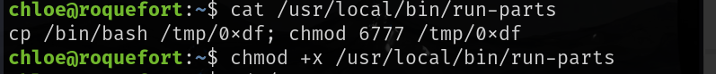

# 信息收集

## nmap

# 3000端口

3000端口部署的`gitea 1.75版本`，

[Gitea 1.7.5 - Remote Code Execution - Multiple webapps Exploit](./https://www.exploit-db.com/exploits/49383?source=post_page-----4328214f4da3---------------------------------------)

搜索一下该版本存在远程代码执行，摸索了半天这个exp也没能使用

查看了其他的利用手法是修改了hook函数的内容，每次更新时都会运行update这个勾子，修改这个勾子的内容即可

尝试了多个反弹shell的代码都会报错，先打印一下`/etc/passwd`，是可以成功命令执行。

将我的公钥写入靶机，使用我的私钥来连接

然后就可以成功连接了

# 提权

wget无法下载linpeas.sh，使用scp上传到靶机

查找可写的路径，其中/usr/local/bin可写

并且发现了run-parts是以root用户在运行定时任务

该脚本在/bin目录下

查看环境变量，我们可写的目录`/usr/local/bin`优先级在`/bin`目录之上，所以可以在`/usr/local/bin`下写一个恶意的`run-parts`，运行时就会执行`/usr/local/bin`下写的`run-parts`

等待一会就会执行这个恶意脚本

