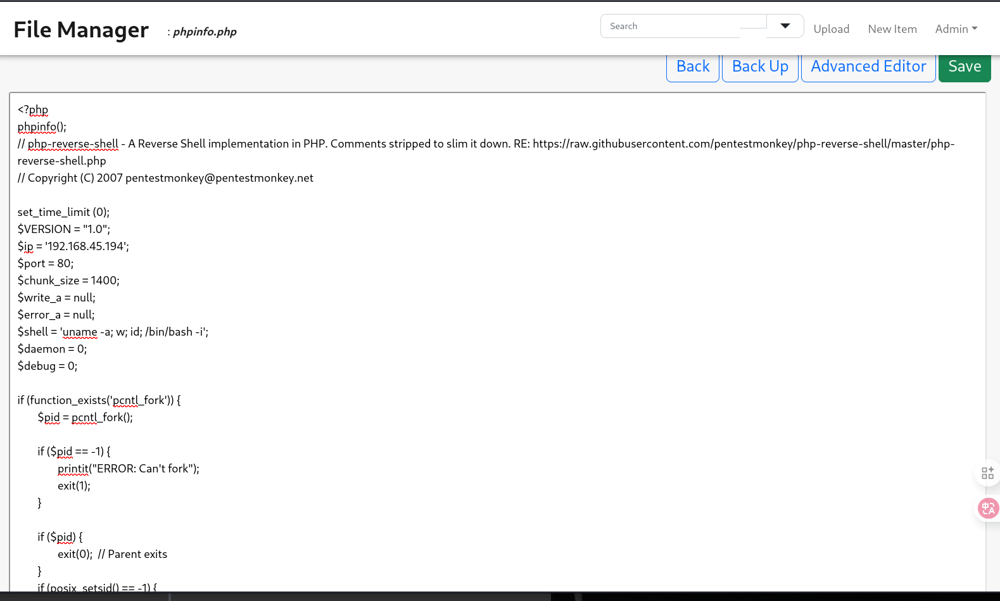

# 信息收集

## nmap


# 80端口

尝试了网上给出的默认密码`admin:admin@123`,`user:12345`都不可以


php-SPX 0.4.15存在目录遍历读取任意文件漏洞，利用方法查看以下连接

[Path traversal in SPX_UI_URI parameter · Issue #251 · NoiseByNorthwest/php-spx](./https://github.com/NoiseByNorthwest/php-spx/issues/251)

```
/index.php?SPX_KEY=a2a90ca2f9f0ea04d267b16fb8e63800&SPX_UI_URI=%2f..%2f..%2f..%2f..%2f..%2f..%2f..%2f..%2f..%2f..%2f..%2f..%2f..%2f..%2f..%2f..%2fetc%2fpasswd
```

需要替换SPX_KEY，替换之后就可以成功读取文件


从phpinfo中可以知道网站根目录是在`/var/www/html`下，根据`tinyfilemanager github`官网介绍的使用方法，结合一些博客写的使用方法，可以知道账号密码就存在于`tinyfilemanager.php`，并且还会复制到网站目录下更改为`Index.php`


尝试读取`index.php`，里面有版本号和账号的密码


使用该网站识别hash类型，然后使用hashcat进行破解

[Hash Type Identifier - Identify unknown hashes](./https://hashes.com/en/tools/hash_identifier)


破解时间较长，但是是可以成功破解的

```
hashcat -m 3200  -a 0  password /home/kali/Desktop/rockyou.txt 
```


```
admin:lowprofile

user:profiler
```


上面得到了版本为2.5.3，该版本存在任意文件上传，但是这两个文件是可以直接编辑的


在里面加入php语言的反向shell就可以了，然后去访问对应的页面即可反弹shell




# 提权

home目录下有一个`profiler`用户,www-data用户无权访问


联想到上面admin和user的密码中就有profile，所以尝试使用上面的密码登录profile用户，最终用root用户的密码lowprofile成功登录，拿到local.txt

该用户可以以sudo权限运行make install 命令

检查要安装的makefile文件，其中有一个shell命令。这个文件我们是可以修改的，改成我们想运行的命令即可，最终就会以root权限运行

我这里是运行了一个shell文件，文件中写入了要执行的恶意代码


