# 信息收集

## nmap

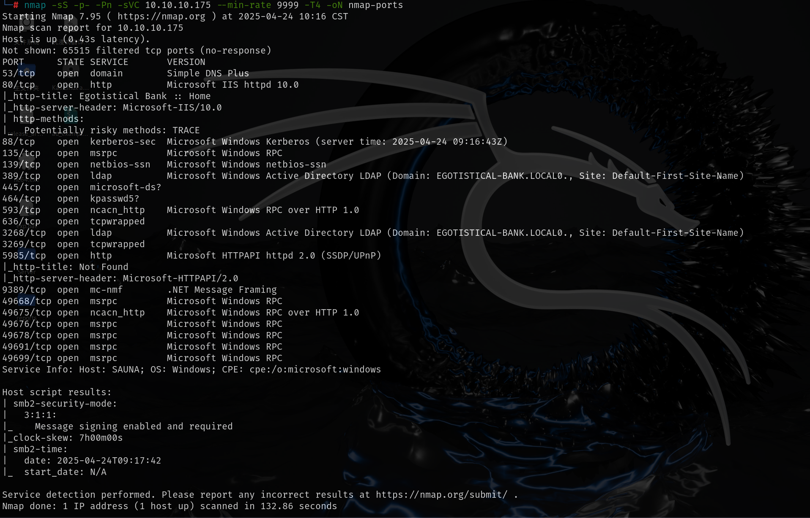

## 80端口


得到一些用户名，保存下来后面用于爆破

## ldap

```
ldapsearch -H ldap://10.10.10.175:389 -x -b "dc=EGOTISTICAL-BANK,dc=LOCAL"
```

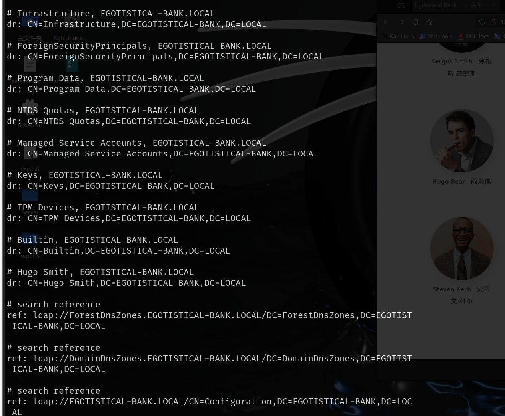

保存可疑的用户名用于后面爆破

## SMB and RPC

SMB和RPC枚举均无信息

## AS-REP Roasting攻击

### 攻击原理

要求用户账户不开启`kerberos`身份验证，此选项的作用是防止密码离线爆破，默认情况下，该选项开启，KDC会记录密码错误次数，防止在线爆破。当关闭之后，攻击者可以请求票据，此时域控不会进行任何验证就返回TGT和密码的hash，然后就可以爆破该hash

### 进行攻击

使用`kerbrute_linux_amd64`枚举的用户名都是无效的，最终使用seclists中的`xato-net-10-million-usernames.txt`字典枚举到Fsmith，发现是将上面名字的首字母和后面半部分组合形成的密码，按照此规律整合一下user字典

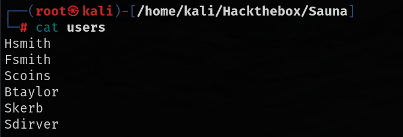

然后使用`kerbrute_linux_amd64`枚举不需要`Kerberos`认证的用户

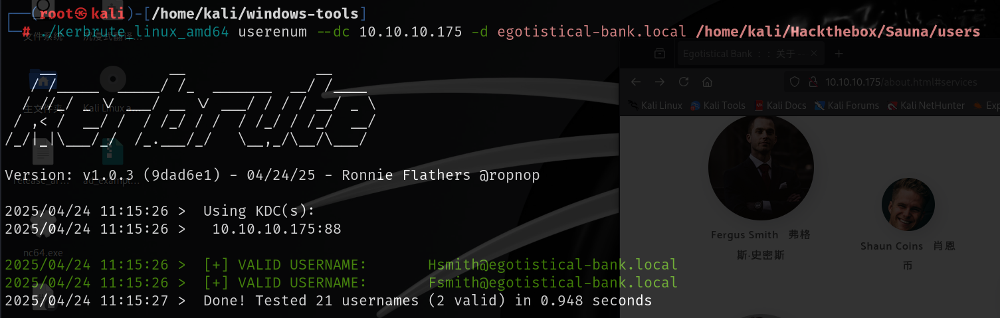

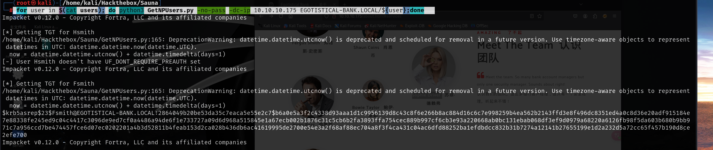

```
hashcat 破解密码
 hashcat -m 18200 -a0 password /usr/share/wordlists/rockyou.txt
```

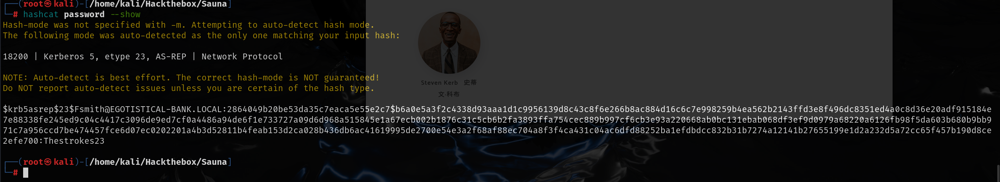

```
Fsmith:Thestrokes23
```

5985端口开启，使用evil-winrm连接

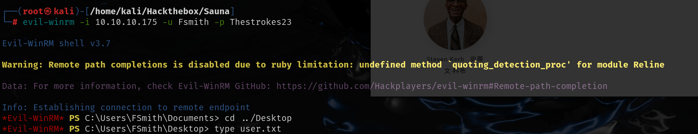

## 提权

winPEASS.exe搜索可能的本地权限提升路径，其中有svc_loanmgr用户的密码

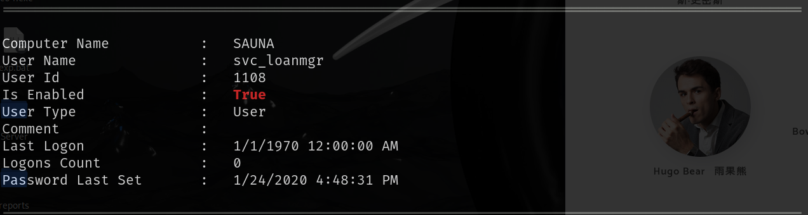

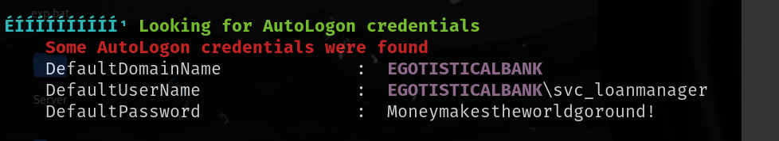

```
svc_loanmgr:Moneymakestheworldgoround!
```

远程连接到svc_loanmgr用户，使用SharpHound.exe检索域信息，导入Bloodhound分析

查找具有DCsync权限的机器，有svc_loanmgr，可以使用DCsync攻击

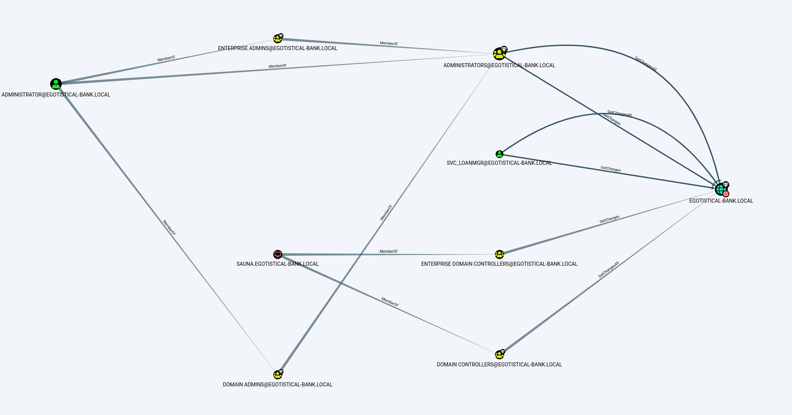

导出密码的hash值然后使用hash进行远程连接到Administrator

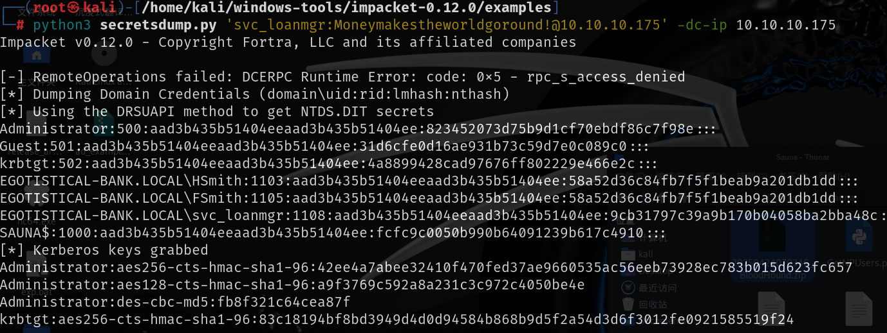

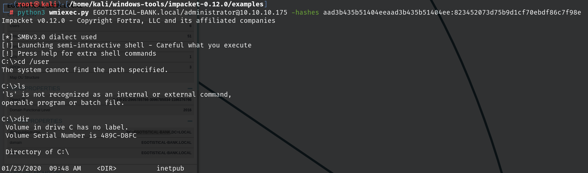