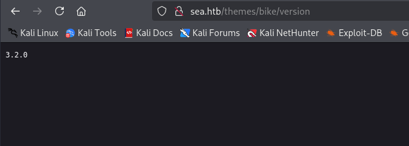

# 信息收集

## nmap


## 80


尝试XSS获取cookie失败，

但是在website输入本机开放的web服务会收到请求


对扫出来的目录再进行扫描


最终在/themes/bike/下找到使用的CMS和版本号





```
turboblack 3.2.0
```

# Get shell

根据该CMS和版本搜索到[CVE-2023-41425 ](./https://github.com/thefizzyfish/CVE-2023-41425-wonderCMS_RCE)，存在xss漏洞


将包含xss的url写入`contact.php`的`website`中，上面测试过对`website`输入框中的内容会发起http请求，等待一会即可得到shell


但是该用户没有权限读取到user.txt


其中有两个斜杠做转义，删除斜杠使用john破解密码

```
mychemicalromance
```


并且本地运行一个8080服务，通过ssh将端口转发到本地,通过浏览器打开

```
ssh -L 8082:127.0.0.1:8000 amay@10.10.11.28
```


分析日志文件的时候进行抓包，此时会从服务器请求日志文件

修改log_file可以任意文件读取


分号后面跟其他命令可以命令执行，需要以+#注释后面的内容，并且是以root权限执行，反弹shell就可以得到root的shell


