# 信息收集

## nmap

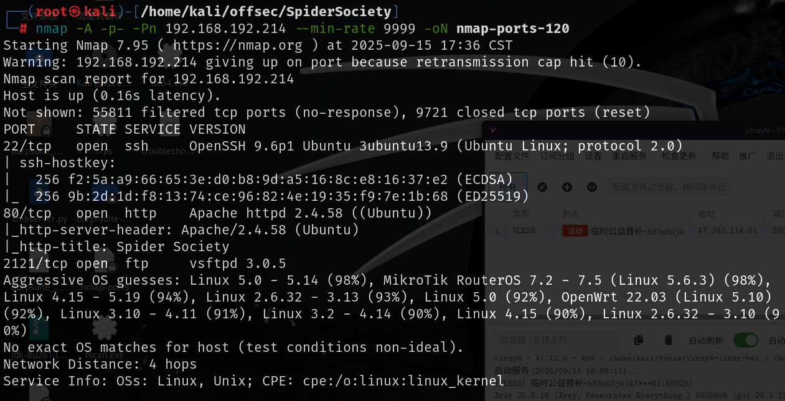

# 80端口

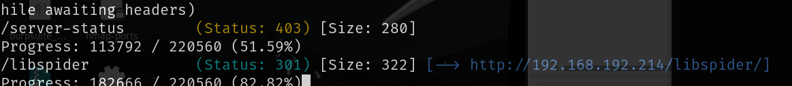

这是个登录界面，直接`admin:admin`弱密码可以进入

点Communications会弹出一条消息，是ftp的备份用户

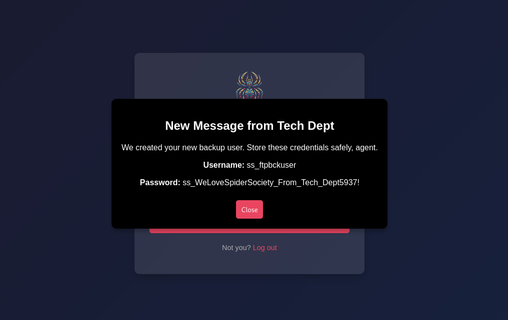

`ss_ftpbckuser:ss_WeLoveSpiderSociety_From_Tech_Dept5937!`

# 2121-ftp

通过上面的账号密码连接到2121端口，其中libspider下有网站源码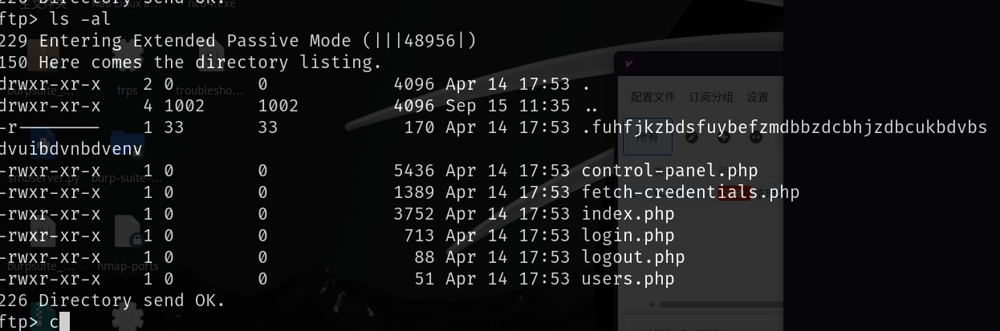

通过查看`fetch-credentials.php`源码，是在`/.fuh********`这个文件中读到了ftp的用户名和密码

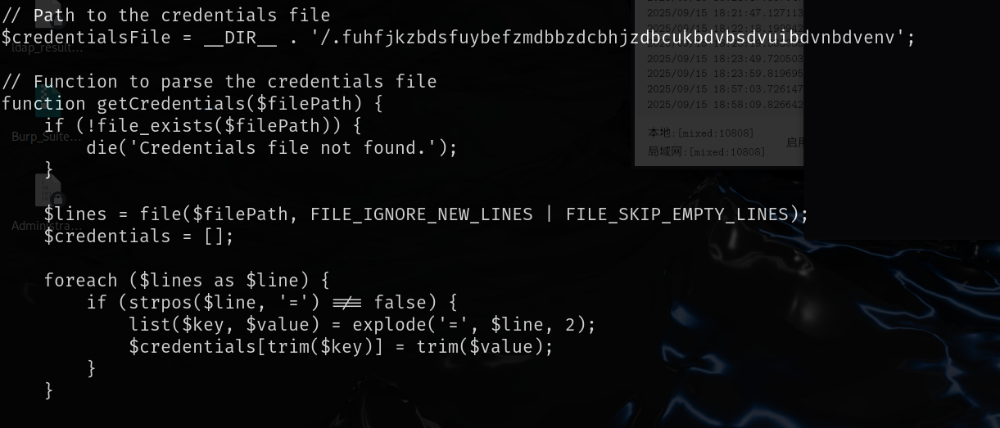

查看这个文件其中有数据库连接账号密码

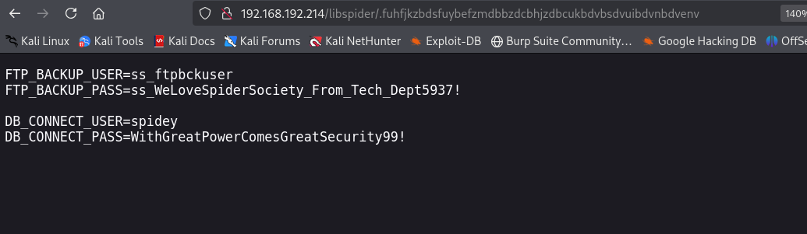

`spidey:WithGreatPowerComesGreatSecurity99!`

这个用户可以通过22端口连接到靶机

# 提权

`/bin/systemctl daemon-reload`命令是重新加载所有`service`文件

`/bin/systemctl restart spiderbackup.service`重启备份这个`service`文件

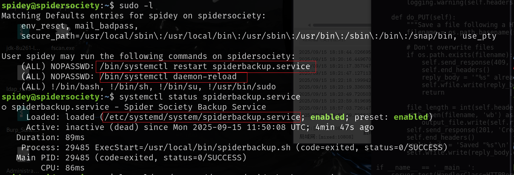

我们通过`systemctl status spiderbackup.service`找到这个`service`文件，这个`service`文件我们可写，其中运行了一个`spiderbackup.sh`文件

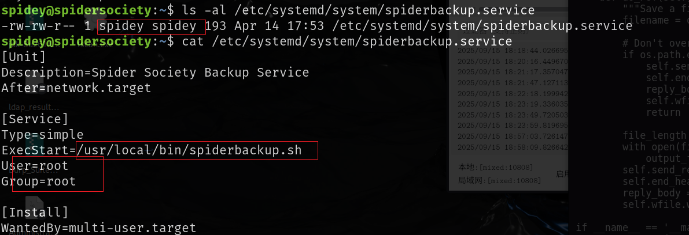

这个sh文件是root权限我们不可写

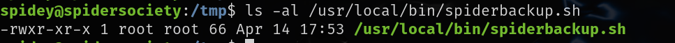

那我们就修改`service`文件，运行我们写好的恶意脚本，然后运行`sudo /bin/systemctl daemon-reload`重新加载`service`文件就可以了

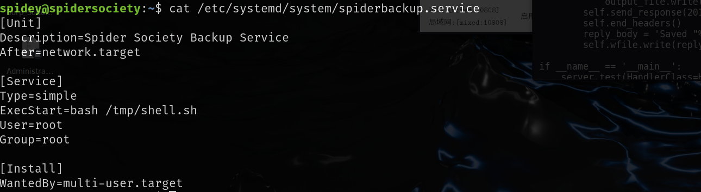

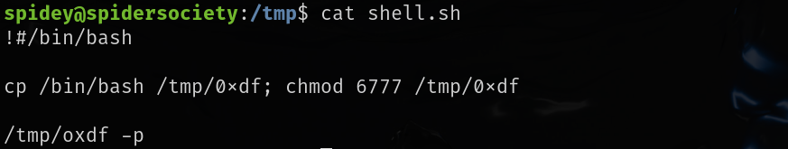

然后挨个运行

```
sudo /bin/systemctl daemon-reload
 sudo  /bin/systemctl restart spiderbackup.service
```

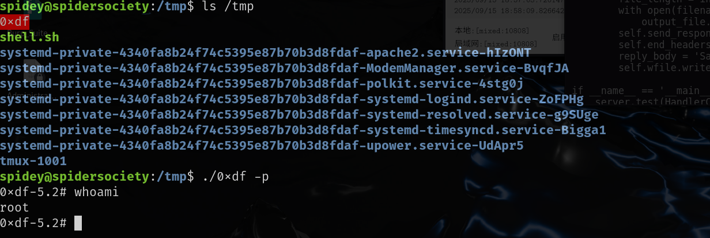