# 信息收集

## nmap

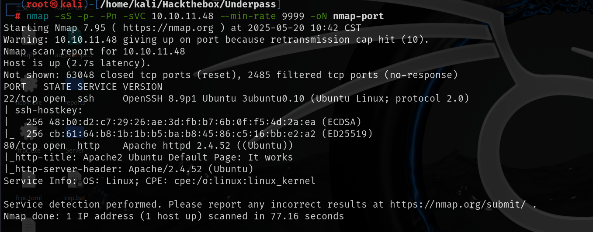

80端口时apache默认页面，对80端口进行子域名爆破，目录扫描都无有用信息，所以应该就是开放了udp端口，扫描udp端口得到如下结果

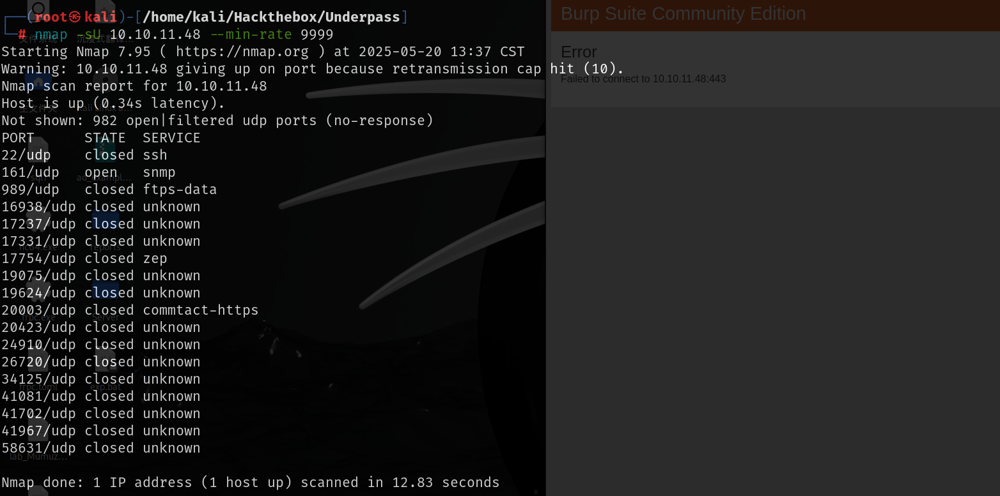

## Web

snmpwalk进行信息枚举，说这个仅运行在daloraadius服务上

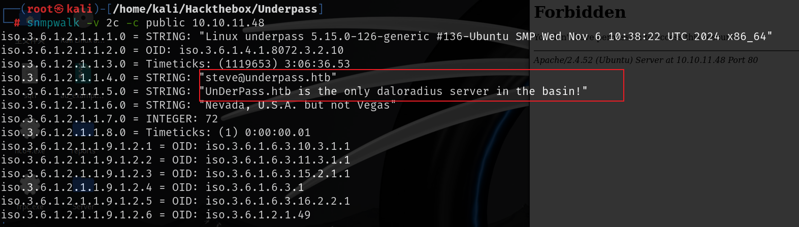

尝试访问该目录显示禁止

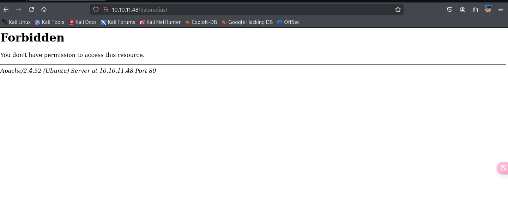

扫目录得到目录其他信息

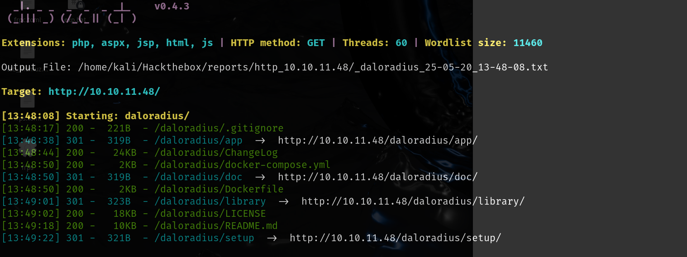

docker-compose.yml中有数据库连接信息

```
      - MYSQL_DATABASE=radius
      - MYSQL_USER=radius
      - MYSQL_PASSWORD=radiusdbpw
      - MYSQL_ROOT_PASSWORD=radiusrootdbpw
```

没有其他有用的信息，去github搜索`daloradius`，其中的Changelog与靶机的Changlog相同

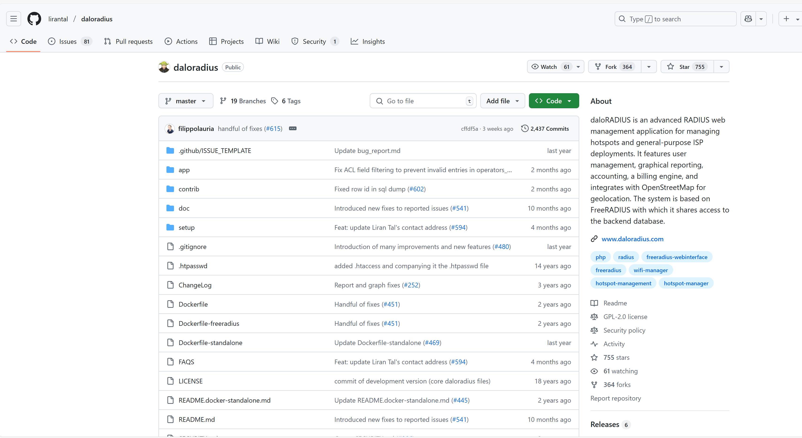

在仓库中搜索login，可以在/app/user/下找到login.php

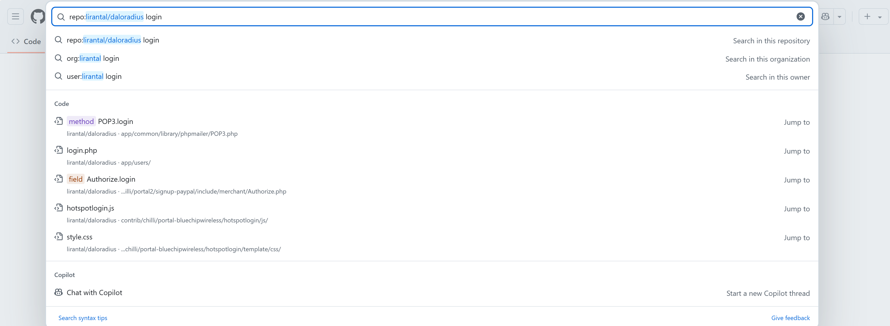

该页面使用默认账号密码无法登录

搜索到默认账号密码为`administrator:radius`

再扫描/daloradius/app目录,operator下扫出几个页面，common下没有可用信息

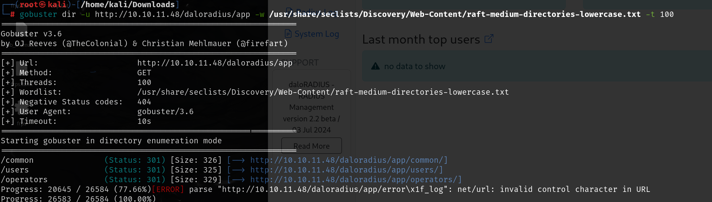

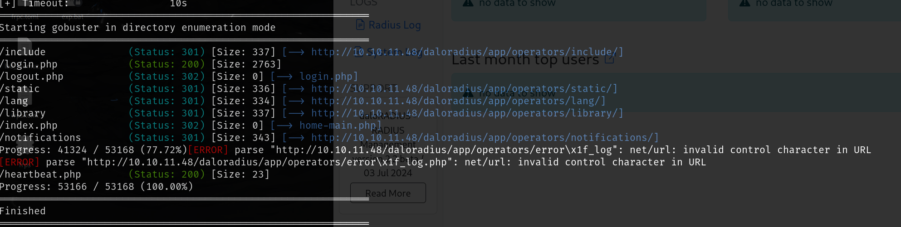

扫出的operator目录下的这些页面是在github上没有的，所以只在github上查询是搜不到这个页面的

heartbeat.php下显示秘钥没提供

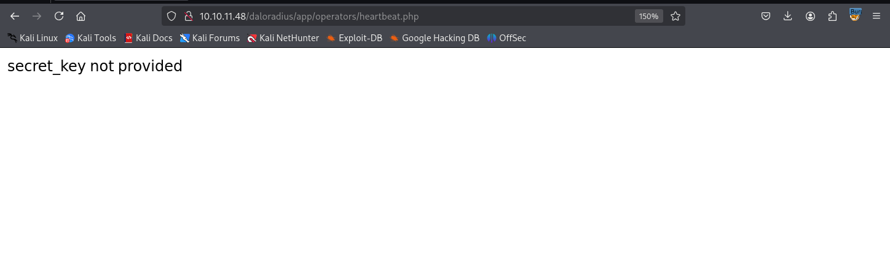

## operator目录下的login.php可以通过默认账号密码登录

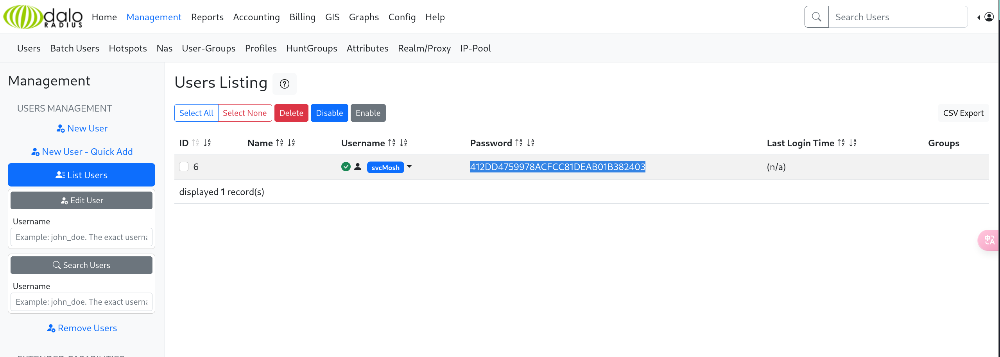

用户页面下有密码的hash值，该hash可以破解

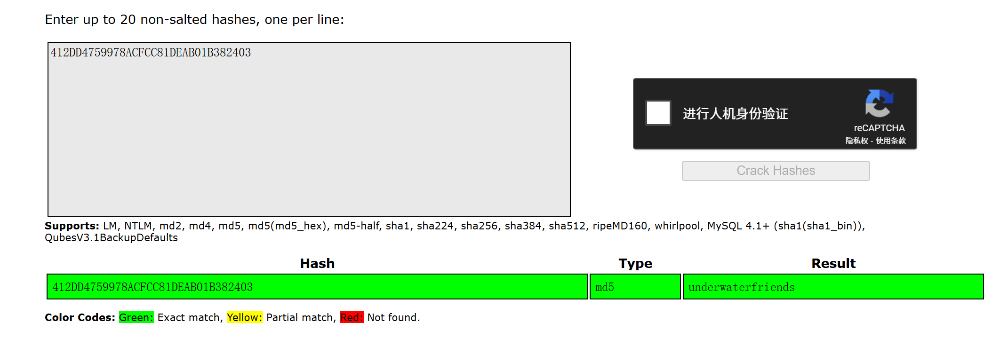

```
svcMosh:underwaterfriends
```

使用该账号可以ssh远程连接

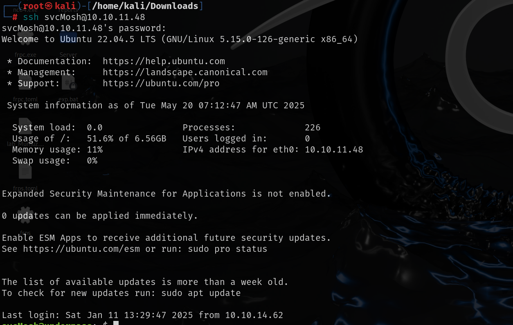

# 提权

该用户可以以root运行mosh-server的权限，mosh-server是一个远程连接工具，该用户以root用户运行的是服务端，可以使用客户端连接

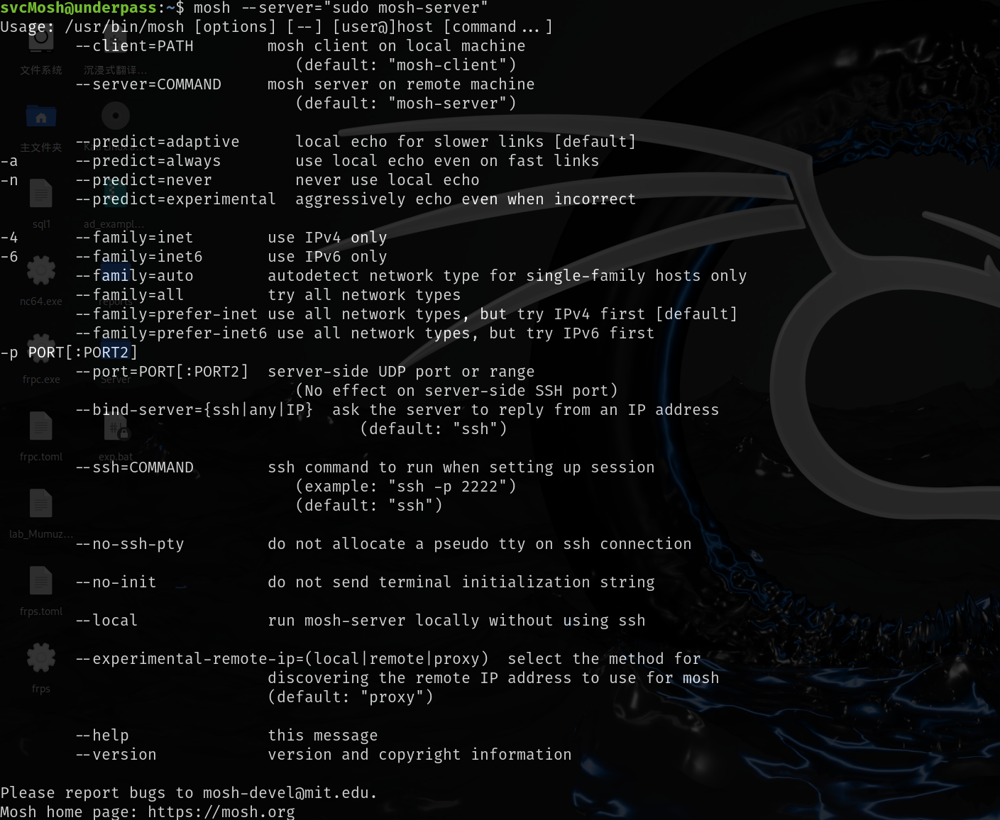

运行mosh会有help命令提示，使用--server选项，运行命令以sudo权限运行mosh-server，连接本地的mosh-server

```
 mosh --server="sudo mosh-server" 127.0.0.1
```

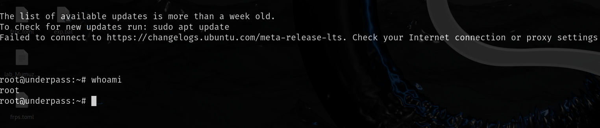