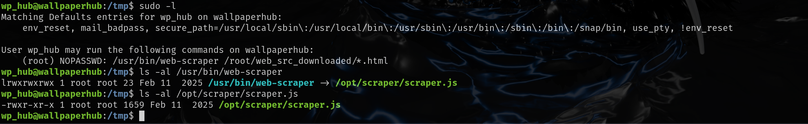

# 信息收集

## nmap


## 5000端口

80页面是apache默认页面

5000端口有登录注册功能，gallery目录可以下载图片


我们先注册一个账号然后登录，后台可以上传壁纸


也可以查看上传的内容，我尝试上传了php文件，可以成功上传，但是访问php文件时会直接下载，无法解析，其他格式的文件也是可以上传的，所以这里应该是无限制上传

尝试对php后缀进行修改，如php3，php4，phtml都没有用，访问时会直接下载


但是我尝试在上传时进行目录穿越，发现上传之后的文件名为passwd


并且下载后是`/etc/passwd`文件，所以我们可以尝试下载其他文件


最初的思路是尝试找web页面的根目录，/var/www/目录下进行尝试已存在的图片，由于我们也不知道网站更目录下的配置文件叫什么，所以这一条思路失败

后面读取了`/home/wp_hub`目录下的`.bash_history`这里存放了历史命令


将历史命令保存到一个数据库文件中了

尝试读这个数据库文件，根目录指的是`/home/wp_hub`目录，完整目录就是`/home/wp_hub/wallpaper_hub/database.db`


然后使用`strings`将其中的字符串筛选一下，最后一行可以看到新建了一个`wp_hub`用户，有密码的`hash`值


使用[Hash Type Identifier - Identify unknown hashes](./https://hashes.com/en/tools/hash_identifier)识别hash类型，然后使用hashcat进行破解


wp_hub的密码为`qazwsxedc`

使用ssh连接即可

# 提权

`/usr/bin/web-scraper`可以以root权限执行，该文件又指向`/opt/scraper/scraper.js`，我们可读可执行，但是不可写



主要是**读取一个 HTML 文件，然后用 `happy-dom` 模拟浏览器环境来解析这个 HTML，再提取其中的外部 CSS、JS 链接和 meta 标签信息**。


搜索到`happy-dom`存在任意命令执行漏洞

https://security.snyk.io/vuln/SNYK-JS-HAPPYDOM-8350065

攻击者可以通过将恶意内容传递到 `<script>` 标签的 `src` 属性来利用此漏洞。

我们可以创建恶意的html文件然后使用该脚本运行

写一个反向shell脚本，让html文件去运行这个脚本，注意脚本要给运行权限


我们当前是在tmp目录下，但是以root权限运行的目录在`/root/web_src_downloaded/`下

可以使用`/root/web_src_downloaded/../../../tmp/test.html`完美解决

```shell
sudo /usr/bin/web-scraper /root/web_src_downloaded/../../../tmp/test.html
```

然后本地监听即可得到root的shell

