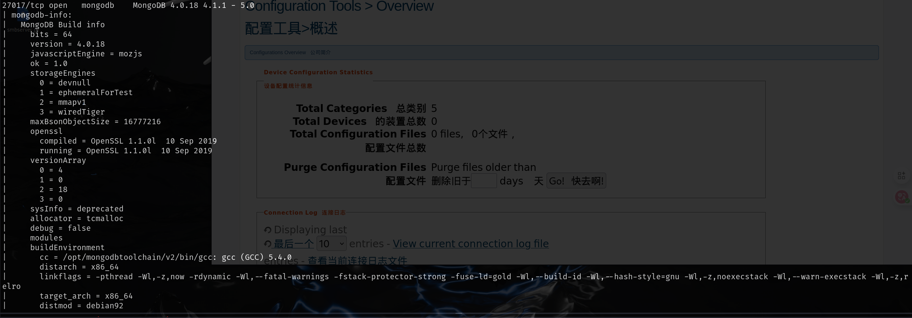
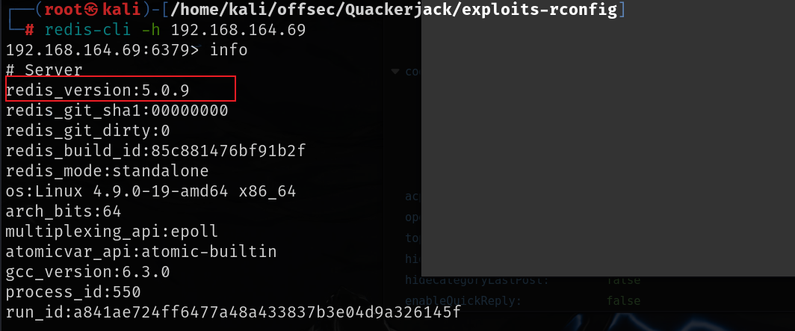
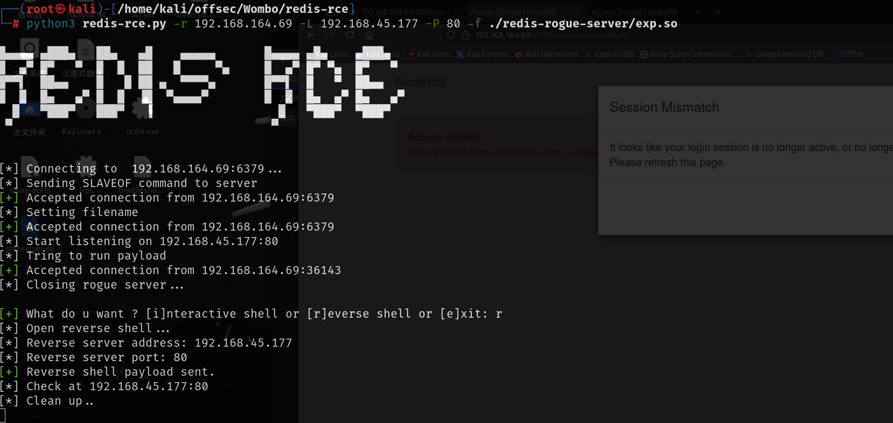
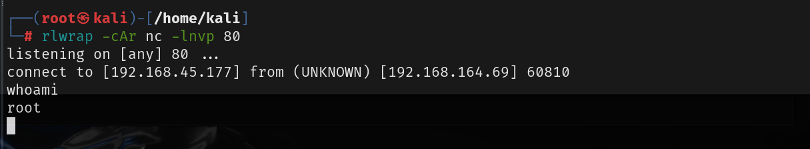

# 信息收集

## nmap

# redis

redis可以未授权登录，并且可以访问信息，可以看到redis的版本为5.0.9

直接利用一个exp就可以得到root权限

[Ridter/redis-rce: Redis 4.x/5.x 远程代码执行 --- Ridter/redis-rce: Redis 4.x/5.x RCE](./https://github.com/Ridter/redis-rce)

mod.so文件地址：[n0b0dyCN/redis-rogue-server: Redis(<=5.0.5) RCE --- n0b0dyCN/redis-rogue-server: Redis(<=5.0.5) RCE](./https://github.com/n0b0dyCN/redis-rogue-server)

