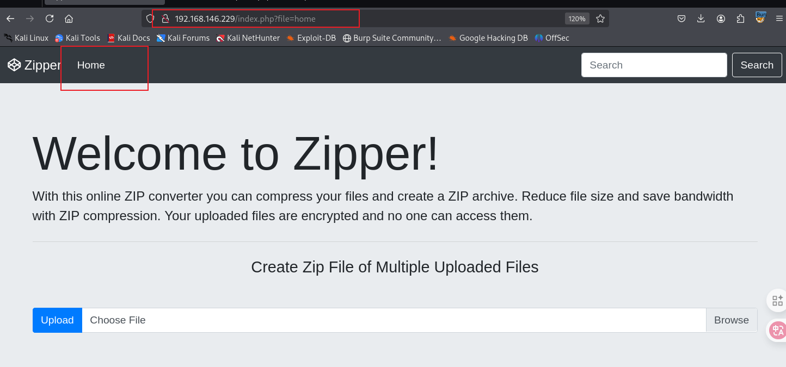

# 信息收集

## nmap


# 80端口


访问style,好像是没什么用


访问upload界面是空的，upload目录是上传了文件之后保存文件的地方，可以随便上传一个文件，然后查看下载链接，下载链接就是在upload目录下


访问home页面就会跳转到url/index.php?file=home，看到file就可以联想到伪协议，



使用php伪协议可以读取到index.php


```php
#index.php
<?php
$file = $_GET['file'];
if(isset($file))
{
    include("$file".".php");
}
else
{
include("home.php");
}
?>

```

index.php源码中include函数包含时只取了文件名，后缀php是源码加上去的，所以我们读取的时候也只需要输入文件名，这也就是为什么读取的时候只需要读index，就可以读到index.php

还可以读取到upload.php


```php
#upload.php
<?php
if ($_FILES && $_FILES['img']) {
    
    if (!empty($_FILES['img']['name'][0])) {
        
        $zip = new ZipArchive();
        $zip_name = getcwd() . "/uploads/upload_" . time() . ".zip";
        
        // Create a zip target
        if ($zip->open($zip_name, ZipArchive::CREATE) !== TRUE) {
            $error .= "Sorry ZIP creation is not working currently.<br/>";
        }
        
        $imageCount = count($_FILES['img']['name']);
        for($i=0;$i<$imageCount;$i++) {
        
            if ($_FILES['img']['tmp_name'][$i] == '') {
                continue;
            }
            $newname = date('YmdHis', time()) . mt_rand() . '.tmp';
            
            // Moving files to zip.
            $zip->addFromString($_FILES['img']['name'][$i], file_get_contents($_FILES['img']['tmp_name'][$i]));
            
            // moving files to the target folder.
            move_uploaded_file($_FILES['img']['tmp_name'][$i], './uploads/' . $newname);
        }
        $zip->close();
        
        // Create HTML Link option to download zip
        $success = basename($zip_name);
    } else {
        $error = '<strong>Error!! </strong> Please select a file.';
    }
}
```

可以上传个php反向shell，压缩之后然后利用file伪协议解压并且inclde包含上传的php文件就可以反弹shell


php伪协议不太懂的可以看这张图


# 提权

在定时任务中找到一个备份脚本


我们没有写的权限，该备份脚本读取了密码之后使用7za进行压缩


使用pspy64可以抓取到这个进程，其中暴露了密码


该密码就是root用户的密码


