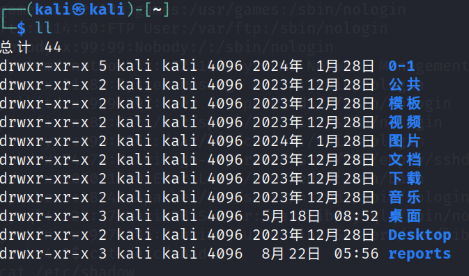
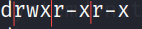
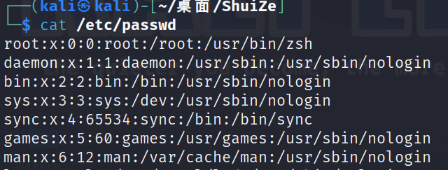
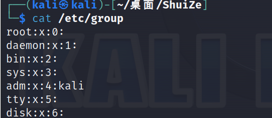
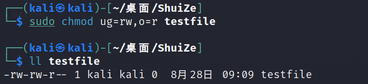
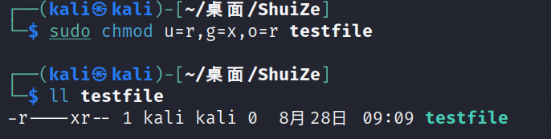

# linux ugo权限

Linux 系统中文件的 ugo 权限是 Linux 进行权限管理的基本方式。

## 文件的所有者和组

Linux 文件的 ugo 权限把对文件的访问者划分为三个类别：文件的所有者、组和其他人。所谓的 ugo 就是指 user(也称为 owner)、group 和 other 三个单词的首字母组合。

***\*文件的所有者\****
文件的所有者一般是创建该文件的用户，对该文件具有完全的权限。在一台允许多个用户访问的 Linux 主机上，可以通过文件的所有者来区分一个文件属于某个用户。当然，一个用户也无权查看或更改其它用户的文件。

***\*文件所属的组\****
假如有几个用户合作开发同一个项目，如果每个用户只能查看和修改自己创建的文件就太不方便了，也就谈不上什么合作了。所以需要一个机制允许一个用户查看和修改其它用户的文件，此时就用到组的概念的。我们可以创建一个组，然后把需要合作的用户都添加都这个组中。在设置文件的访问权限时，允许这个组中的用户对该文件进行读取和修改。

***\*其他人\****
如果我想把-一个文件共享给系统中的所有用户该怎么办？通过组的方式显然是不合适的，因为需要把系统中的所有用户都添加到一个组中。并且系统中添加了新用户该怎么办，每添加一个新用户就把他添加到这个组中吗？这个问题可以通过其他人的概念解决。在设置文件的访问权限时，允许其他人户对该文件进行读取和修改。

## 文件属性

使用ll可以查看文件的属性信息



第一列是文件的类型和ugo权限

第二列是对文件的引用计数

第三列是文件的所有者

第四列是文件所属的组

### 文件类型



第一位是文件类型

- d 表示目录
- \- 表示普通文件
- l 表示链接文件
- b 表示块设备文件
- c 表示字符设备文件
- s 表示 socket 文件

后九个字符三个为一组，<font color=red>第一组为文件所有者的权限，第二组为文件所属组的权限，第三组为其他人的权限</font>

- r (read)：可以读取文件的实际内容，比如读取文本文件内的文字等。
- w (write)：可以编辑、增加、删除文件的内容(但不含删除该文件)。
- x (execute)：该文件具有可以被系统执行的权限。

## 保护用户和组的文件

用户和组的信息分别记录在`/etc/passwd`、`/etc/group`文件中，可以直接读取期中的内容，并且所有人都有读取权限





用户的密码存储在`/etc/shadow`要读取此文件必须拥有root权限

## 修改文件权限

- chown ：改变文件所有者
- chgrp ：改变文件所属的组
- chmod ：改变文件的权限

### 改变文件所有者

```
sudo chown kali root
```

### 改变文件所属的组

```
sudo chgrp tester testfile
```

### 改变文件的权限

chmod修改权限有两种表示方法

#### 以数字表示权限

<font color=red>r:4</font>

<font color=red>w:2</font>

<font color=red>x:1</font>

如果是rwx就是4+2+1=7权限，如果不附加此权限就是0

chmod可以修改文件所有者，文件所属的组，其他人的权限

每个单位的权限以数字表示，例如将文件权限改为所有人可读可写可执行

```
sudo chmod 777 testfile
```

#### [u g o]分别赋予权限

```
sudo ug=rw,o=r testfile 
```



```
sudo chmod u=r,g=x,o=r testfile
```

