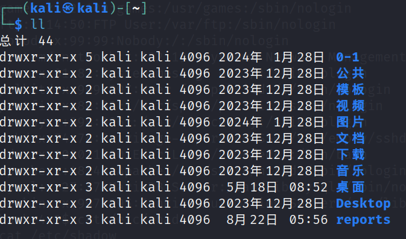

# linux ugo权限

Linux 系统中文件的 ugo 权限是 Linux 进行权限管理的基本方式。

## 文件的所有者和组

Linux 文件的 ugo 权限把对文件的访问者划分为三个类别：文件的所有者、组和其他人。所谓的 ugo 就是指 user(也称为 owner)、group 和 other 三个单词的首字母组合。

***\*文件的所有者\****
文件的所有者一般是创建该文件的用户，对该文件具有完全的权限。在一台允许多个用户访问的 Linux 主机上，可以通过文件的所有者来区分一个文件属于某个用户。当然，一个用户也无权查看或更改其它用户的文件。

***\*文件所属的组\****
假如有几个用户合作开发同一个项目，如果每个用户只能查看和修改自己创建的文件就太不方便了，也就谈不上什么合作了。所以需要一个机制允许一个用户查看和修改其它用户的文件，此时就用到组的概念的。我们可以创建一个组，然后把需要合作的用户都添加都这个组中。在设置文件的访问权限时，允许这个组中的用户对该文件进行读取和修改。

***\*其他人\****
如果我想把-一个文件共享给系统中的所有用户该怎么办？通过组的方式显然是不合适的，因为需要把系统中的所有用户都添加到一个组中。并且系统中添加了新用户该怎么办，每添加一个新用户就把他添加到这个组中吗？这个问题可以通过其他人的概念解决。在设置文件的访问权限时，允许其他人户对该文件进行读取和修改。

## 文件属性

使用ll可以查看文件的属性信息

第一列是文件的类型和ugo权限

第二列是对文件的引用计数

第三列是文件的所有者

第四列是文件所属的组

### 文件类型

