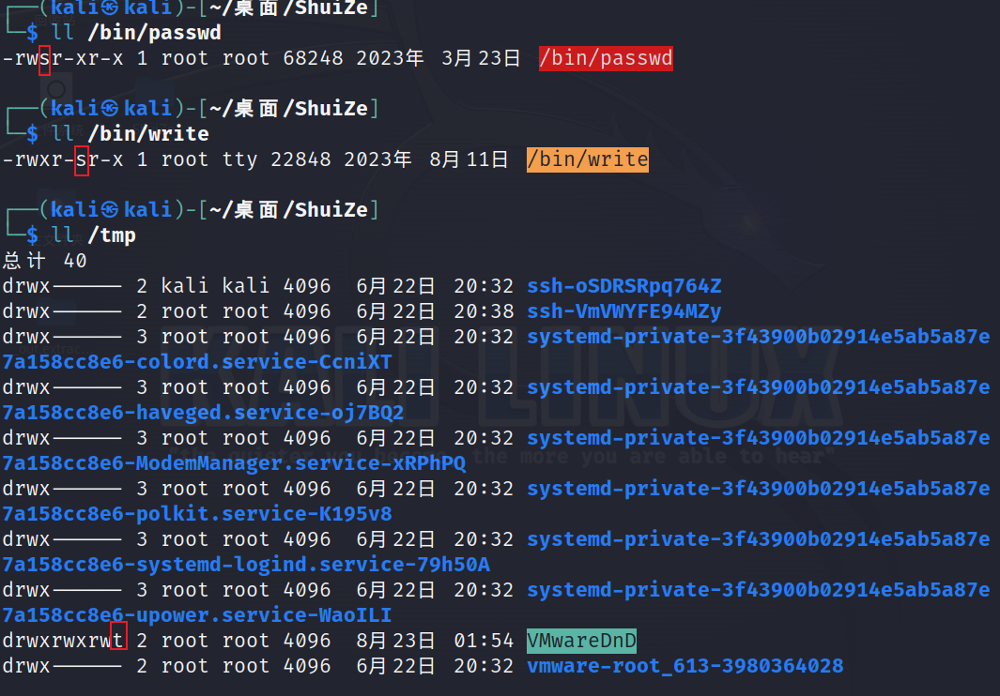
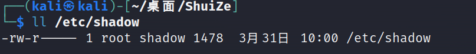

# 1.linux特殊权限介绍

在linux中，除了r、w、x权限之外，还有s和t权限



# 2.suid

### 1.介绍suid之前需要了解一些问题

- **普通用户是否可以修改密码**
  可以修改自己密码
- **/etc/shadow文件的作用是什么**
  存储用户密码的文件
- **/etc/shadow文件的权限是什么**



其他用户不可读取、不可写入不可执行

- **普通用户是否可以修改/etc/shadow文件**
  不可以修改，没有任何权限
- **为什么普通用户可以修改密码**

1. 使用了passwd命令
2. passwd在x权限位上有s权限
3. 在使用有suid权限的文件或者命令时，会以该文件的属主身份去执行该命令

### 2.suid作用详解

**概念：命令文件的x权限位变为s，那么其他用户执行命令文件时，就会以该命令文件的属主用户去执行**
如果属主权限位上有x，则会显示小s
如果属主权限位上没有x，则会显示大S
**实例：**

设置suid，普通用户可以正常修改自己的密码，取消suid，普通账户无法修改自己的密码

> 在root权限下取消suid权限
>
> ```
> chmod u-s /bin/passwd
> ```
>
> 普通用户无法使用passwd命令修改密码`问题：如果普通用户在使用passwd命令时，是以root的身份去执行的，普通用户是否能修改其他账户的密码`
> 无法修改，只有root在使用passwd命令时后面可以接用户名称，其他账号不可以。

**问题：如果普通用户在使用passwd命令时，是以root的身份去执行的，普通用户是否能修改其他账户的密码**
无法修改，只有root在使用passwd命令时后面可以接用户名称，其他账号不可以。

### 3.授权、撤销suid权限

授权格式：

```
chmod u+s 文件名称
```

撤销格式：

```
 chmod u-s 文件名称
```

# 3.sgid

### 1、Sgid作用详解

**概念：一般情况下是设置给目录使用的，主要目的就是为了让别的用户无法删除其它用户所创建的文件或目录。**

如果该属组权限位上有执行权限，则会显示（小写）s。

如果该属组权限位上没有执行权限，则会显示（大写）S。

### 2、授权Sgid

授权格式：

```
chmod g+s 目录名
```

撤销格式：

```
 chmod g-s 目录名
```

# 4.sticky bit（沾滞位）

## 1、sticky bit 详解

如果该其它用户权限位上有执行权限，则会显示（小写）t。

如果该其它用户权限位上没有执行权限，则会显示（大写）T。

**概念：只作用在目录上，当一个目录的没有设置sticky bit权限时，并且该目录对所有用户都有读、写、执行权限时，普通用户在该目录下所创建的文件或目录都会被其它用户删除。**

**概念：当一个目录设置了sticky bit权限时，普通用户在该目录下所创建的文件或目录，只能被该文件或目录的属主用户或root用户删除，其它用户无法删除别的用户所创建的目录或文件。**

## 2.授权Sticky bit

**授权方式**：

```
chmod o+t filename
```

**撤销格式：**

```
chmod o-t filename
```

### 3、Sticky bit 总结

①让多个用户都具有写权限，并让每个用户都只能删除自己的文件

②投入数sticky目录表现在others 的 x 位，用（小写）t 表示，没有执行权限时（大写）T

③一个目录即使使得它的权限为“777” ，如果设置了粘滞位，除了目录的属主和“root”用户有权限删除，其它用户都不允许删除。


# 5.总结

## 1、SUID

主要对命令、或者二进制文件，设置了SUID，那么其它用户在执行该文件时，就会以该文件的属主权限来执行。

## 2、SGID

主要针对目录进行授权，共享目录，设置了SGID，其它任意用户在该目录下所创建的文件或目录，它们的属组用户都会与父目录相同。

## 3、SBIT

粘滞位，主要针对目录，设置了SBIT，即便该目录对所有用户都有写的权限，除了root用户，其它用户也只能对自己所创建的文件进行删除移动。

r：读 4

w：写 2

x ：执行 1

Suid：4000

> 4表示`S`权限 后三位分别表示所有者（user）权限（rwx）；所属组（group）权限（rwx）；其他用户（others）权限（rwx）。
>
> 可以用作find命令时
>
> ```shell
> find / -perm 4000 -type f -ls 2>/dev/null
> ```
>
> 

Sgid ：2000

Sbit ：1000

