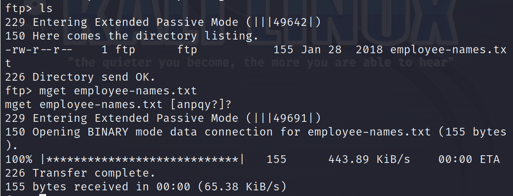
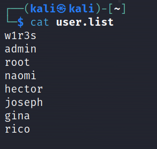

# 信息收集

## 1.主机扫描

查看kali网段，然后使用nmap扫描该网段的主机，得到主机后扫描该主机开启的端口

-sn参数是指扫描主机，不扫描端口，n是no port scan


也可以使用该命令(当时忘记截图，此截图为后续补充，所以ip有所不同)

```
sudo arp-scan -l
```


在打靶机时可以扫描靶机还未打开和打开时的ip，新增的ip就是靶机的ip

得到主机192.168.204.130

## 2.端口扫描


21，22，80，3306端口开放

## 3.详细信息扫描

-sT表示进行TCP扫描会，进行完整的TCP连接建立过程，不加-sT参数默认为-sS，-sS是发送SYN包，只建立TCP握手的第一步，再有防火墙的情况下可能会对不完整的TCP建立过滤；

-p表示待扫描的端口（后跟待扫描的端口21，22，80，3306）；

-sV表示探测开放服务的版本，-O表示探测操作系统版本，扫描结果如下：


  

在扫描UDP端口，显示3306关闭，其他打开/被过滤的状态


## 4.漏洞扫描

使用nmap自带的漏扫工具进行漏洞扫描，-script=vuln参数


发现有dos攻击漏洞，在渗透方面作用不大，上面还有一个登录页面

# FTP渗透

先试试FTP能不能匿名登录，FTP匿名登录的账号都是这个：anonymous，密码为空


直接可以登录，使用的命令可以使用？显示出来-

逐个查看目录并且下载其中的文件，这里需要注意的是，如果目录下的文件不是文本.txt文件的话，需要先运行binary指令（即输入binary然后回车）转换为二进制格式，以保证通过FTP下载的文件不会损坏。如果本身就是txt文件，则运不运行binary都可。多个文件下载的命令是：mget ，单个文件下载的命令是：get




返回kali查看文件内容


使用hash-identifier识别其加密算法


MD5加密，使用在线网站解密,

```
https://hashes.com/en/decrypt/hash
```


后面类似是base64


然后查看下一个文件


将照片倒过来,或者使用在线网站

```
https://www.upsidedowntext.com/
```


暗示我们要提权，获取root权限

查看emplyee文件，这是雇员信息，在web渗透时说不定有用


# 80端口

直接访问靶机的ip试试，显示使用的是apache2的中间件


然后扫目录看看能不能扫到其他页面，扫出administrator,javascript,wordpress页面，尝试访问


访问administrator页面，这是cuppa cms的安装页面，暴露了一些配置信息


访问javascript页面


访问wordpress页面


# 查找该cms的漏洞

查找一下有没有cuppa这个cms的已知漏洞，使用kali的searchsploit查找


下载下来查看如何使用，下载的命令

```
searchsploit cuppa -m cuppa //-m是mirror后面是要保存的文件名
```

他说alertConfigFireld.php文件的22行这里有漏洞


下面有说明如果利用该漏洞


这里的target就是靶机的ip


cuppa目录访问不到，前面发现扫目录administrator目录，猜测根目录可能就是adminstrator，将cuppa换成administrator试试

任然无法读取到passwd


源码审计，在github找到该cms的源码


这里的urlConfig是post提交

红队笔记是使用curl提交，后面有直接使用hackbar进行post提交的

## 1.curl提交

curl的--data-urlencode参数就是进行POST提交

```
curl --data-urlencode urlConfig=../../../../../../../../../etc/passwd http://192.168.204.130/administrator/alerts/alertConfigField.php 
```


成功读取到文件， 在现在linux系统中，passwd文件里面所有账户的密码都是用x代替的，真正的密码（加密后）放在/etc/shadow中，同样的curl方法，我们改一下路径，看看etc/shadow


分别有三个账号有密码，然后破解hash，得到两个账户的密码，root的密码破解不出来，先使用其他账号登录，后续在提权


## 2.使用hackbar中的post提交


可以读取到/etc/passwd，然后再读取/etc/shadow


# 提权

ssh远程连接


发现具有all权限直接运行bash即可得到root权限


进入root目录，得到flag


# 6.其他方式

可以尝试ssh破解

先创建一个账户本，将常见的账户保存进去，一部分用户为前面ftp得到的内部工作人员的姓名



然后使用/user/share/wordlists/rockyou.txt字典破解1

该命令是使用rockyou字典去爆破user.list中账号的密码

```
hydra -L user.list -p /user/share/wordlists/rockyou.txt ssh://192.168.204.130 -t 4
```

也可以破解出w1r3s的密码为computer